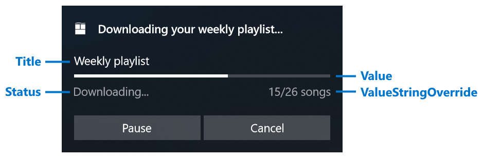
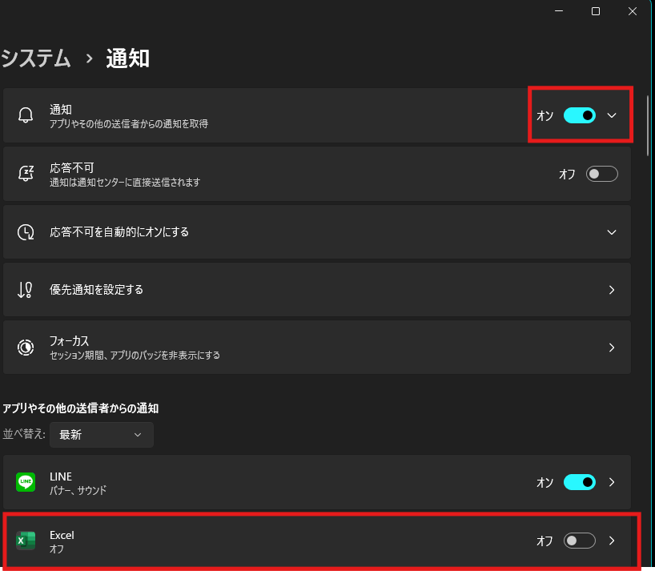
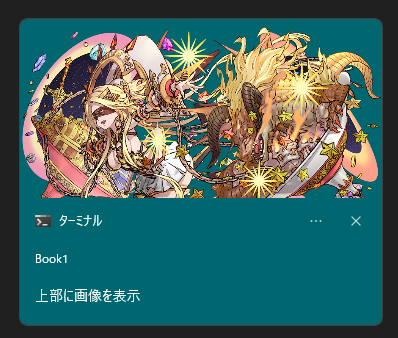

# ✅ トースト通知を、VBAで！

「Excelから通知を出せたら便利なのに…」  
そんな願い、**VBA × C++ DLLの連携**で実現しました。

Windows 10/11で標準搭載されている**トースト通知**を、  
VBAから簡単に使えるようにした拡張モジュールです。

📢 リマインダーに！  
📊 レポート完了の通知に！  
🎯 入力ミスや完了メッセージに！  
⚙️ ボタン押下で指定マクロを実行！

**VBAの限界を超えて、モダンなUI通知をあなたのExcelに。**

# DEMO

| シチュエーション例            | 動作イメージ | 
| ---------------------------- |   ------------ | 
| 処理終了 その1                    |        | 
| 処理終了 その2          |        | 
| リマインド通知          |        | 
| プログレスバー付き通知          |        | 

他にも様々なアプリ通知の外観を設定できます。設定方法等は後述します。

# Features

- DLLインポートと専用に用意されたクラスファイルをインポートすることにより、数行で手軽にアプリ通知の表示が可能です。
- DLLインポートが使用できない環境でも、WindowsPowerShellを経由したアプリ通知の表示が可能です。
- [「自動的に閉じるMsgBox」](http://officetanaka.net/excel/vba/tips/tips21.htm)の代わりに使用することが可能です。
- 昔ながらの通知手法：[Shell_NotifyIconA](https://learn.microsoft.com/ja-jp/windows/win32/api/shellapi/nf-shellapi-shell_notifyicona)ではなく、WinRT APIを使った通知手法なので、カスタマイズ性が高いです。

# Development History

「自動的に閉じるMsgBox」という機能に一定のニーズを感じ、その代替として作ってみました。<br>
この機能は、vbsで実現しておりそのvbsがもうすぐで最新OSでは、搭載しなくなるとのことで色々と試行錯誤して作成してみました。<br>
モダンなWindows との親和性を高めるためにも、使ってみてはいかがでしょうか？

# Requirement

以下で検証済みです。

- Microsoft Office Excel 2019 以上 64bit
- Windows 10 , 11 64bit

# Load DLL

WindowsAPIの「LoadLibrary関数」を使って、読み込みます。

```bas
hDll = LoadLibrary("AppNotificationBuilderVBA.dll")
```

実際に使う場合は、"Excelファイル(.xlsm)の存在するディレクトリ"というような[動的な場所を設定する仕組み](https://liclog.net/vba-dll-create-5/)で読み込むことをおすすめします。

```bas
'動的にDLLを取得するためのWinAPI
Private Declare PtrSafe Function LoadLibrary Lib "kernel32" Alias "LoadLibraryA" (ByVal lpLibFileName As String) As LongPtr

Private Sub Workbook_Open()

    Dim hDll As LongPtr
    Dim sFolderPath As String
    
    'DLLファイルを保存するフォルダパスを設定
    sFolderPath = ThisWorkbook.Path
    
    'DLLﾌｧｲﾙを読み込む
    hDll = LoadLibrary(sFolderPath & "\" & "AppNotificationBuilderVBA.dll")　'DLLファイルフルパス

    debug.print hDll
End Sub
```

hDll の中身が、0 以外であれば読み込み、成功です。

# Usage

1. [このクラスファイル](doc/AssistMakeToastSchema/clsAppNotificationBuilder.cls)をVisual Basic Editorのプロジェクトにインポートして下さい。<br>

2. Visual Basic Editorを開きメニューバーの「ツール」→「参照設定」→「Microsoft XML v6.0」にCheckをいれOKを押下して下さい。<br>
<br>
<br>
これは、クラスファイルで[トースト コンテンツ スキーマ](https://learn.microsoft.com/ja-jp/uwp/schemas/tiles/toastschema/schema-root)の作成に使います。

3. 標準モジュールを作成し、下記のように簡単なコードを記述してみましょう

```bas
Sub ShowToastTest()
    With New clsAppNotificationBuilder
        '1. プロパティ設定
       .SetToastGenericTitleText = "Hello World"
       .SetToastGenericContentsText = "Test message"

        '2. メソッド実行
       .RunDll_ToastNotifierShow "Hello World"
    End With
End Sub
```

実行結果は、下記のとおりです<br>
<br>
この「Book1」は、Excelのブック名と連動しています。

# プロパティ説明

## AppUserModelID 関連

### AllowUse_InternetImage

HTTP上の画像ソースを使うか決めます。<br>
例えば以下の設定で通知を表示させる際……<br>

```bas
Sub httpソースの画像付き通知()
    With New clsAppNotificationBuilder
        .SetToastGenericTitleText = "上部に画像を表示"
        .SetToastGenericHeroImage = "https://pad.gungho.jp/member/img/graphic/illust/6828.png"


        Shell .GenerateCmd_ToastNotifierShow("withImageToast"), vbHide
    End With
End Sub
```

次のような表示になり上手くいきません…<br>
<br>

そこで、「.AllowUse_InternetImage = True」を加えると…

```bas
Sub httpソースの画像付き通知()
    With New clsAppNotificationBuilder
        .AllowUse_InternetImage = True

        .SetToastGenericTitleText = "上部に画像を表示"
        .SetToastGenericHeroImage = "https://pad.gungho.jp/member/img/graphic/illust/6828.png"


        Shell .GenerateCmd_ToastNotifierShow("withImageToast"), vbHide
    End With
End Sub
```

正しく表示できます。<br>
<br>

このHTTP上の画像ソースに関する詳しい挙動は、[こちら](#allowuse_internetimage-の挙動)を参照下さい。

### SetAppUserModelID

この通知をどのAppUserModelIDで出すかを設定します。<br>
存在しない(未インストール)AppUserModelID、無効な文字列を指定すると、Toastが発行されないのでご注意ください。<br>
指定したAppUserModelIDによっては、AllowUse_InternetImageの設定が効きません。<br>
この仕様については、[こちら](#AppUserModelID-の仕様)を参照下さい

#### 設定値

Windows にインストールされているAppUserModelID

#### サンプルコード

```bas
Sub TestSetAppUserModelID()
    Dim ActionCmd as String

    With New clsAppNotificationBuilder
        '任意のAppUserModelID
        .SetAppUserModelID = "Microsoft.WindowsTerminal_8wekyb3d8bbwe!App"


        'コマンド文字列を生成(Windows PowerShell経由で実行する場合)
        ActionCmd = .GenerateCmd_ToastNotifierShow("By Terminal")

        'タイトル設定
        .SetToastGenericTitleText = "By Terminal"

        '通知表示
        .RunDll_ToastNotifierShow "By Terminal"
        'Shell ActionCmd,vbHide
    End With
End Sub
```
<br>
上記の例では、[Windows Terminal](https://apps.microsoft.com/detail/9n0dx20hk701) のAppUserModelIDを設定します。<br>
既定値、記述なしは、vbnullstringです。

## [toast要素](https://learn.microsoft.com/ja-jp/uwp/schemas/tiles/toastschema/element-toast)

### SetToastContent_Duration

トーストが[表示される時間](https://learn.microsoft.com/ja-jp/uwp/schemas/tiles/toastschema/element-toast#:~:text=%E6%97%A2%E5%AE%9A%E5%80%A4-,duration,-%E3%83%88%E3%83%BC%E3%82%B9%E3%83%88%E3%81%8C%E8%A1%A8%E7%A4%BA)を設定します。

#### 設定値
| 値            | 説明                            | 
| ------------- | ------------------------------- | 
| False(既定値) | `short` と同等                     | 
| True          | `long` と同等<br>25s、表示できます | 

#### サンプルコード
```bas
Sub 長く表示される通知()
    Dim AppNotification As New clsAppNotificationBuilder
    Dim ActionCmd As String
    
    With AppNotification
        '25秒表示されます
        .SetToastContent_Duration = True


        'タイトル設定
        .SetToastGenericTitleText = "25秒間、表示"

        'コマンド文字列を生成(Windows PowerShell経由で実行する場合)
        ActionCmd = .GenerateCmd_ToastNotifierShow("sample")

        '通知表示
        'Shell ActionCmd, vbHide
        .RunDll_ToastNotifierShow "sample"
    End With
End Sub
```


### SetToastContent_Launch

[トースト通知自体のクリック](https://learn.microsoft.com/ja-jp/uwp/schemas/tiles/toastschema/element-toast#:~:text=%E3%81%AA%E3%81%97-,launch,-%E3%83%88%E3%83%BC%E3%82%B9%E3%83%88%E9%80%9A%E7%9F%A5%E3%81%AB%E3%82%88%E3%81%A3%E3%81%A6)によって、アプリケーションがアクティブ化されるときにアプリケーションに渡される文字列です。
VBAでは、起動スキーマ(https:// , ms-excel:// など)を設定するぐらいの役目です。
#### 設定値
起動スキーマ
- https://
- ms-excel://

など

#### 利用可能な引数
| 引数名            | 解説                                                                                                                                                                                                                                                                                                                                                             | 既定値   | 
| ----------------- | ---------------------------------------------------------------------------------------------------------------------------------------------------------------------------------------------------------------------------------------------------------------------------------------------------------------------------------------------------------------- | -------- | 
| ArgActivationType | ユーザーが特定の操作を行った際に使用されるアクティブ化の種類を決定します。<br>`taForeground` - フォアグラウンド アプリが起動します。<br>`taBackground` - 対応するバックグラウンド タスクがトリガーされ、ユーザーを中断することなくバックグラウンドでコードを実行できます。<br>`taProtocol` - プロトコルのアクティブ化を使用して別のアプリを起動します。 | protocol | 

> [!CAUTION]
> `taSystem` も選択可能ですが、意味をなしません。

#### サンプルコード
```bas
Sub リンクを開く()
    Dim AppNotification As New clsAppNotificationBuilder
    Dim ActionCmd As String
    
    With AppNotification
        'URL等を指定
        .SetToastContent_Launch(taProtocol) = "https://www.google.com/"


        'タイトル設定
        .SetToastGenericTitleText = "このトーストをクリックすると、指定リンクに対応するアプリが起動"

        'コマンド文字列を生成(Windows PowerShell経由で実行する場合)
        ActionCmd = .GenerateCmd_ToastNotifierShow("sample")

        '通知表示
        'Shell ActionCmd, vbHide
        .RunDll_ToastNotifierShow "sample"
    End With
End Sub
```


### SetToastContent_DisplayTimestamp

Windows プラットフォームによって通知が受信された時刻ではなく、通知コンテンツが実際に配信された日時を表すカスタム タイムスタンプで既定の[タイムスタンプをオーバーライド](https://learn.microsoft.com/ja-jp/windows/apps/design/shell/tiles-and-notifications/custom-timestamps-on-toasts?tabs=xml)します。

#### 設定値
Excelのシリアル値

#### サンプルコード
```bas
Sub アプリ通知のカスタムタイムスタンプ()
    Dim AppNotification As New clsAppNotificationBuilder
    Dim ActionCmd As String
    
    With AppNotification
        'シリアル値で設定。基本は過去に設定
        .SetToastContent_DisplayTimestamp = Now() - 0.1


        .SetToastGenericTitleText = "Hello World"
        .SetToastGenericContentsText = "このメッセージは、以前から通知されてました。"
        .SetToastGenericAttributionText = "カスタムタイムスタンプテスト"

        'コマンド文字列を生成(Windows PowerShell経由で実行する場合)
        ActionCmd = .GenerateCmd_ToastNotifierShow("sample")

        '通知表示
        'Shell ActionCmd, vbHide
        .RunDll_ToastNotifierShow "sample"
    End With
End Sub
```


> [!NOTE]
> 過去の度合いによって、`hh:mm` → 曜日表記 → `mm/dd` 表記になります。

### SetToastContent_Scenario

トーストが使用される[シナリオ](https://learn.microsoft.com/ja-jp/windows/apps/design/shell/tiles-and-notifications/adaptive-interactive-toasts?tabs=xml#scenarios)を設定します。列挙型に対応します。

#### 設定値
| シナリオ名   | 主な特徴                                                                                                                                                                                  | 
| ------------ | ------------------------------------------------------------------------------------------------------------------------------------------------------------------------------------- | 
| Default(既定値)      | 一般的な挙動通知                                                                                                                                                                      | 
| [Reminder](https://learn.microsoft.com/ja-jp/windows/apps/design/shell/tiles-and-notifications/adaptive-interactive-toasts?tabs=xml#reminders)     | ・通知を永遠に表示する。<br>・action要素がないと効果は発動しない<br>・任意の通知音に設定可能<br>                                                                                          | 
| [Alarm](https://learn.microsoft.com/ja-jp/windows/apps/design/shell/tiles-and-notifications/adaptive-interactive-toasts?tabs=xml#alarms)        | ・通知を永遠に表示する。<br>・action要素がないと効果は発動しない<br>・通知音は、アラーム系(Alarm)のみ<br>・応答不可モードでも必ず表示<br>                                                 | 
| [IncomingCall](https://learn.microsoft.com/ja-jp/windows/apps/design/shell/tiles-and-notifications/adaptive-interactive-toasts?tabs=xml#incoming-calls) | ・通知を永遠に表示する。<br>・action要素がなくても効果発動<br>・通知音は呼び出し系(Call)のみ<br>・最後のボタン位置のみ、Windowsのテーマ色に基づく着色が施され、位置が必ず下側になる。<br> | 
| [Urgent](https://learn.microsoft.com/ja-jp/windows/apps/design/shell/tiles-and-notifications/adaptive-interactive-toasts?tabs=xml#important-notifications)       | ・通知に感嘆符が付与<br>・応答不可モードでの表示/非表示の、切り替え可能<br>・Build 22546 以降のOS で有効<br>                                                                                                               | 

#### サンプルコード
```bas
Sub シナリオテスト()
    Dim AppNotification As New clsAppNotificationBuilder
    Dim ActionCmd As String
    
    With AppNotification
        'トーストのシナリオを設定(ctrl + Space で候補を表示できます)
        .SetToastContent_Scenario = tsAlarm


        '紐付け用識別子(解説は後述)
        Const ReminderID As String = "アラーム"

        'select要素を準備(解説は後述)
        .SetToastSelectionBox(1, "1 分後") = 1
        .SetToastSelectionBox(5, "5 分後") = 2
        .SetToastSelectionBox(10, "10 分後") = 3
        .SetToastSelectionBox(30, "30 分後") = 4
        .SetToastSelectionBox(60, "1 時間後") = 5

        'input要素を作成し、上記で準備したselect要素を挿入(解説は後述)
        .SetIToastInput(ReminderID, True, , "選択肢から、再通知する時間を選択", 10) = 1

        '再通知用と、解除用を用意(解説は後述)
        .SetIToastActions("", "snooze", system, , , , ReminderID) = 1
        .SetIToastActions("", "dismiss", system) = 2

        'テキスト要素を用意
        .SetToastGenericTitleText = "Hello World"

        'コマンド文字列を生成(Windows PowerShell経由で実行する場合)
        ActionCmd = .GenerateCmd_ToastNotifierShow("sample")

        '通知表示
        .RunDll_ToastNotifierShow "sample"
        'Shell ActionCmd, vbHide

    End With
End Sub
```

### SetToastContent_UseButtonStyle
toast要素の[useButtonStyle](https://learn.microsoft.com/ja-jp/uwp/schemas/tiles/toastschema/element-toast#:~:text=%E3%81%AA%E3%81%97-,useButtonStyle,-%E3%82%B9%E3%82%BF%E3%82%A4%E3%83%AB%E4%BB%98%E3%81%8D%E3%83%9C%E3%82%BF%E3%83%B3)属性の設定を行います。<br>

#### 設定値
| 値            | 説明                            | 
| ------------- | ------------------------------- | 
| False(既定値) | スタイル付きボタンを使用できないようにします。後述の[action 要素](#SetIToastActions)の `hint-buttonStyle` 属性に影響しません。 | 
| True          | スタイル付きボタンを使用できるようにします。後述の[action 要素](#SetIToastActions)の `hint-buttonStyle` 属性に影響します。 | 

#### サンプルコード
```bas
Sub UseButtonStyle()
    Dim AppNotification As New clsAppNotificationBuilder
    Dim ActionCmd As String
    
    With AppNotification
        'スタイル付きボタンを有効化
        .SetToastContent_UseButtonStyle = True


        'タイトル設定
        .SetToastGenericTitleText = "緑と赤のボタン"

        '設定方法は後述
        .SetIToastActions("Green", "", , , , , , tbsSuccess) = 1
        .SetIToastActions("Red", "", , , , , , tbsCritical) = 2

        'コマンド文字列を生成(Windows PowerShell経由で実行する場合)
        ActionCmd = .GenerateCmd_ToastNotifierShow("sample")

        '通知表示
        'Shell ActionCmd, vbHide
        .RunDll_ToastNotifierShow "sample"
    End With
End Sub
```


## [image要素](https://learn.microsoft.com/ja-jp/uwp/schemas/tiles/toastschema/element-image)
### SetToastGenericAppLogo
image要素のうち、AppLogo(appLogoOverride)に設定する画像のパスと、丸いロゴフラグの設定を行います。<br>

#### 設定値
ロゴ画像のパス指定
- ローカルパス(C:\\)
- HTTPソース(https://)

#### 利用可能な引数
| 引数名             | 説明                                                                                                           | 既定値       | 
| ------------------ | -------------------------------------------------------------------------------------------------------------- | ------------ | 
| Arg_LogoCircle     | `True` 画像は円にトリミングされます。<br>`False` 画像はトリミングされず、正方形として表示されます。              | False        | 
| Flag_addImageQuery | Windows がトースト通知で指定されたイメージ URI にクエリ文字列を追加できるようにするには、"true" に設定します。 | False        | 
| Arg_Alt            | 支援技術のユーザー向けの画像の説明。                                                                      | vbnullstring | 

#### サンプルコード
```bas
Sub ロゴ画像()
    Dim AppNotification As New clsAppNotificationBuilder
    Dim ActionCmd As String
    
    With AppNotification
        'ロゴ画像のパスを指定します。(Arg_LogoCircle=False)
        .SetToastGenericAppLogo = "C:\Windows\SystemApps\Microsoft.XboxGameCallableUI_cw5n1h2txyewy\Assets\Logo.scale-100.png"

        'ロゴ画像のパスを指定し、円にトリミング。(Arg_LogoCircle=True)
        '.SetToastGenericAppLogo(True) = "C:\Windows\SystemApps\Microsoft.XboxGameCallableUI_cw5n1h2txyewy\Assets\Logo.scale-100.png"


        'タイトル設定
        .SetToastGenericTitleText = "ロゴ画像テスト"

        'コマンド文字列を生成(Windows PowerShell経由で実行する場合)
        ActionCmd = .GenerateCmd_ToastNotifierShow("sample")

        '通知表示
        .RunDll_ToastNotifierShow "sample"
        'Shell ActionCmd, vbHide
    End With
End Sub
```

| Arg_LogoCircle=False | Arg_LogoCircle=True | 
| -------------------- | ------------------- | 
|                    |                   | 

### SetToastGenericInlineImage
image要素のうち、テキスト要素の後に表示する画像パスと、丸いロゴフラグの設定を行います。<br>
先ほどと同様、インライン画像のパス指定も、ローカルパス(C:\\)、HTTPソースに対応してます。<br>
引数の内容も同様のため、省略します。

#### サンプルコード
```bas
Sub インライン画像()
    Dim AppNotification As New clsAppNotificationBuilder
    Dim ActionCmd As String
    
    With AppNotification
        '通常
        .SetToastGenericInlineImage(False, , "win の壁紙") = "C:\Windows\Web\Screen\img100.jpg"
        '円にトリミング
        ''.SetToastGenericInlineImage(True, , "win の壁紙") = "C:\Windows\Web\Screen\img100.jpg"


        'タイトル設定
        .SetToastGenericTitleText = "インライン画像テスト"

        'コマンド文字列を生成(Windows PowerShell経由で実行する場合)
        ActionCmd = .GenerateCmd_ToastNotifierShow("sample")

        '通知表示
        'Shell ActionCmd, vbHide
        .RunDll_ToastNotifierShow "sample"
    End With
End Sub
```

| Arg_LogoCircle=False | Arg_LogoCircle=True | 
| -------------------- | ------------------- | 
|                    |                   | 

### SetToastGenericHeroImage
ヒーローイメージとして表示させる画像を設定します。<br>

#### 設定値
ヒーロー画像のパス指定
- ローカルパス(C:\\)
- HTTPソース(https://)

#### 利用可能な引数
| 引数名             | 説明                                                                                                           | 既定値       | 
| ------------------ | -------------------------------------------------------------------------------------------------------------- | ------------ | 
| Flag_addImageQuery | Windows がトースト通知で指定されたイメージ URI にクエリ文字列を追加できるようにするには、"true" に設定します。 | False        | 
| Arg_Alt            | 支援技術のユーザー向けの画像の説明。                                                                      | vbnullstring | 

#### サンプルコード
```bas
Sub 上部に画像()
    Dim AppNotification As New clsAppNotificationBuilder
    Dim ActionCmd As String
    
    With AppNotification
        '上部に画像を配置します
        .SetToastGenericHeroImage(, "win11壁紙") = "C:\Windows\Web\Screen\img100.jpg"


        'タイトル設定
        .SetToastGenericTitleText = "上部に画像を配置"

        'コマンド文字列を生成(Windows PowerShell経由で実行する場合)
        ActionCmd = .GenerateCmd_ToastNotifierShow("sample")

        '通知表示
        'Shell ActionCmd, vbHide
        .RunDll_ToastNotifierShow "sample"
    End With
End Sub
```


## [text要素](https://learn.microsoft.com/ja-jp/uwp/schemas/tiles/toastschema/element-text)
アプリ通知で使用されるテキストを指定します。

#### 設定値
任意の文字列。
| プロパティ名                   | 配置位置 | 最大行数 | 
| ----------------------------- | -------- | -------- | 
| SetToastGenericTitleText     | タイトル | 2行      | 
| SetToastGenericContentsText      | 内容     | 4行      | 
| SetToastGenericAttributionText | 下部     | 2行      | 

### 利用可能な引数
| 引数名             | 説明                                                                                                           | 既定値       | 
| ------------------ | -------------------------------------------------------------------------------------------------------------- | ------------ | 
| HintCallScenarioCenterAlign | 横中央揃えの配置にする設定です。`True` にしつつ、シナリオモードを `tsIncomingCall` にしないと効果ありません。 | False        | 

#### サンプルコード
```bas
Sub 最大行数テキスト()
    Dim AppNotification As New clsAppNotificationBuilder
    Dim ActionCmd As String

    With AppNotification
        'テキスト設定
        .SetToastGenericTitleText(True) = "タイトル 1Line" & vbCrLf & "タイトル 2Line" & vbCrLf & "タイトル 3Line"
        .SetToastGenericContentsText(True) = "コンテンツ 1Line" & vbCrLf & "コンテンツ 2Line" & vbCrLf & "コンテンツ 3Line" & vbCrLf & "コンテンツ 4Line" & vbCrLf & "コンテンツ 5Line"
        .SetToastGenericAttributionText(True) = "コンテンツソース 1Line" & vbCrLf & "コンテンツソース 2Line" & vbCrLf & "コンテンツソース 3Line"


        '中央揃えにするとき
        '.SetToastContent_Scenario = tsIncomingCall

        'コマンド文字列を生成(Windows PowerShell経由で実行する場合)
        ActionCmd = .GenerateCmd_ToastNotifierShow("sample")

        '通知表示
        'Shell ActionCmd, vbHide
        .RunDll_ToastNotifierShow "sample"
    End With
end sub
```

| HintCallScenarioCenterAlign = False             | HintCallScenarioCenterAlign = True かつ、SetToastContent_Scenario = tsIncomingCall |
| ------------------------------------------------- | --------------------------------------- |
|            |  |

## [audio要素](https://learn.microsoft.com/ja-jp/uwp/schemas/tiles/toastschema/element-audio)
### SetToastAudio
アプリ通知を表示するときに再生するサウンドを指定します。 ミュートも対応してます。<br>
ただし、ファイルシステム上の音声ファイルのパスや URLの指定は使えません。システムで決められた通知音のみ設定可能です。

#### 設定値
設定可能な通知音は、[こちら](https://learn.microsoft.com/ja-jp/uwp/schemas/tiles/toastschema/element-audio#:~:text=false-,src,-%E6%97%A2%E5%AE%9A%E3%81%AE%E3%82%B5%E3%82%A6%E3%83%B3%E3%83%89)をどうぞ。<br>
また、False で指定すると、ミュート扱いになります。

#### 利用可能な引数
| 引数名             | 説明                                                                                                           | 既定値       | 
| ------------------ | -------------------------------------------------------------------------------------------------------------- | ------------ | 
| ArgLoop            | トーストが表示されている限り、サウンドを繰り返す場合は `true` に設定します。<br> 1 回だけ再生する場合は `false`  | False        | 

#### サンプルコード
```bas
Sub 通知音変更テスト()
    Dim AppNotification As New clsAppNotificationBuilder
    Dim ActionCmd As String

    With AppNotification
        '通知音設定(ctrl + Space　で候補が出ます)
        .SetToastAudio = NotificationLoopingAlarm01


        'タイトル設定
        .SetToastGenericTitleText = "通知音変更"

        'コマンド文字列を生成(Windows PowerShell経由で実行する場合)
        ActionCmd = .GenerateCmd_ToastNotifierShow("sample")

        '通知表示
        'Shell ActionCmd, vbHide
        .RunDll_ToastNotifierShow "sample"
    End With
End Sub
```

## [action要素](https://learn.microsoft.com/ja-jp/uwp/schemas/tiles/toastschema/element-action)
### SetIToastActions
トーストに表示されるボタンを指定します。
#### 設定値
ボタンの配置順。1~5まで有効です。

#### 利用可能な引数
| 引数名             | 説明                                                                                                                                                                                                                                                                                                                                                             | 既定値                       | 
| ------------------ | ---------------------------------------------------------------------------------------------------------------------------------------------------------------------------------------------------------------------------------------------------------------------------------------------------------------------------------------------------------------- | ---------------------------- | 
| ArgContent         | ボタンに表示されるコンテンツ                                                                                                                                                                                                                                                                                                                                     | ※必須項目                   | 
| ArgArguments       | ユーザーがこのボタンをクリックした場合にアプリが後から受け取る、アプリで定義された引数の文字列です。                                                                                                                                                                                                                                                             | ※必須項目だが、空文字でもOK | 
| ArgActivationType  | ユーザーが特定の操作を行った際に使用されるアクティブ化の種類を決定します。<br>`tsForeground` フォアグラウンド アプリが起動します。<br>`tsBackground` 対応するバックグラウンド タスクがトリガーされ、ユーザーを中断することなくバックグラウンドでコードを実行できます。<br>`tsProtocol`プロトコルのアクティブ化を使用して別のアプリを起動します。 <br>`tsSystem` ArgArgumentsに特定の文字列を入れると、リマインダー機能が使えます。(後述)| protocol                     | 
| ArgPendingUpdate   | ・TRUE：ユーザーがトースト上のボタンをクリックすると、通知は "保留中の更新" 表示状態のままです。 この "更新の保留中" の表示状態が長時間続くことを避けるため、バックグラウンド タスクから即座にトーストを更新する必要があります。<br>・FALSE：ユーザーがトーストに対して操作を行うと、トーストが無視されます。                                                    | FALSE                        | 
| ArgContextMenu     | `TRUE` トースト ボタンではなく、トースト通知のコンテキスト メニューに追加されたコンテキスト メニュー アクションになります。<br>`FALSE` 従来通り、トースト ボタンに配置                                                                                                                                                                                         | FALSE                        | 
| ArgIcon            | トースト ボタン アイコンのイメージ ソースの URI。<br>ローカルパス、HTTPソースに対応します。                                                                                                                                                                                                                                                                      | vbnullstring                 | 
| ArgHintInputId     | 後述の Input要素のID属性を指定すると、そのInput要素の横にボタンが配置されます。                                                                                                                                                                                                                                                                                                       | vbnullstring                 | 
| ArgHintButtonStyle | ボタンのスタイル。<br>事前に[toast要素のuseButtonStyle属性](#SetToastContent_UseButtonStyle)にtrue を設定する必要があります。<br><br>`tbsSuccess` 緑<br>`tbsCritical` 赤<br>`NoStyle` 色なし                                                                                                                                                                                                             | NoStyle                      | 
| ArgHintToolTip     | ボタンに空のコンテンツ文字列がある場合のボタンのヒント。                                                                                                                                                                                                                                                                                                         | vbnullstring                 | 

#### サンプルコード
```bas
Sub MakeActionTest()
    Dim AppNotification As New clsAppNotificationBuilder
    Dim ActionCmd As String

    With AppNotification
        'ボタン作成
        .SetIToastActions("Green", "", , , , , , tbsSuccess) = 1
        
        'コンテキストメニュー側に移す
        .SetIToastActions("コンテキストメニューにあります", "", , , True) = 2
        
        'ボタンにカーソルをあてるとToolTip表示し、アイコンセット
        .SetIToastActions("", "ms-search://Search", , , , "C:\Windows\IdentityCRL\WLive48x48.png", , , "クリックで、検索を開く") = 3
        
        'このボタンを押下すると、Youtubeにアクセスします
        .SetIToastActions("YouTube開く", "https://www.youtube.com/", , , , , , tbsCritical) = 4


        'スタイル付きボタンの有効化
        .SetToastContent_UseButtonStyle = True

        'タイトル設定
        .SetToastGenericTitleText = "ActionTest"

        'コマンド文字列を生成(Windows PowerShell経由で実行する場合)
        ActionCmd = .GenerateCmd_ToastNotifierShow("sample")

        '通知表示
        'Shell ActionCmd, vbHide
        .RunDll_ToastNotifierShow "sample"
    End With
End Sub
```

 

## [subgroup要素](https://learn.microsoft.com/ja-jp/uwp/schemas/tiles/toastschema/element-subgroup)

高度な通知の表現を行うことが出来ます。<br>
そのため、他の設定とは複雑な方式での設定となります。サンプルコードを見ればおおよそ、把握できると思います。

### [AddAdaptiveSubgroupText](https://learn.microsoft.com/ja-jp/windows/apps/design/shell/tiles-and-notifications/toast-schema#adaptivetext)

テキスト要素を追加します。ある程度の書式設定が可能です。

#### 設定値
任意の文字列<br>
折り返しを使用する場合は引数：HintWrap を True にすること。

#### 利用可能な引数
| 引数名            | 説明                                                                                                                           | 既定値            | 
| ----------------- | ------------------------------------------------------------------------------------------------------------------------------ | ----------------- | 
| [HintStyle](https://learn.microsoft.com/ja-jp/windows/apps/design/shell/tiles-and-notifications/toast-schema#adaptivetextstyle)             | 書式設定を施します。 | Default | 
| HintWrap      | ・True：テキストの折り返しが有効になります。<br>・False：テキストの折り返しが無効になります。(最大行数1行)                                        | False | 
| HintMaxLines | 表示が許可される、テキスト要素の最大行数です。 | 0(上限なし) | 
| HintMinLines | 表示する必要のある、テキスト要素の最小行数です。 | 0 | 
| [HintAlign](https://learn.microsoft.com/ja-jp/windows/apps/design/shell/tiles-and-notifications/toast-schema#adaptivetextalign) | テキストの水平方向の配置を指定します。             | Default | 
| Language | "en-US" や "ja-JP" のように BCP-47 言語タグとして指定されます。 | vbnullstring | 

### [AddAdaptiveSubgroupImage](https://learn.microsoft.com/ja-jp/windows/apps/design/shell/tiles-and-notifications/toast-schema#adaptiveimage)
画像要素を追加します。

#### 設定値
画像パス<br>
ローカルパス、httpソースがつかえます。

#### 利用可能な引数
| 引数名            | 説明                                                                                                                           | 既定値            | 
| ----------------- | ------------------------------------------------------------------------------------------------------------------------------ | ----------------- | 
| [HintCrop](https://learn.microsoft.com/ja-jp/windows/apps/design/shell/tiles-and-notifications/toast-schema#adaptiveimagecrop)  | イメージの目的のトリミングを制御します。 | Default | 
| HintRemoveMargin      | ・True：8 ピクセルの余白を生成(マージン処理)<br>・False：マージン処理なし                                       | True | 
| [HintAlign](https://learn.microsoft.com/ja-jp/windows/apps/design/shell/tiles-and-notifications/toast-schema#adaptiveimagealign) | 画像の水平方向の配置です。 | Default  | 
| AlternateText | アクセシビリティ対応目的で使用される、画像を説明する代替テキストです。 | Default  | 
| AddImageQuery | ・True：クエリ文字列付きURLを許可<br>・False：クエリ文字列付きURLを拒否  | False  | 

### [AddAdaptiveSubgroup](https://learn.microsoft.com/ja-jp/windows/apps/design/shell/tiles-and-notifications/toast-schema#adaptivesubgroup)
事前に、AddAdaptiveSubgroupText、AddAdaptiveSubgroupImage を呼び出した物に対して、Subgroup要素に挿入します。<br>
なお、これを呼び出すと以前設定した、subgroup要素内のtext,image要素はリセットされます。
#### 利用可能な引数
| 引数名            | 説明                                                                                                                           | 
| ----------------- | ------------------------------------------------------------------------------------------------------------------------------ | 
| HintWeight        | 列の幅を制御します。         |
| [HintTextStacking](https://learn.microsoft.com/ja-jp/windows/apps/design/shell/tiles-and-notifications/toast-schema#adaptivesubgrouptextstacking)  | 垂直方向の配置を制御します。  |

#### サンプルコード
次のコードは、週間天気予報っぽい通知を作成します

> [!TIP]
> `AddAdaptiveSubgroupText` か `AddAdaptiveSubgroupImage` を順番に書き、`AddAdaptiveSubgroup` で、1つのグループが出来上がるイメージです。

```bas
Sub 天気予報ライク()
    Dim AppNotification As New clsAppNotificationBuilder
    Dim ActionCmd As String
    
    With AppNotification
        'ネット上の画像を使うようにする
        .AllowUse_InternetImage = True
        
        'ルートURLを設定
        .SetToastBindingGeneric = "https://weathernews.jp/s/topics/img/wxicon/"
        
        'タイトル
        .SetToastGenericTitleText = "来週の天気予報"
        .SetToastHeader(vbNullString) = ""
        
        '1subgroup
        .AddAdaptiveSubgroupText(, , , , TextAlign_Center) = "Mon"
        .AddAdaptiveSubgroupImage = "100.png"
        .AddAdaptiveSubgroupText(, , , , TextAlign_Center) = "29℃"
        .AddAdaptiveSubgroupText(TextStyle_CaptionSubtle, , , , TextAlign_Center) = "23℃"
        .AddAdaptiveSubgroup (1)

        '2subgroup
        .AddAdaptiveSubgroupText(, , , , TextAlign_Center) = "Tue"
        .AddAdaptiveSubgroupImage = "550.png"
        .AddAdaptiveSubgroupText(, , , , TextAlign_Center) = "36℃"
        .AddAdaptiveSubgroupText(TextStyle_CaptionSubtle, , , , TextAlign_Center) = "26℃"
        .AddAdaptiveSubgroup (1)

        '3subgroup
        .AddAdaptiveSubgroupText(, , , , TextAlign_Center) = "Wed"
        .AddAdaptiveSubgroupImage = "200.png"
        .AddAdaptiveSubgroupText(, , , , TextAlign_Center) = "26℃"
        .AddAdaptiveSubgroupText(TextStyle_CaptionSubtle, , , , TextAlign_Center) = "23℃"
        .AddAdaptiveSubgroup (1)

        '4subgroup
        .AddAdaptiveSubgroupText(, , , , TextAlign_Center) = "Thu"
        .AddAdaptiveSubgroupImage = "300.png"
        .AddAdaptiveSubgroupText(, , , , TextAlign_Center) = "25℃"
        .AddAdaptiveSubgroupText(TextStyle_CaptionSubtle, , , , TextAlign_Center) = "23℃"
        .AddAdaptiveSubgroup (1)

        '5subgroup
        .AddAdaptiveSubgroupText(, , , , TextAlign_Center) = "Fri"
        .AddAdaptiveSubgroupImage = "850.png"
        .AddAdaptiveSubgroupText(, , , , TextAlign_Center) = "24℃"
        .AddAdaptiveSubgroupText(TextStyle_CaptionSubtle, , , , TextAlign_Center) = "22℃"
        .AddAdaptiveSubgroup (1)

        '6subgroup
        .AddAdaptiveSubgroupText(, , , , TextAlign_Center) = "Sat"
        .AddAdaptiveSubgroupImage = "430.png"
        .AddAdaptiveSubgroupText(, , , , TextAlign_Center) = "20℃"
        .AddAdaptiveSubgroupText(TextStyle_CaptionSubtle, , , , TextAlign_Center) = "14℃"
        .AddAdaptiveSubgroup (1)

        '7subgroup
        .AddAdaptiveSubgroupText(, , , , TextAlign_Center) = "Sun"
        .AddAdaptiveSubgroupImage = "411.png"
        .AddAdaptiveSubgroupText(, , , , TextAlign_Center) = "21℃"
        .AddAdaptiveSubgroupText(TextStyle_CaptionSubtle, , , , TextAlign_Center) = "18℃"
        .AddAdaptiveSubgroup (1)


        '実行コマンドを格納
        ActionCmd = .GenerateCmd_ToastNotifierShow("天気予報")

        '通知表示
        .RunDll_ToastNotifierShow "sample033"
        'wsh.Run ActionCmd, 0, False
    End With
End Sub
```


## [header要素](https://learn.microsoft.com/ja-jp/uwp/schemas/tiles/toastschema/element-header)
### SetToastHeader
アクション センター内で複数の通知をグループにまとめるカスタム ヘッダーを指定します。<br>
なお、Classファイルを定義する際(Class_Initialize)、予め既定値を入れるように仕込んでいるため基本、呼び出す必要はありません。

#### 設定値
任意の文字列<br>
既定値は、ThisWorkbook.Nameですが、拡張子がある場合は、省略します。

#### 利用可能な引数
| 引数名            | 説明                                                                                                                           | 既定値            | 
| ----------------- | ------------------------------------------------------------------------------------------------------------------------------ | ----------------- | 
| ArgID             | このヘッダーを一意に識別します。 2 つの通知が同じヘッダー ID を持つ場合、アクション センターで同じヘッダーの下に表示されます。 | ThisWorkbook.Name | 
| ArgArguments      | ユーザーがこのヘッダーをクリックするとアプリに返されます。 null にすることはできません。                                       | ThisWorkbook.Path | 
| ArgActivationType | このヘッダーがクリックされた場合に使用するアクティブ化の種類。                                                                 | protocol          | 

> [!TIP]
> アクションセンターのヘッダー部分をクリックするとこのExcelブックのあるカレントパスをエクスプローラーで開くことが可能です

#### サンプルコード
```bas
Sub ヘッダーテスト()
    Dim AppNotification As New clsAppNotificationBuilder
    Dim ActionCmd As String

    With AppNotification
        'ヘッダー名を変更
        .SetToastHeader = "えくせる"


        'コマンド文字列を生成(Windows PowerShell経由で実行する場合)
        ActionCmd = .GenerateCmd_ToastNotifierShow("sample")

        '通知表示
        'Shell ActionCmd, vbHide
        .RunDll_ToastNotifierShow "sample"
    End With
End Sub
```
<br>

> [!TIP]
> ヘッダーをクリアしたい場合は下記のようにします。<br>
> これにより、Header要素自体をなくします。
> ```bas
> With New clsAppNotificationBuilder
>     .SetToastHeader = ""
> End With
>```

## [input要素](https://learn.microsoft.com/ja-jp/uwp/schemas/tiles/toastschema/element-input)

### SetIToastInput

トースト通知に表示される入力 (テキスト ボックスまたは選択メニュー) を指定します。<br>

#### 設定値
Input要素の配置順。1~5まで有効です。

#### 利用可能な引数
| 引数名                | 説明                                                                    | 既定値       | 
| --------------------- | ----------------------------------------------------------------------- | ------------ | 
| ArgID                 | 入力に関連付けられている ID                                             | ※必須項目     | 
| ChoseFlag             | `True` "selection"<br>`False` "text"                                  | False        | 
| ArgPlaceHolderContent | テキスト入力用に表示されるプレースホルダー。<br>ChoseFlag=False時、有効 | vbnullstring | 
| ArgTitle              | 入力のラベルとして表示されるテキスト                                    | vbnullstring | 
| ArgDefaultInput       | デフォルトの入力値                                                      | vbnullstring | 

#### サンプルコード
```bas
Sub メッセ()
    Dim AppNotification As New clsAppNotificationBuilder
    Dim ActionCmd As String
    
    With AppNotification
        'テキスト入力要素を作成("はみがきなう！"を除去すると、右のような画像になります)
        .SetIToastInput("textBox", , "reply", "テキスト入力ができます。", "はみがきなう！") = 1


        'InputのIDと、Actionのhint-inputIdを同じ値にして、同じIndex値に対応するInput要素の横にボタンを配置できます
        .SetIToastActions("Send", "", , , , , "textBox") = 1

        'ネット上の画像を使用する
        .AllowUse_InternetImage = True
        .SetToastGenericAppLogo(True) = "https://blogger.googleusercontent.com/img/b/R29vZ2xl/AVvXsEhkdhNl7CCgOAZmjObZRRINCu9udW_Mum-_FSCEvLFULZRP_wEuO_Y1grKy28zSCw2fyBN5jM2RS1PYmE9prAk5uSI8ImDn1wcyZPy8ctGJ-vFaY36ULy_rjvrilHjXjuN0_O-p6sQi3Hc3/s857/ha_hamigaki_suit_woman.png"
        .SetToastGenericHeroImage = "https://unsplash.it/360/180?image=1043"

        .SetToastGenericTitleText = "メッセージ返信デザイン"

        'コマンド文字列を生成(Windows PowerShell経由で実行する場合)
        ActionCmd = .GenerateCmd_ToastNotifierShow("sample")

        '通知表示
        'Shell ActionCmd, vbHide
        .RunDll_ToastNotifierShow "sample"
    End With
End Sub
```
 <br>


## [selection要素](https://learn.microsoft.com/ja-jp/uwp/schemas/tiles/toastschema/element-selection)
### SetToastSelectionBox
選択項目の id とテキストを指定します。全て必須項目です。
基本、リマインダー用途のみとなります。

#### 設定値
selection要素の配置順。1~5まで有効です。

#### 利用可能な引数
| 引数名         | 説明                                               | 備考                       | 
| -------------- | -------------------------------------------------- | -------------------------- | 
| ReminderMinute | 何分後にリマインダー通知させるか、値で指定します。 | vbnullstringで未定義扱いとします。 | 
| ArgChoseName   | 選択項目の内容                                     |                            | 

#### [リマインダーの設定方法](https://learn.microsoft.com/ja-jp/windows/apps/design/shell/tiles-and-notifications/adaptive-interactive-toasts?tabs=xml#snoozedismiss)
Input要素と、selection要素を使ったリマインダー方法を紹介します。<br>
コード内コメントにある手順を参考にどうぞ。

#### サンプルコード
```bas
Sub リマインドテスト()
    Dim AppNotification As New clsAppNotificationBuilder
    Dim ActionCmd As String
    
    With AppNotification
        '1. トーストシナリオをリマインダーか、アラームにする
        .SetToastContent_Scenario = tsReminder

        '2. 紐付け用識別子を設定
        Const ReminderID As String = "リマインダー"

        '3. select要素を準備し、リマインドする"分"と名称をセット(最大、5つ)
        .SetToastSelectionBox(1, "1 分後") = 1
        .SetToastSelectionBox(5, "5 分後") = 2
        .SetToastSelectionBox(10, "10 分後") = 3
        .SetToastSelectionBox(30, "30 分後") = 4
        .SetToastSelectionBox(60, "1 時間後") = 5

        '4. input要素を作成し、上記で準備したselect要素を挿入し、先ほど作成した紐付け用識別子をInput-IDにセット
        .SetIToastInput(ReminderID, True, , "選択肢から、リマインドする時間を選択", 10) = 1

        '5. 再通知用と、解除用を用意("snooze", taSystem,ReminderID にセットされてる引数位置は、必ずこの値にする)
        .SetIToastActions("", "snooze", taSystem, , , , ReminderID) = 1
        .SetIToastActions("", "dismiss", taSystem) = 2

        '6. テキスト要素を用意(任意)
        .SetToastGenericTitleText = "リマインダーテスト"
        .SetToastGenericContentsText = "「再通知」で、選択した時間で、再通知" & vbcrlf & "解除で、何もしない"

        '7. コマンド文字列を生成(Windows PowerShell経由で実行する場合)
        ActionCmd = .GenerateCmd_ToastNotifierShow("リマインド")

        '8. 通知表示
        .RunDll_ToastNotifierShow "リマインド"
        'Shell ActionCmd,vbHide
    End With
End Sub
```
 

## その他
### SetTimeZone
タイムゾーンを変更します。<br>
後述の、通知の有効期限、通知スケジュールなどの日付関係の処理を行う際、UTC基準になるため、そのズレを補正します。<br>
なお、Classファイルを定義する際(Class_Initialize)、予め日本時間としてセッティングするため、日本在宅者は呼び出す必要はありません。<br>
国をまたがない使用の場合は、Class_Initialize の所で、予め自国として設定し直すことを推奨します。

#### 利用可能な引数
| 引数名        | 説明                                                          | 
| ------------- | ------------------------------------------------------------- | 
| ArgUTC_Hour   | UTCからの時差のうち、時の部分を指定します。<br>正負対応です。 | 
| ArgUTC_Minute | UTCからの時差のうち、分の部分を指定します。                   | 

日本の場合、「JST / UTC+0900」なので、上記に当てはめると、下記になります
```bas
    SetTimeZone 9, 0
```

米国東部の場合、「EST / UTC-0500」なので、下記になります。
```bas
    SetTimeZone -5, 0
```

インドの場合、「IST / UTC+0530」なので、下記になります。
```bas
    SetTimeZone 5, 30
```

### PresetReminder
この1行を記述することで、簡単にリマインド機能を作成できます。<br>
このプロパティを呼び出す前に定義した下記の要素は、上書きされますのでご注意ください。
- 1,2つ目のaction要素
- 1つ目のinput要素

#### 利用可能な引数
| 引数名          | 説明                                                                     | 
| --------------- | ------------------------------------------------------------------------ | 
| RemindMinute1~5 | 何分後に再通知するか数値で指定。最大5つ分<br>1つ目のみ必須。他は省略可。 | 
| Message         | 入力のラベルとして表示されるテキスト。                                   | 

> [!CAUTION]
> 制限事項として、選択肢の表記は全て`分`です。

#### サンプルコード
```bas
Sub 簡易リマインドテスト()
    Dim AppNotification As New clsAppNotificationBuilder
    Dim ActionCmd As String
    
    With AppNotification
        '記述
        .PresetReminder 1, 5, 10, 30, 120, "選択肢から､リマインドする時間を選択"


        'テキスト要素を用意(任意)
        .SetToastGenericTitleText = "簡易リマインダーテスト"
        .SetToastGenericContentsText = "「再通知」で、選択した時間で、再通知" & vbCrLf & "解除で、何もしない"

        'リマインドモード
        .SetToastContent_Scenario = tsReminder

        'コマンド文字列を生成(Windows PowerShell経由で実行する場合)
        ActionCmd = .GenerateCmd_ToastNotifierShow("簡易リマインド")

        '通知表示
        .RunDll_ToastNotifierShow "簡易リマインド"
        'Shell ActionCmd,vbHide
    End With
End Sub
```
 


# メソッド説明
## 単純な通知
### GenerateCmd_ToastNotifierShow
引数に渡された値で、単純なトースト通知を表示するコマンド文字列を返します。指定日時に通知するスケジュール機能も対応します<br>
コマンド文字列を返すため、Shell関数と併用して使用して下さい。Windows PowerShell環境があれば、Windows 10 以降のどのPCでも動作が可能です。

#### 利用可能な引数
| 引数                                                                                                                                                         | 意味                                                                                 | 型         | 既定値       | 
| ------------------------------------------------------------------------------------------------------------------------------------------------------------ | ------------------------------------------------------------------------------------ | ---------- | ------------ | 
| [ToastTag](https://learn.microsoft.com/ja-jp/uwp/api/windows.ui.notifications.toastnotification.tag)                                                         | グループ内のこの通知の一意識別子を設定します。                        | 文字列     | ※必須項目   | 
| [CollectionID](https://learn.microsoft.com/ja-jp/uwp/api/windows.ui.notifications.toastnotificationmanagerforuser.gettoastnotifierfortoastcollectionidasync) | 送信する通知コレクションのID。                                                          | 文字列     | vbnullstring | 
| [ScheduleDate](https://learn.microsoft.com/ja-jp/uwp/api/windows.ui.notifications.scheduledtoastnotification.-ctor)                                          | Windows でトースト通知を表示する日付と時刻。<br>設定日時になるまで、トーストは表示されません。<br><br>・過去にするとエラーになります。<br>・省略(0) で、即日通知です。                        | シリアル値 | 0            | 
| [ExpirationDate](https://learn.microsoft.com/ja-jp/uwp/api/windows.ui.notifications.scheduledtoastnotification.expirationtime)                               | 通知の有効期限。<br>設定日時を超えると、アクションセンターから削除されます。<br><br>・過去にすると、通知が来ません。<br>・省略(0) で、3日後の有効期限になります。これはシステムで決められた[上限](https://learn.microsoft.com/ja-jp/windows/apps/design/shell/tiles-and-notifications/send-local-toast-cpp-uwp?tabs=builder-syntax#set-an-expiration-time)です。<br>・負に設定すると、[再起動時、通知が消える](https://learn.microsoft.com/ja-jp/uwp/api/windows.ui.notifications.toastnotification.expiresonreboot)ようになります。                                                                     | シリアル値 | 0            | 
| [Suppress](https://learn.microsoft.com/ja-jp/uwp/api/windows.ui.notifications.toastnotification.suppresspopup)                                               | トーストのポップアップ UI をユーザーの画面に表示するかどうかを取得または設定します。 | フラグ値   | False        | 

#### サンプルコード
次の例では、10秒後に通知が来ます。
```bas
Sub スケジュールを設定()
    Dim AppNotification As New clsAppNotificationBuilder
    Dim ActionCmd As String

    With AppNotification
        'メッセージ内容を設定
        .SetToastGenericTitleText = "Hello World"
        .SetToastGenericContentsText = "10秒後に通知しました。"
        .SetToastGenericAttributionText = "スケジュールシステム Shell"

        '現在から、10s後に通知するコマンド文字列を生成
        ActionCmd = .GenerateCmd_ToastNotifierShow("sample", , Now() + #12:00:10 AM#)

        '実行コマンド確認
        Debug.Print ActionCmd
        Stop

        '通知表示コマンド実行
        Shell ActionCmd, vbHide
    End With
End Sub
```
10秒経つと、この通知ができます<br>


#### 返り値
このようなコマンド文字列が、返ります。<br>
これをShellに介すことで、通知表示出来ます。サンプルコードなら、Stop部分で確認可能です。
```bat
powershell -Command "$xml = '<toast><visual><binding template=\"ToastGeneric\"><text>Hello World</text><text>10秒後に通知しました。</text><text placement=\"attribution\">スケジュールシステム</text></binding></visual><header id=\"Book1\" title=\"Book1\" arguments=\"\" activationType=\"protocol\"/></toast>';$XmlDocument = [Windows.Data.Xml.Dom.XmlDocument, Windows.Data.Xml.Dom.XmlDocument, ContentType = WindowsRuntime]::New();$XmlDocument.loadXml($xml);$ToastNotification = [Windows.UI.Notifications.ScheduledToastNotification, Windows.UI.Notifications, ContentType = WindowsRuntime]::New($XmlDocument,'2024/09/21 11:27:02');$ToastNotification.id = 'ExcelSchedule';$ToastNotification.Group = 'Book1';$ToastNotification.Tag = 'sample';$AppId = 'Microsoft.Office.EXCEL.EXE.15';[Windows.UI.Notifications.ToastNotificationManager, Windows.UI.Notifications, ContentType = WindowsRuntime]::CreateToastNotifier($AppId).addToSchedule($ToastNotification)"
```

整形するとこんな感じです。
```ps1
powershell -Command "
$xml = '<toast><visual><binding template=\"ToastGeneric\"><text>Hello World</text><text>10秒後に通知しました。</text><text placement=\"attribution\">スケジュールシステム</text></binding></visual><header id=\"Book1\" title=\"Book1\" arguments=\"\" activationType=\"protocol\"/></toast>';
$XmlDocument = [Windows.Data.Xml.Dom.XmlDocument, Windows.Data.Xml.Dom.XmlDocument, ContentType = WindowsRuntime]::New();
$XmlDocument.loadXml($xml);
$ToastNotification = [Windows.UI.Notifications.ScheduledToastNotification, Windows.UI.Notifications, ContentType = WindowsRuntime]::New($XmlDocument,'2024/09/21 11:27:02');
$ToastNotification.id = 'ExcelSchedule';
$ToastNotification.Group = 'Book1';
$ToastNotification.Tag = 'sample';
$AppId = 'Microsoft.Office.EXCEL.EXE.15';
[Windows.UI.Notifications.ToastNotificationManager, Windows.UI.Notifications, ContentType = WindowsRuntime]::CreateToastNotifier($AppId).addToSchedule($ToastNotification)
"
```


### RunDll_ToastNotifierShow
GenerateCmd_ToastNotifierShow と同様の機能です。
こちらは、DLLファイルを読み込んだときに使う専用メソッドです。Shellを介さない分、パフォーマンスが向上するので使える環境であればこちらがおすすめです。<br>
引数等は、GenerateCmd_ToastNotifierShow と同じなので省略します。

#### サンプルコード
次の例でも、10秒後に通知が来ます。
```bas
Sub スケジュールを設定()
    Dim AppNotification As New clsAppNotificationBuilder
    Dim ActionCmd As String

    With AppNotification
        'メッセージ内容を設定
        .SetToastGenericTitleText = "Hello World"
        .SetToastGenericContentsText = "10秒後に通知しました。"
        .SetToastGenericAttributionText = "スケジュールシステム DLL"


        '現在から、10s後に通知する
        .RunDll_ToastNotifierShow "sample", , Now() + #12:00:10 AM#
    End With
End Sub
```


### GenerateCmd_ToastNotificationHistoryRemove
タグを指定して、トーストの削除を行います。<br>
主にプログレスバー付き通知において、処理の途中でエラーが起こって再開不可能の時、不自然に通知が残ってると不気味なので、これを呼び出して削除してあげて下さい。<br>
因みに、通知音が鳴ってる途中で削除すると、通知音も停止します。

#### サンプルコード
次の例は、通常通り通知を呼び出し、MsgBoxに反応すると、通知が消えます。
```bas
Sub トースト通知削除()
    Const ToastTag As String = "deleteTest"

    With New clsAppNotificationBuilder
        '表示メッセージの設定
        .SetToastGenericTitleText = "Hello World"
        .SetToastGenericContentsText = "MsgBoxに反応すると、このトーストが消えます"
        .SetToastGenericAttributionText = "削除テスト"
        .SetToastContent_Scenario = tsIncomingCall

        '通知表示
        Shell .GenerateCmd_ToastNotifierShow(ToastTag), vbHide
        
        '続けると通知が消えます
        MsgBox "OKを押すと、通知を削除します", vbInformation, "RemoveNotice"

        '削除
        Shell .GenerateCmd_ToastNotificationHistoryRemove(ToastTag), vbHide

    End With
End Sub
```
#### 返り値
このようなコマンド文字列が、返ります。1行完結です。<br>
これをShellに介すことで、指定のトースト通知を削除できます。
```bat
powershell -Command "[Windows.UI.Notifications.ToastNotificationManager, Windows.UI.Notifications, ContentType = WindowsRuntime]::History.Remove('deleteTest','Book1','Microsoft.Office.EXCEL.EXE.15')"
```

### RunDll_ToastNotificationHistoryRemove
GenerateCmd_ToastNotificationHistoryRemove と同様の機能です。
先述と同様こちらも、DLLファイルを読み込んだときに使う専用メソッドです。Shellを介さない分、パフォーマンスが向上するので使える環境であればこちらがおすすめです。<br>
引数等は、GenerateCmd_ToastNotificationHistoryRemove と同じなので省略します。

#### サンプルコード
次の例も、通常通り通知を呼び出し、MsgBoxに反応すると、通知が消えます。
```bas
Sub トースト通知削除()
    Const ToastTag As String = "deleteTest"

    With New clsAppNotificationBuilder
        '表示メッセージの設定
        .SetToastGenericTitleText = "Hello World"
        .SetToastGenericContentsText = "MsgBoxに反応すると、このトーストが消えます"
        .SetToastGenericAttributionText = "削除テスト"
        .SetToastContent_Scenario = tsIncomingCall

        '通知表示
        .RunDll_ToastNotifierShow ToastTag
        
        '続けると通知が消えます
        MsgBox "OKを押すと、通知を削除します", vbInformation, "RemoveNotice"

        '削除
        .RunDll_ToastNotificationHistoryRemove ToastTag

    End With
End Sub
```

## [プログレスバー付き通知について](https://learn.microsoft.com/ja-jp/windows/apps/design/shell/tiles-and-notifications/toast-progress-bar)

`SetAdaptiveProgressBar` と `〇〇_ToastNotifierShow` を組み合わせて表示した後、`〇〇_ToastNotifierUpdate` を実行することで、通知を表示しながら更新処理を行うことが出来ます。

### SetAdaptiveProgressBar

このメソッドで、Progress要素の属性値を変更/設定します。



#### 設定値
`Status` を設定します。文字列で必須項目となります。

> [!TIP]
> Progress要素を設定し表示後、完了通知みたいにProgress要素自体をなくすには、`〇〇_ToastNotifierShow` を行う手前に `.SetAdaptiveProgressBar = vbNullString` と記述することで、なくすことが出来ます。

#### 利用可能な引数
| 引数名                  | 説明                                                                                                                                                                               | 既定値       | 
| ----------------------- | ---------------------------------------------------------------------------------------------------------------------------------------------------------------------------------- | ------------ | 
| Arg_Value               | 進行値を設定します。<br>基本は、0.0~1.0のDoubleで指定です。<br>ただし、負の値にすると、"Indeterminate" となり、アニメーションドットによる、処理中を示す状態になります。| 0            | 
| Arg_Title               | タイトル文字列を設定します。                                                                                                                                                       | 空文字       | 
| Arg_ValueStringOverride | 割合を示す既定の文字列に代わって表示される文字列 (オプション) を設定します。<br>これを指定しない場合は、"70%" という書式になります。                                              | vbnullstring | 

#### サンプルコード
次の例では、50%として、プログレスバー付き通知を表示します。

```bas
Sub プログレスバーを表示()
    Dim AppNotification As New clsAppNotificationBuilder
    Dim ActionCmd As String

    With AppNotification
        'メッセージ内容を設定
        .SetToastGenericTitleText = "プログレスバーテスト"

        'Progress要素を構成
        .SetAdaptiveProgressBar(0.5, "進捗バーテスト") = "Processing..."

        'プログレスバー付き通知を表示するコマンド文字列を生成
        ActionCmd = .GenerateCmd_ToastNotifierShow("FirstProgressBar")

        '実行コマンド確認
        Debug.Print ActionCmd
        Stop

        '通知表示コマンド実行
        Shell ActionCmd, vbHide
    End With
End Sub
```

<br>
プログレスバーの色は、Windowsのテーマ色に基づきます。容易に色を変えることは出来ません。

### GenerateCmd_ToastNotifierUpdate

この状態ではプログレスバーの意味をなさないので、上記のメソッドで、更新処理を行います。<br>
これを呼び出す前に、`SetAdaptiveProgressBar` で再度値を更新して呼び出すといいでしょう。<br>
引数は、`ToastID,CollectionID` です。基本は、`ToastID`のみでOKです。

#### サンプルコード
次の例は、「データ準備→処理→完了」という一連の演出処理を行います。最初にお見せした4つ目のDEMOとほぼ同じ演出になります。

```bas
Sub UpdateProgressBar()
    With New clsAppNotificationBuilder
        'ヘッダー情報をクリアする
        .SetToastHeader = ""

        'タイトル設定
        .SetToastGenericTitleText = "ログファイル収集"

        '常時表示するため、シナリオを"IncomingCall"にする
        .SetToastContent_Scenario = tsIncomingCall

        '"Indeterminate"で、準備っぽい演出をする
        Dim ToastTag As String
        ToastTag = "ProgressUpdate"
        
        .SetAdaptiveProgressBar(True) = "Ready..."
        
        Shell .GenerateCmd_ToastNotifierShow(ToastTag), vbHide

        '5s待機
        Application.Wait (Now() + TimeValue("0:00:05"))


        'Updateで、一部分の内容を置き換えるようにする
        Dim currentProgress As Long
        For currentProgress = 0 To 100
            DoEvents    'フリーズ対策
            
            '何かの処理
            
            'プログレスバー更新
            .SetAdaptiveProgressBar(currentProgress / 100, "プログレスバーを更新") = "処理中..."
            Shell .GenerateCmd_ToastNotifierUpdate(ToastTag), vbHide

        Next


        'トーストのすべてのコンテンツ/レイアウトを完全に変更し、終了メッセージとして表示
        .SetToastContent_Scenario = Default     'シナリオを通常に
        .SetAdaptiveProgressBar = ""            'Progress要素を除外する
    
        .SetToastGenericContentsText = "プログレスバーの更新処理を終えました"
        Shell .GenerateCmd_ToastNotifierShow(ToastTag), vbHide
    End With
End Sub
```

実行すると分かりますが、かなりCPUに負荷がかかるため、実際に運用する際は、一定ループ毎に1度のUpdate処理を流すのが望ましいです。<br>
実際、Application.StatusBar も[毎回呼び出す](https://qiita.com/OldCity/items/8b24d4c45da17165fa4e)と、負荷がかかります。

### RunDll_ToastNotifierUpdate

`GenerateCmd_ToastNotifierUpdate` と同様の機能です。
先述と同様こちらも、DLLファイルを読み込んだときに使う専用メソッドです。Shellを介さない分、パフォーマンスが向上するので使える環境であればこちらがおすすめです。<br>
引数等は、GenerateCmd_ToastNotifierUpdate と同じなので省略します。

#### サンプルコード
次の例も、「データ準備→処理→完了」という一連の演出処理を行います。最初にお見せした4つ目のDEMOとほぼ同じ演出になります。
```bas
Sub UpdateProgressBar()
    With New clsAppNotificationBuilder
        'ヘッダー情報をクリアする
        .SetToastHeader = ""

        'タイトル設定
        .SetToastGenericTitleText = "ログファイル収集"

        '常時表示するため、シナリオを"IncomingCall"にする
        .SetToastContent_Scenario = tsIncomingCall

        '"Indeterminate"で、準備っぽい演出をする
        Dim ToastTag As String
        ToastTag = "ProgressUpdate"
        
        .SetAdaptiveProgressBar(True) = "Ready..."
        
        .RunDll_ToastNotifierShow ToastTag

        '5s待機
        Application.Wait (Now() + TimeValue("0:00:05"))


        'Updateで、一部分の内容を置き換えるようにする
        Dim currentProgress As Long
        For currentProgress = 0 To 100
            DoEvents    'フリーズ対策
            
            '何かの処理
            
            'プログレスバー更新
            .SetAdaptiveProgressBar(currentProgress / 100, "プログレスバーを更新") = "処理中..."
            Debug.Print .RunDll_ToastNotifierUpdate(ToastTag)
            
            '1s待機
            Application.Wait (Now() + TimeValue("0:00:01"))

        Next


        'トーストのすべてのコンテンツ/レイアウトを完全に変更し、終了メッセージとして表示
        .SetToastContent_Scenario = Default     'シナリオを通常に
        .SetAdaptiveProgressBar = ""            'Progress要素を除外する
    
        .SetToastGenericContentsText = "プログレスバーの更新処理を終えました"
        .RunDll_ToastNotifierShow ToastTag
    End With
End Sub
```

#### 返り値
| 返り値 | 説明                                                          | 
| ------ | ------------------------------------------------------------ | 
| 0      | Succeeded<br>通知が更新されました。                          | 
| 1      | Failed<br>通知の更新に失敗しました。                         | 
| 2      | NotificationNotFound<br>指定した通知が見つかりませんでした。 | 

`RunDll_ToastNotifierUpdate` の場合、列挙型[NotificationUpdateResult](https://learn.microsoft.com/ja-jp/uwp/api/windows.ui.notifications.notificationupdateresult) の返却に対応しています。これにより、前述のサンプルコードにて、ユーザーが通知を閉じた時、トースト更新プログラムの送信を停止し、無駄な処理をなくすことが出来ます。<br>
現状、「GenerateCmd_ToastNotifierUpdate」では、上記の対応は出来ません。

## [コレクションを使用したトースト通知のグループ化](https://learn.microsoft.com/ja-jp/windows/apps/design/shell/tiles-and-notifications/toast-collections)
表示名とアイコンを指定したheader要素よりも高度なグループ化を提供します。<br>

> [!CAUTION]
> 一応、PowerShell経由版もありますが、安定性の観点からDLL経由版のメソッドに使用を推奨します。<br>
> 以降は、DLL経由版のみの説明とします。

### [RunDll_ToastCollectionManagerSaveToastCollectionAsync](https://learn.microsoft.com/ja-jp/uwp/api/windows.ui.notifications.toastcollectionmanager.savetoastcollectionasync)
指定したCollectionIDでグループを作成します。

#### [利用可能な引数](https://learn.microsoft.com/ja-jp/uwp/api/windows.ui.notifications.toastcollection.-ctor?view=winrt-26100#windows-ui-notifications-toastcollection-ctor(system-string-system-string-system-string-windows-foundation-uri))
| 引数名       | 説明                                                                                                             | 
| ------------ | ---------------------------------------------------------------------------------------------------------------- | 
| CollectionId | このコレクション通知の ID を設定します。                                                                         | 
| DisplayName  | アクション センターに表示されるグループ タイトルを設定します                                                     | 
| LaunchArgs   | アクション センターで通知グループのタイトルをクリックしたときにアプリに提供される起動引数を設定します。          | 
| IconUri      | アクション センターのグループ タイトルの横に表示されるアイコンを設定します。<br>ローカルパスのみ対応しています。 | 

#### 返り値
作成に成功すると、0 を返します。

#### サンプルコード
次の例は、[Microsoft 365 Copilot (PWA)](https://apps.microsoft.com/detail/9WZDNCRD29V9?hl=ja&gl=JP&ocid=pdpshare)として、CollectionIDを作成し、そこの中で通知を表示します。

> [!WARNING]
> IconPath ですが、アプリバージョンによってはサンプルコードが機能しないため、その際は適宜修正して下さい。

```bas
Sub コレクションを使用したトースト通知のグループ化作成()
    'CollectionIDをセット
    Const CollectionID As String = "TestGroup"
    
    With New clsAppNotificationBuilder
        'PWA Microsoft 365 を指定
        .SetAppUserModelID = "Microsoft.MicrosoftOfficeHub_8wekyb3d8bbwe!Microsoft.MicrosoftOfficeHub"

        'コレクションの作成
        Debug.Print .RunDll_ToastCollectionManagerSaveToastCollectionAsync(CollectionID, "A社 ログ関係", "https://www.microsoft365.com/launch/excel", "C:\Program Files\WindowsApps\Microsoft.MicrosoftOfficeHub_19.2506.33061.0_x64__8wekyb3d8bbwe\Images\AppExcel32x32.png")
        Stop

        '通知内容を作成
        .SetToastGenericTitleText = "Hello World"
        .SetToastGenericContentsText = "Collection経由で通知しました"
        .SetToastGenericAttributionText = "ToastCollectionTest"

        'ヘッダーをクリア
        .SetToastHeader(vbNullString) = ""

        '作ったCollectionにトーストを送信して表示
        .RunDll_ToastNotifierShow "CollectionTest", CollectionID
    End With
End Sub
```

#### 通知の比較

|       経由   | トースト       | アクションセンター                                                                                                             | 
| ------------ | ------------ | ---------------------------------------------------------------------------------------------------------------- | 
| Collection   |  |  |
| 通常         |  |  |

「通常」では、アプリ名が必ずグループ名称になります。<br>
対して、「Collection」は任意のグループ名称で設定が可能です。<br>
アイコン画像については、Microsoft 365 (PWA)を[インストール](https://www.microsoft.com/store/productId/9WZDNCRD29V9?ocid=pdpshare)することで、基本的なOfficeアイコンのセットがついてきます。

> [!CAUTION]
> この機能はUWP版を前提に設計している影響で、DeskTop版でも使えなくはないですが下記画像のように正しく設定できません。
>
> <br>
> - DisplayName ,IconUri が無視されます
> - CollectionId が DisplayName扱いになります。

### RunRunDll_ToastCollectionManagerRemoveToastCollectionAsync

「RunDll_ToastCollectionManagerSaveToastCollectionAsync」等で作成したCollectionIDのグループ化を削除します。

#### 利用可能な引数

| 引数名       | 説明                                                                                                             | 
| ------------ | ---------------------------------------------------------------------------------------------------------------- | 
| CollectionId | 削除したいコレクション通知の ID を設定します。<br><br>・指定時、[そのCollectionIDのみ削除](https://learn.microsoft.com/ja-jp/uwp/api/windows.ui.notifications.toastcollectionmanager.removetoastcollectionasync)<br>・省略時、[全てのCollectionIDを削除](https://learn.microsoft.com/ja-jp/uwp/api/windows.ui.notifications.toastcollectionmanager.removealltoastcollectionsasync)                                                                         | 

#### 返り値
削除に成功すると、0 を返します。

#### サンプルコード
次の例は、Microsoft 365 (PWA)として、前述の例で作成したCollectionIDを指定し、削除します

```bas
Sub コレクションを使用したトースト通知のグループ化削除()
    'CollectionIDをセット
    Const CollectionID As String = "TestGroup"
    
    With New clsAppNotificationBuilder
        'PWA Microsoft 365 を指定
        .SetAppUserModelID = "Microsoft.MicrosoftOfficeHub_8wekyb3d8bbwe!Microsoft.MicrosoftOfficeHub"

        'コレクションを削除
        Debug.Print .RunDll_ToastCollectionManagerRemoveToastCollectionAsync(CollectionID)
    End With
End Sub
```

> [!TIP]
> 無闇にCollectionIDを作成しまくると、[通知設定](ms-settings:notifications)に、赤枠のような欄が増殖してしまうので、`RunRunDll_ToastCollectionManagerRemoveToastCollectionAsync` で、必要に応じて削除を行って下さい。<br>
> 

# [アクティブ化処理](https://learn.microsoft.com/ja-jp/uwp/api/windows.ui.notifications.toastnotification.activated)
ユーザーがクリックまたはタッチでトースト通知をアクティブ化したとき、指定マクロを実行する事ができます。<br>
action要素のarguments属性にマクロ名、activationType属性に`taForeground`を設定して、`RunDll_ToastNotifierShow`関数を実行する事で、アクティブ化処理が可能です。<br>

> [!CAUTION]
> アクティブ化処理は、DLL経由による`RunDll_ToastNotifierShow`での実行が必要です。  
> スケジュール通知で発行したアプリ通知の場合は、上記のアクティブ化処理はできません。

## アクティブ化準備

### アクティブ化できる箇所

下記の要素と属性に、実行したいプロシージャ名を記述することができます。
- toast要素 － [launch属性](https://learn.microsoft.com/ja-jp/uwp/schemas/tiles/toastschema/element-toast#:~:text=%E3%81%AA%E3%81%97-,launch,-%E3%83%88%E3%83%BC%E3%82%B9%E3%83%88%E9%80%9A%E7%9F%A5%E3%81%AB%E3%82%88%E3%81%A3%E3%81%A6)
```bas
    With New clsAppNotificationBuilder
        .SetToastContent_Launch(taForeground) = "[ここに実行したいプロシージャ名]"
        ~
    End With
```

- action要素 － [arguments属性](https://learn.microsoft.com/ja-jp/uwp/schemas/tiles/toastschema/element-action#:~:text=%E3%81%AA%E3%81%97-,arguments,-%E3%83%A6%E3%83%BC%E3%82%B6%E3%83%BC%E3%81%8C%E3%81%93%E3%81%AE)
```bas
    With New clsAppNotificationBuilder
        .SetIToastActions("TestRun", "[ここに実行したいプロシージャ名]", taForeground) = 1
        ~
    End With
```
> [!CAUTION]
> できるだけ、ブック内にてプロシージャ名は、ユニークにしてください。  
> どーーしてもなら、`Module1.Run01FromToast` という書き方でも動作します。

> [!IMPORTANT]
> header要素も同じような意味の属性がありますが、Microsoftの設計思想の都合上、`protocol`で扱うのが無難です。


### アクティブ化時のプロシージャ記述
下記の要件に合うように記述すること

#### 引数
| 順番 | 型      | 説明                                                                            | 
| ---- | ------- | ------------------------------------------------------------------------------- | 
| 1    | Variant | 2次元配列<br>・行数：入力フィールド(Input要素)の数。最大5つ<br>・列数：2（キーと値のペア） | 

#### 配列の構造について

| 列位置  | 説明                                                                            | 
| ----  | ------------------------------------------------------------------------------- | 
| 0     | Input要素のID属性の名称 |
| 1     | Input要素のID属性に紐づく入力値。<br> selection要素での入力値の場合、そのID属性の名称となります。|

- 最小要素数：0
- 入力フィールドがない場合は行数が、-1
- 利用時には、CreateObject("Scripting.Dictionary") で整理することをおすすめします。
- 引数を扱わないプロシージャでも、用意する必要があります。

#### プロシージャの種類
Sub,Function 問いませんが、publicとして設定する必要があります。

### サンプルコード
いくつかのアクティブ化パターンを体験できるサンプルコードを提示します。<br>
この例では、アプリ通知上で簡易的なクイズを作ってみます。
```bas
Option Explicit

'トーストのアクティブ化テスト
Sub ToastWithActiveShow()
    With New clsAppNotificationBuilder
        'タイトル設定
        .SetToastGenericTitleText = "クイズ！"
        '内容設定
        .SetToastGenericContentsText = "正しい回答を選択、入力しよう"
        'ソース
        .SetToastGenericAttributionText = "トーストアクティブ化テスト"
        'synalioをリマインダーにする
        .SetToastContent_Scenario = tsReminder
        'ヘッダーをクリア
        .SetToastHeader = ""
        
        
        'トーストクリック時の、プロシージャ名を記載
        .SetToastContent_Launch(taForeground) = "ToastTrigger_Click"
        
        
        '選択肢を用意する
        .SetToastSelectionBox("選択肢A", "1 m") = 1
        .SetToastSelectionBox("選択肢B", "1 km") = 2
        .SetToastSelectionBox("選択肢C", "1 天文単位") = 3
        .SetToastSelectionBox("選択肢D", "1 光年") = 4
        '上記の選択肢を、下記のInput要素として、インポート
        .SetIToastInput("地学問題", True, , "Q1：太陽から地球の距離は？") = 1
        
        'テキスト入力を用意
        .SetIToastInput("冥王星とは", , , "Q2：冥王星は何惑星？", "〇惑星") = 2
        
        '各ボタンに対応するプロシージャ名を記載(接頭語等を付けて区別をつけよう)
        .SetIToastActions("回答する", "ToastTrigger_Answer", taForeground) = 1
        .SetIToastActions("閉じる", "ToastTrigger_Close", taForeground) = 2
        
        '通知実行
        .RunDll_ToastNotifierShow "RunMacto"
    End With
End Sub


'-----------------------C++(ToastActive)から呼ばれるマクロを記述-----------------------
'クリック時
Sub ToastTrigger_Click(UserInputs As Variant)
    'メッセージを表示するだけ
    MsgBox "アプリ通知をクリックして、マクロ起動しました", vbInformation, "クリックで、アクティブ化テスト"
End Sub

'1つ目のボタン押下時
Sub ToastTrigger_Answer(UserInputs As Variant)
    Dim Dict_UserInputs As Object
    Dim keyToFind As String
    Dim foundValue As Variant
    
    ' Scripting.Dictionaryオブジェクトを作成
    Set Dict_UserInputs = CreateObject("Scripting.Dictionary")
    Dim i As Long
    For i = 0 To UBound(UserInputs)
        'キーと値を設定
        Dict_UserInputs.Add UserInputs(i, 0), UserInputs(i, 1)
    Next

    'AnswerCheck1
    If Dict_UserInputs("地学問題") = "選択肢C" Then
        MsgBox "正解！", vbInformation, "問題1の結果"
    Else
        MsgBox "不正解", vbCritical, "問題1の結果"
        Exit Sub
    End If
    
    'AnswerCheck2
    If Dict_UserInputs("冥王星とは") = "準惑星" Then
        MsgBox "正解！", vbInformation, "問題2の結果"
    Else
        MsgBox "不正解", vbCritical, "問題2の結果"
        Exit Sub
    End If
    
    MsgBox "全問正解！", vbInformation, "All Clear!"
    
End Sub

'2つ目のボタン押下時
Sub ToastTrigger_Close(UserInputs As Variant)
    'メッセージを表示するだけ
    MsgBox "回答をキャンセルしました", vbExclamation, "回答辞退"
End Sub
```
<br>
アプリ通知で選択した選択肢や、入力テキストを扱う場合は、予め辞書型（Scripting.Dictionary）で内容をインポートして処理することをおすすめします。

# イベント一覧機能
ひらめき次第では使えるかも…? な、現時点で扱えるイベント機能を紹介します。
> [!CAUTION]
> DLL経由で表示したトースト通知のみ動作します。

## [Dismissed イベント](https://learn.microsoft.com/ja-jp/uwp/api/windows.ui.notifications.toastnotification.dismissed)
トースト通知が、有効期限が切れているか、ユーザーによって明示的に無視された状態になると、発生します。
### 動作確認方法
1. 下記のサンプルコードを任意の標準Moduleへ貼り付けで下さい。

```bas
Sub DismissedTest()
    With New clsAppNotificationBuilder
        '1. プロパティ設定
       .SetToastGenericTitleText = "Hello World"
       .SetToastGenericContentsText = "Test message"

        '2. メソッド実行
       .RunDll_ToastNotifierShow "Hello World"
    End With
End Sub

Sub ExcelToast_Dismissed(理由)
    Debug.Print "Toast.Tag：" & 理由(0, 0) & "　にて、Dismissed 発生"

    Select Case 理由(0, 1)
        Case 0: Debug.Print "理由：ユーザーはトースト通知を無視しました。"
        Case 1: Debug.Print "理由：アプリは、 ToastNotifier.hide メソッドを呼び出して、トースト通知を明示的に隠しました。"
        Case 2: Debug.Print "理由：トースト通知は最大許容時間で表示され、フェードアウトされました。トースト通知を表示する最大時間は 7 秒ですが、長時間のトーストの場合は 25 秒です。"
        Case Else: Debug.Print "理由：予期せぬエラー　Code：" & 理由(0, 0)
    End Select
    
    Debug.Print ""
End Sub
```

2. DismissedTest プロシージャを実行します。この状態でしばらく待って、通知がアクションセンターに格納されると…
```
Toast.Tag：Hello World　にて、Dismissed 発生
理由：トースト通知は最大許容時間で表示され、フェードアウトされました。トースト通知を表示する最大時間は 7 秒ですが、長時間のトーストの場合は 25 秒です。
```
とイミディエイトに表示されます。

#### 引数について
2次元配列ですが、1行分のみです。
- 1列目：Dismissed になった Tag名
- 2列目：[ToastDismissalReason 列挙型](https://learn.microsoft.com/ja-jp/uwp/api/windows.ui.notifications.toastdismissalreason)

## [Failed イベント](https://learn.microsoft.com/ja-jp/uwp/api/windows.ui.notifications.toastnotification.failed)
Windows がトースト通知を生成しようとしたときにエラーが発生したときに発生します。
### 動作確認方法
1. 下記のサンプルコードを任意の標準Moduleへ貼り付けで下さい。

```bas
Sub FailedTest()
    With New clsAppNotificationBuilder
        '1. プロパティ設定
       .SetToastGenericTitleText = "Hello World"
       .SetToastGenericContentsText = "Test message"

        '2. メソッド実行
       .RunDll_ToastNotifierShow "Hello World"
    End With
End Sub

Sub ExcelToast_Failed(エラー理由)
    Debug.Print "Toast.Tag：" & エラー理由(0, 0) & "　にて、Failed 発生"

    Debug.Print "原因：" & エラー理由(0, 1) & vbcrlf
End Sub
```

2. Excel の通知、あるいは通知機能全般をOFFにします。  


3. FailedTest プロシージャを実行します。すると、
```
Toast.Tag：Hello World　にて、Failed 発生
原因：0x803E0111
現在の設定では、通知を配信できません。
```
とイミディエイトに表示されます。

#### 引数について
2次元配列ですが、1行分のみです。
- 1列目：Failed になった Tag名
- 2列目：エラーコードとエラー内容

# httpソース画像の取り扱いについて
## AllowUse_InternetImage の挙動
Trueにすると、画像設定関連(SetToastGenericAppLogo等)にて「http」始まりのソースを、[WindowsAPI:URLDownloadToFile](http://officetanaka.net/other/extra/tips01.htm) を介して、環境変数tmp(C:\Users\XXX\AppData\Local\Temp)に保存します。そして、保存したパスのローカルパスを返して、画像付き通知を表示させています。DLが終わるまでは通知がでないのでご注意下さい。<br>
Tempフォルダ内は一定期間過ぎると自動で削除されますが、まだ残っている場合はDLはせず、直ぐに通知を表示させています。

## AppUserModelID の仕様
Excel等のデスクトップアプリケーションは、「非パッケージ化アプリ」扱いとなりToastの仕様上、[HTTP イメージはサポートされていません。](https://learn.microsoft.com/ja-jp/windows/apps/design/shell/tiles-and-notifications/send-local-toast-desktop-cpp-wrl#step-7-send-a-notification)これを解決するべく、前述のAllowUse_InternetImage を実装しました。<br>
ただし、マニフェストにインターネット機能があるパッケージアプリのAppUserModelIDを指定する場合、「AllowUse_InternetImage = true」をする必要なく、httpソース画像付き通知が使えます。<br>
bat処理等でhttpソース画像付き通知を使用する場合は、対応するAppUserModelIDを指定して、「GenerateCmd_ToastNotifierShow」で返る文字列を埋め込みましょう。
```bas
Sub httpソースの画像付き通知()
    With New clsAppNotificationBuilder
        'マニフェストにインターネット機能があるAppUserModelID
        .SetAppUserModelID = "Microsoft.WindowsTerminal_8wekyb3d8bbwe!App"

        .SetToastGenericTitleText = "上部に画像を表示"
        .SetToastGenericHeroImage = "https://pad.gungho.jp/member/img/graphic/illust/6828.png"


        Shell .GenerateCmd_ToastNotifierShow("withImageToast"), vbHide
    End With
End Sub
```


# Attention
DLL側の処理は、ある程度のエラー処理を施していますが、現時点ではあまり完璧ではありません。<br>
一応、クラスファイル側でもエラー処理を施していますが、突然Excelが落ちることがあるので利用前には保存を推奨します。
