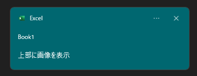
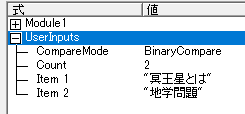

# AppNotificationBuilderVBA
VBAから、[アプリ通知(トースト通知)](https://learn.microsoft.com/ja-jp/windows/apps/design/shell/tiles-and-notifications/adaptive-interactive-toasts)を表示する機能を提供します。

# DEMO

| シチュエーション例            | 動作イメージ | 
| ---------------------------- |   ------------ | 
| 処理終了 その1                    |        | 
| 処理終了 その2          |        | 
| リマインド通知          |        | 
| プログレスバー付き通知          |        | 

他にも様々なアプリ通知の外観を設定できます。設定方法等は後述します。

# Features
- DLLインポートと専用に用意されたクラスファイルをインポートすることにより、数行で手軽にアプリ通知の表示が可能です。
- DLLインポートが使用できない環境でも、WindowsPowerShellを経由したアプリ通知の表示が可能です。
- [「自動的に閉じるMsgBox」](http://officetanaka.net/excel/vba/tips/tips21.htm)の代わりに使用することが可能です。
- 昔ながらの通知手法：[Shell_NotifyIconA](https://learn.microsoft.com/ja-jp/windows/win32/api/shellapi/nf-shellapi-shell_notifyicona)ではなく、WinRT APIを使った通知手法なので、カスタマイズ性が高いです。

# Development History
「自動的に閉じるMsgBox」という機能に一定のニーズを感じ、その代替として作ってみました。<br>
この機能は、vbsで実現しておりそのvbsがもうすぐで最新OSでは、搭載しなくなるとのことで色々と試行錯誤して作成してみました。<br>
モダンなWindows との親和性を高めるためにも、使ってみてはいかがでしょうか？

# Requirement

以下で検証済みです。

- Microsoft Office Excel 2019 以上 64bit
- Windows 10 , 11 64bit

# Load DLL

WindowsAPIの「LoadLibrary関数」を使って、読み込みます。

```bas
hDll = LoadLibrary("AppNotificationBuilderVBA.dll")
```

実際に使う場合は、"Excelファイル(.xlsm)の存在するディレクトリ"というような[動的な場所を設定する仕組み](https://liclog.net/vba-dll-create-5/)で読み込むことをおすすめします。

```bas
'動的にDLLを取得するためのWinAPI
Private Declare PtrSafe Function LoadLibrary Lib "kernel32" Alias "LoadLibraryA" (ByVal lpLibFileName As String) As LongPtr

Private Sub Workbook_Open()

    Dim hDll As LongPtr
    Dim sFolderPath As String
    
    'DLLファイルを保存するフォルダパスを設定
    sFolderPath = ThisWorkbook.Path
    
    'DLLﾌｧｲﾙを読み込む
    hDll = LoadLibrary(sFolderPath & "\" & "AppNotificationBuilderVBA.dll")　'DLLファイルフルパス

    debug.print hDll
End Sub
```

hDll の中身が、0 以外であれば読み込み、成功です。

# Usage

1. [このクラスファイル](doc/AssistMakeToastSchema/cls_AppNotificationBuilder.cls)をVisual Basic Editorのプロジェクトにインポートして下さい。<br>

2. Visual Basic Editorを開きメニューバーの「ツール」→「参照設定」→「Microsoft XML v6.0」にCheckをいれOKを押下して下さい。<br>
<br>
<br>
これは、クラスファイルで[トースト コンテンツ スキーマ](https://learn.microsoft.com/ja-jp/uwp/schemas/tiles/toastschema/schema-root)の作成に使います。

3. 標準モジュールを作成し、下記のように簡単なコードを記述してみましょう
```bas
Sub ShowToastTest()
    With New cls_AppNotificationBuilder
        '1. プロパティ設定
       .SetToastContent_TextTitle = "Hello World"
       .SetToastContent_TextBody = "Test message"

        '2. メソッド実行
       .RunDll_ToastNotifierShow "Hello World"
    End With
End Sub
```
実行結果は、下記のとおりです<br>
<br>
この「Book1」は、Excelのブック名と連動しています。

# プロパティ説明
## AppUserModelID 関連
### AllowUse_InternetImage
HTTP上の画像ソースを使うか決めます。<br>
実際は、プリセットのOffice系AppUserModelIDを切り替えます。<br>
これは、[マニフェストにインターネット機能があるパッケージ アプリ](https://learn.microsoft.com/ja-jp/windows/apps/design/shell/tiles-and-notifications/send-local-toast?tabs=uwp#:~:text=%E3%81%A8%E3%81%97%E3%81%BE%E3%81%99%E3%80%82-,%E9%87%8D%E8%A6%81,-HTTP%20%E3%82%A4%E3%83%A1%E3%83%BC%E3%82%B8%E3%81%AF)(主にStore アプリ)でないと、HTTP上の画像ソースが使えない制限があるためです。

#### 設定値
| 値            | 設定するAppUserModelID                                                                          | 
| ------------- | ------------------------------------------------------------------------------- | 
| True          | <br>Microsoft.MicrosoftOfficeHub_8wekyb3d8bbwe!Microsoft.MicrosoftOfficeHub | 
| False(規定値) | <br>Microsoft.Office.EXCEL.EXE.15                                           | 

True の方を使用する場合は、[こちらから](https://www.microsoft.com/store/productId/9WZDNCRD29V9?ocid=pdpshare)インストールを行って下さい。<br>
既定値、記述なしは、Falseです。

#### サンプルコード
```bas
Sub TestAllowUse_InternetImage()
    Dim ActionCmd as String

    With New cls_AppNotificationBuilder
        '切り替え
        .AllowUse_InternetImage = True


        'タイトル設定
        .SetToastContent_TextTitle = "Microsoft 365から"

        'コマンド文字列を生成(Windows PowerShell経由で実行する場合)
        ActionCmd = .GenerateCmd_ToastNotifierShow("InternetImage")

        '通知表示
        .RunDll_ToastNotifierShow "InternetImage"
        'Shell ActionCmd,vbHide
    End With
End Sub
```

### SetToastContent_AppUserModelID
この通知をどのAppUserModelIDで出すかを設定します。<br>
存在しない(未インストール)AppUserModelID、無効な文字列を指定すると、Toastが発行されないのでご注意ください。<br>
このプロパティが設定されてると、AllowUse_InternetImageの設定より優先されます。

#### 設定値
Windows にインストールされているAppUserModelID

#### サンプルコード
```bas
Sub TestSetAppUserModelID()
    Dim ActionCmd as String

    With New cls_AppNotificationBuilder
        '任意のAppUserModelID
        .SetToastContent_AppUserModelID = "Microsoft.WindowsTerminal_8wekyb3d8bbwe!App"


        'コマンド文字列を生成(Windows PowerShell経由で実行する場合)
        ActionCmd = .GenerateCmd_ToastNotifierShow("By Terminal")

        'タイトル設定
        .SetToastContent_TextTitle = "By Terminal"

        '通知表示
        .RunDll_ToastNotifierShow "By Terminal"
        'Shell ActionCmd,vbHide
    End With
End Sub
```
<br>
上記の例では、[Windows Terminal](https://apps.microsoft.com/detail/9n0dx20hk701) のAppUserModelIDを設定します。<br>
既定値、記述なしは、vbnullstringです。

## [toast要素](https://learn.microsoft.com/ja-jp/uwp/schemas/tiles/toastschema/element-toast)
### SetToastContent_Duration
トーストが[表示される時間](https://learn.microsoft.com/ja-jp/uwp/schemas/tiles/toastschema/element-toast#:~:text=%E6%97%A2%E5%AE%9A%E5%80%A4-,duration,-%E3%83%88%E3%83%BC%E3%82%B9%E3%83%88%E3%81%8C%E8%A1%A8%E7%A4%BA)を設定します。

#### 設定値
| 値            | 説明                            | 
| ------------- | ------------------------------- | 
| False(既定値) | shortと同等                     | 
| True          | longと同等<br>25s、表示できます | 

#### サンプルコード
```bas
Sub 長く表示される通知()
    Dim AppNotification As New cls_AppNotificationBuilder
    Dim ActionCmd As String
    
    With AppNotification
        '25秒表示されます
        .SetToastContent_Duration = True


        'タイトル設定
        .SetToastContent_TextTitle = "25秒間、表示"

        'コマンド文字列を生成(Windows PowerShell経由で実行する場合)
        ActionCmd = .GenerateCmd_ToastNotifierShow("sample")

        '通知表示
        'Shell ActionCmd, vbHide
        .RunDll_ToastNotifierShow "sample"
    End With
End Sub
```


### SetToastContent_Launch
[トースト通知自体のクリック](https://learn.microsoft.com/ja-jp/uwp/schemas/tiles/toastschema/element-toast#:~:text=%E3%81%AA%E3%81%97-,launch,-%E3%83%88%E3%83%BC%E3%82%B9%E3%83%88%E9%80%9A%E7%9F%A5%E3%81%AB%E3%82%88%E3%81%A3%E3%81%A6)によって、アプリケーションがアクティブ化されるときにアプリケーションに渡される文字列です。
VBAでは、起動スキーマ(https:// , ms-excel:// など)を設定するぐらいの役目です。
#### 設定値
起動スキーマ
- https://
- ms-excel://

など

#### 利用可能な引数
| 引数名            | 解説                                                                                                                                                                                                                                                                                                                                                             | 既定値   | 
| ----------------- | ---------------------------------------------------------------------------------------------------------------------------------------------------------------------------------------------------------------------------------------------------------------------------------------------------------------------------------------------------------------- | -------- | 
| ArgActivationType | ユーザーが特定の操作を行った際に使用されるアクティブ化の種類を決定します。<br>・"foreground" - 既定値。 フォアグラウンド アプリが起動します。<br>・"background" - 対応するバックグラウンド タスクがトリガーされ、ユーザーを中断することなくバックグラウンドでコードを実行できます。<br>・"protocol" - プロトコルのアクティブ化を使用して別のアプリを起動します。 | protocol | 

#### サンプルコード
```bas
Sub リンクを開く()
    Dim AppNotification As New cls_AppNotificationBuilder
    Dim ActionCmd As String
    
    With AppNotification
        'URL等を指定
        .SetToastContent_Launch = "https://www.google.com/"


        'タイトル設定
        .SetToastContent_TextTitle = "このトーストをクリックすると、指定リンクに対応するアプリが起動"

        'コマンド文字列を生成(Windows PowerShell経由で実行する場合)
        ActionCmd = .GenerateCmd_ToastNotifierShow("sample")

        '通知表示
        'Shell ActionCmd, vbHide
        .RunDll_ToastNotifierShow "sample"
    End With
End Sub
```


### SetToastContent_DisplayTimestamp
Windows プラットフォームによって通知が受信された時刻ではなく、通知コンテンツが実際に配信された日時を表すカスタム タイムスタンプで既定の[タイムスタンプをオーバーライド](https://learn.microsoft.com/ja-jp/windows/apps/design/shell/tiles-and-notifications/custom-timestamps-on-toasts?tabs=xml)します。

#### 設定値
Excelのシリアル値

#### サンプルコード
```bas
Sub アプリ通知のカスタムタイムスタンプ()
    Dim AppNotification As New cls_AppNotificationBuilder
    Dim ActionCmd As String
    
    With AppNotification
        'シリアル値で設定。基本は過去に設定
        .SetToastContent_DisplayTimestamp = Now() - 0.1


        .SetToastContent_TextTitle = "Hello World"
        .SetToastContent_TextBody = "このメッセージは、以前から通知されてました。"
        .SetToastContent_TextAttribute = "カスタムタイムスタンプテスト"

        'コマンド文字列を生成(Windows PowerShell経由で実行する場合)
        ActionCmd = .GenerateCmd_ToastNotifierShow("sample")

        '通知表示
        'Shell ActionCmd, vbHide
        .RunDll_ToastNotifierShow "sample"
    End With
End Sub
```


### SetToastScenario
トーストが使用される[シナリオ](https://learn.microsoft.com/ja-jp/windows/apps/design/shell/tiles-and-notifications/adaptive-interactive-toasts?tabs=xml#scenarios)を設定します。列挙型に対応します。

#### 設定値
| シナリオ名   | 主な特徴                                                                                                                                                                                  | 
| ------------ | ------------------------------------------------------------------------------------------------------------------------------------------------------------------------------------- | 
| Default(既定値)      | 一般的な挙動通知                                                                                                                                                                      | 
| [Reminder](https://learn.microsoft.com/ja-jp/windows/apps/design/shell/tiles-and-notifications/adaptive-interactive-toasts?tabs=xml#reminders)     | ・通知を永遠に表示する。<br>・action要素がないと効果は発動しない<br>・任意の通知音に設定可能<br>                                                                                          | 
| [Alarm](https://learn.microsoft.com/ja-jp/windows/apps/design/shell/tiles-and-notifications/adaptive-interactive-toasts?tabs=xml#alarms)        | ・通知を永遠に表示する。<br>・action要素がないと効果は発動しない<br>・通知音は、アラーム系(Alarm)のみ<br>・応答不可モードでも必ず表示<br>                                                 | 
| [IncomingCall](https://learn.microsoft.com/ja-jp/windows/apps/design/shell/tiles-and-notifications/adaptive-interactive-toasts?tabs=xml#incoming-calls) | ・通知を永遠に表示する。<br>・action要素がなくても効果発動<br>・通知音は呼び出し系(Call)のみ<br>・最後のボタン位置のみ、Windowsのテーマ色に基づく着色が施され、位置が必ず下側になる。<br> | 
| [Urgent](https://learn.microsoft.com/ja-jp/windows/apps/design/shell/tiles-and-notifications/adaptive-interactive-toasts?tabs=xml#important-notifications)       | ・通知に感嘆符が付与<br>・応答不可モードでの表示/非表示の、切り替え可能<br>・Build 22546 以降のOS で有効<br>                                                                                                               | 

#### サンプルコード
```bas
Sub シナリオテスト()
    Dim AppNotification As New cls_AppNotificationBuilder
    Dim ActionCmd As String
    
    With AppNotification
        'トーストのシナリオを設定(ctrl + Space で候補を表示できます)
        .SetToastScenario = Urgent


        '紐付け用識別子(解説は後述)
        Const ReminderID As String = "アラーム"

        'select要素を準備(解説は後述)
        .SetToastSelectionBox(1, "1 分後") = 1
        .SetToastSelectionBox(5, "5 分後") = 2
        .SetToastSelectionBox(10, "10 分後") = 3
        .SetToastSelectionBox(30, "30 分後") = 4
        .SetToastSelectionBox(60, "1 時間後") = 5

        'input要素を作成し、上記で準備したselect要素を挿入(解説は後述)
        .SetIToastInput(ReminderID, True, , "選択肢から、再通知する時間を選択", 10) = 1

        '再通知用と、解除用を用意(解説は後述)
        .SetIToastActions("", "snooze", "system", , , , ReminderID) = 1
        .SetIToastActions("", "dismiss", "system") = 2

        'テキスト要素を用意
        .SetToastContent_TextTitle = "Hello World"

        'コマンド文字列を生成(Windows PowerShell経由で実行する場合)
        ActionCmd = .GenerateCmd_ToastNotifierShow("sample")

        '通知表示
        .RunDll_ToastNotifierShow "sample"
        'Shell ActionCmd, vbHide

    End With
End Sub
```

### AllowToastContent_UseButtonStyle
toast要素の[useButtonStyle](https://learn.microsoft.com/ja-jp/uwp/schemas/tiles/toastschema/element-toast#:~:text=%E3%81%AA%E3%81%97-,useButtonStyle,-%E3%82%B9%E3%82%BF%E3%82%A4%E3%83%AB%E4%BB%98%E3%81%8D%E3%83%9C%E3%82%BF%E3%83%B3)属性の設定を行います。<br>

#### 設定値
| 値            | 説明                            | 
| ------------- | ------------------------------- | 
| False(既定値) | スタイル付きボタンを使用できないようにします。後述の[action 要素](#SetIToastActions)の 「hint-buttonStyle」 属性に影響しません。 | 
| True          | スタイル付きボタンを使用できるようにします。後述の[action 要素](#SetIToastActions)の 「hint-buttonStyle」 属性に影響します。 | 

#### サンプルコード
```bas
Sub UseButtonStyle()
    Dim AppNotification As New cls_AppNotificationBuilder
    Dim ActionCmd As String
    
    With AppNotification
        'スタイル付きボタンを有効化
        .AllowToastContent_UseButtonStyle = True


        'タイトル設定
        .SetToastContent_TextTitle = "緑と赤のボタン"

        '設定方法は後述
        .SetIToastActions("Green", "", , , , , , Success) = 1
        .SetIToastActions("Red", "", , , , , , Critical) = 2

        'コマンド文字列を生成(Windows PowerShell経由で実行する場合)
        ActionCmd = .GenerateCmd_ToastNotifierShow("sample")

        '通知表示
        'Shell ActionCmd, vbHide
        .RunDll_ToastNotifierShow "sample"
    End With
End Sub
```


## [image要素](https://learn.microsoft.com/ja-jp/uwp/schemas/tiles/toastschema/element-image)
### SetToastContent_ImageAppLogo
image要素のうち、AppLogo(appLogoOverride)に設定する画像のパスと、丸いロゴフラグの設定を行います。<br>

#### 設定値
ロゴ画像のパス指定
- ローカルパス(C:\\)
- HTTPソース(https://)

#### 利用可能な引数
| 引数名             | 説明                                                                                                           | 既定値       | 
| ------------------ | -------------------------------------------------------------------------------------------------------------- | ------------ | 
| Arg_LogoCircle     | True：画像は円にトリミングされます。<br>False：画像はトリミングされず、正方形として表示されます。              | False        | 
| Flag_addImageQuery | Windows がトースト通知で指定されたイメージ URI にクエリ文字列を追加できるようにするには、"true" に設定します。 | False        | 
| Arg_Alt            | 支援技術のユーザー向けの画像の説明。                                                                      | vbnullstring | 

#### サンプルコード
```bas
Sub 丸いロゴ画像()
    Dim AppNotification As New cls_AppNotificationBuilder
    Dim ActionCmd As String
    
    With AppNotification
        'ロゴ画像のパスを指定します。(Arg_LogoCircle=False)
        .SetToastContent_ImageAppLogo = "C:\Windows\SystemApps\Microsoft.XboxGameCallableUI_cw5n1h2txyewy\Assets\Logo.scale-100.png"

        'ロゴ画像のパスを指定し、円にトリミング。(Arg_LogoCircle=True)
        '.SetToastContent_ImageAppLogo(True) = "C:\Windows\SystemApps\Microsoft.XboxGameCallableUI_cw5n1h2txyewy\Assets\Logo.scale-100.png"


        'タイトル設定
        .SetToastContent_TextTitle = "ロゴ画像テスト"

        'コマンド文字列を生成(Windows PowerShell経由で実行する場合)
        ActionCmd = .GenerateCmd_ToastNotifierShow("sample")

        '通知表示
        .RunDll_ToastNotifierShow "sample"
        'Shell ActionCmd, vbHide
    End With
End Sub
```

| Arg_LogoCircle=False | Arg_LogoCircle=True | 
| -------------------- | ------------------- | 
|                    |                   | 

### SetToastContent_ImageInline
image要素のうち、テキスト要素の後に表示する画像パスと、丸いロゴフラグの設定を行います。<br>
先ほどと同様、インライン画像のパス指定も、ローカルパス(C:\\)、HTTPソースに対応してます。<br>
引数の内容も同様のため、省略します。

#### サンプルコード
```bas
Sub インライン画像()
    Dim AppNotification As New cls_AppNotificationBuilder
    Dim ActionCmd As String
    
    With AppNotification
        '通常
        .SetToastContent_ImageInline(False, , "win の壁紙") = "C:\Windows\Web\Screen\img100.jpg"
        '円にトリミング
        ''.SetToastContent_ImageInline(True, , "win の壁紙") = "C:\Windows\Web\Screen\img100.jpg"


        'タイトル設定
        .SetToastContent_TextTitle = "インライン画像テスト"

        'コマンド文字列を生成(Windows PowerShell経由で実行する場合)
        ActionCmd = .GenerateCmd_ToastNotifierShow("sample")

        '通知表示
        'Shell ActionCmd, vbHide
        .RunDll_ToastNotifierShow "sample"
    End With
End Sub
```

| Arg_LogoCircle=False | Arg_LogoCircle=True | 
| -------------------- | ------------------- | 
|                    |                   | 

### SetToastContent_ImageHero
ヒーローイメージとして表示させる画像を設定します。<br>

#### 設定値
ヒーロー画像のパス指定
- ローカルパス(C:\\)
- HTTPソース(https://)

#### 利用可能な引数
| 引数名             | 説明                                                                                                           | 既定値       | 
| ------------------ | -------------------------------------------------------------------------------------------------------------- | ------------ | 
| Flag_addImageQuery | Windows がトースト通知で指定されたイメージ URI にクエリ文字列を追加できるようにするには、"true" に設定します。 | False        | 
| Arg_Alt            | 支援技術のユーザー向けの画像の説明。                                                                      | vbnullstring | 

#### サンプルコード
```bas
Sub 上部に画像()
    Dim AppNotification As New cls_AppNotificationBuilder
    Dim ActionCmd As String
    
    With AppNotification
        '上部に画像を配置します
        .SetToastContent_ImageHero(, "win11壁紙") = "C:\Windows\Web\Screen\img100.jpg"


        'タイトル設定
        .SetToastContent_TextTitle = "上部に画像を配置"

        'コマンド文字列を生成(Windows PowerShell経由で実行する場合)
        ActionCmd = .GenerateCmd_ToastNotifierShow("sample")

        '通知表示
        'Shell ActionCmd, vbHide
        .RunDll_ToastNotifierShow "sample"
    End With
End Sub
```


## [text要素](https://learn.microsoft.com/ja-jp/uwp/schemas/tiles/toastschema/element-text)
アプリ通知で使用されるテキストを指定します。

#### 設定値
任意の文字列。
| プロパティ名                   | 配置位置 | 最大行数 | 
| ----------------------------- | -------- | -------- | 
| SetToastContent_TextTitle     | タイトル | 2行      | 
| SetToastContent_TextBody      | 内容     | 4行      | 
| SetToastContent_TextAttribute | 下部     | 2行      | 

### 利用可能な引数
| 引数名             | 説明                                                                                                           | 既定値       | 
| ------------------ | -------------------------------------------------------------------------------------------------------------- | ------------ | 
| HintCallScenarioCenterAlign | 横中央揃えの配置にする設定です。trueにしつつ、シナリオモードを「IncomingCall」にしないと効果ありません。 | False        | 

#### サンプルコード
```bas
Sub 最大行数テキスト()
    Dim AppNotification As New cls_AppNotificationBuilder
    Dim ActionCmd As String

    With AppNotification
        'テキスト設定
        .SetToastContent_TextTitle(False) = "タイトル 1Line" & vbCrLf & "タイトル 2Line" & vbCrLf & "タイトル 3Line"
        .SetToastContent_TextBody(False) = "コンテンツ 1Line" & vbCrLf & "コンテンツ 2Line" & vbCrLf & "コンテンツ 3Line" & vbCrLf & "コンテンツ 4Line" & vbCrLf & "コンテンツ 5Line"
        .SetToastContent_TextAttribute(False) = "コンテンツソース 1Line" & vbCrLf & "コンテンツソース 2Line" & vbCrLf & "コンテンツソース 3Line"


        '中央揃えにするとき
        '.SetToastScenario = IncomingCall

        'コマンド文字列を生成(Windows PowerShell経由で実行する場合)
        ActionCmd = .GenerateCmd_ToastNotifierShow("sample")

        '通知表示
        'Shell ActionCmd, vbHide
        .RunDll_ToastNotifierShow "sample"
    End With
```

| HintCallScenarioCenterAlign = False             | HintCallScenarioCenterAlign = True かつ、SetToastScenario = IncomingCall |
| ------------------------------------------------- | --------------------------------------- |
|            |  |

## [audio要素](https://learn.microsoft.com/ja-jp/uwp/schemas/tiles/toastschema/element-audio)
### SetToastAudio
アプリ通知を表示するときに再生するサウンドを指定します。 ミュートも対応してます。<br>
ただし、ファイルシステム上の音声ファイルのパスや URLの指定は使えません。システムで決められた通知音のみ設定可能です。

#### 設定値
設定可能な通知音は、[こちら](https://learn.microsoft.com/ja-jp/uwp/schemas/tiles/toastschema/element-audio#:~:text=false-,src,-%E6%97%A2%E5%AE%9A%E3%81%AE%E3%82%B5%E3%82%A6%E3%83%B3%E3%83%89)をどうぞ。<br>
また、False で指定すると、ミュート扱いになります。

#### 利用可能な引数
| 引数名             | 説明                                                                                                           | 既定値       | 
| ------------------ | -------------------------------------------------------------------------------------------------------------- | ------------ | 
| ArgLoop            | トーストが表示されている限り、サウンドを繰り返す場合は true に設定します。<br> 1 回だけ再生する場合は false。  | False        | 

#### サンプルコード
```bas
Sub 通知音変更テスト()
    Dim AppNotification As New cls_AppNotificationBuilder
    Dim ActionCmd As String

    With AppNotification
        '通知音設定(ctrl + Space　で候補が出ます)
        .SetToastAudio = NotificationLoopingAlarm01


        'タイトル設定
        .SetToastContent_TextTitle = "通知音変更"

        'コマンド文字列を生成(Windows PowerShell経由で実行する場合)
        ActionCmd = .GenerateCmd_ToastNotifierShow("sample")

        '通知表示
        'Shell ActionCmd, vbHide
        .RunDll_ToastNotifierShow "sample"
    End With
End Sub
```

## [action要素](https://learn.microsoft.com/ja-jp/uwp/schemas/tiles/toastschema/element-action)
### SetIToastActions
トーストに表示されるボタンを指定します。
#### 設定値
ボタンの配置順。1~5まで有効です。

#### 利用可能な引数
| 引数名             | 説明                                                                                                                                                                                                                                                                                                                                                             | 既定値                       | 
| ------------------ | ---------------------------------------------------------------------------------------------------------------------------------------------------------------------------------------------------------------------------------------------------------------------------------------------------------------------------------------------------------------- | ---------------------------- | 
| ArgContent         | ボタンに表示されるコンテンツ                                                                                                                                                                                                                                                                                                                                     | ※必須項目                   | 
| ArgArguments       | ユーザーがこのボタンをクリックした場合にアプリが後から受け取る、アプリで定義された引数の文字列です。                                                                                                                                                                                                                                                             | ※必須項目だが、空文字でもOK | 
| ArgActivationType  | ユーザーが特定の操作を行った際に使用されるアクティブ化の種類を決定します。<br>・"foreground"：既定値。 フォアグラウンド アプリが起動します。<br>・"background"：対応するバックグラウンド タスクがトリガーされ、ユーザーを中断することなくバックグラウンドでコードを実行できます。<br>・"protocol"：プロトコルのアクティブ化を使用して別のアプリを起動します。 <br>・"system"：ArgArgumentsに特定の文字列を入れると、リマインダー機能が使えます。(後述)| protocol                     | 
| ArgPendingUpdate   | ・TRUE：ユーザーがトースト上のボタンをクリックすると、通知は "保留中の更新" 表示状態のままです。 この "更新の保留中" の表示状態が長時間続くことを避けるため、バックグラウンド タスクから即座にトーストを更新する必要があります。<br>・FALSE：ユーザーがトーストに対して操作を行うと、トーストが無視されます。                                                    | FALSE                        | 
| ArgContextMenu     | ・TRUE：トースト ボタンではなく、トースト通知のコンテキスト メニューに追加されたコンテキスト メニュー アクションになります。<br>・FALSE：従来通り、トースト ボタンに配置                                                                                                                                                                                         | FALSE                        | 
| ArgIcon            | トースト ボタン アイコンのイメージ ソースの URI。<br>ローカルパス、HTTPソースに対応します。                                                                                                                                                                                                                                                                      | vbnullstring                 | 
| ArgHintInputId     | 入力の横にある [位置への 入力 ] ボタンの ID に設定します。                                                                                                                                                                                                                                                                                                       | vbnullstring                 | 
| ArgHintButtonStyle | ボタンのスタイル。<br>事前に[toast要素のuseButtonStyle属性](#AllowToastContent_UseButtonStyle)にtrue を設定する必要があります。<br><br>・Success：緑<br>・Critical：赤<br>・NoStyle：無色                                                                                                                                                                                                             | NoStyle                      | 
| ArgHintToolTip     | ボタンに空のコンテンツ文字列がある場合のボタンのヒント。                                                                                                                                                                                                                                                                                                         | vbnullstring                 | 

#### サンプルコード
```bas
Sub MakeActionTest()
    Dim AppNotification As New cls_AppNotificationBuilder
    Dim ActionCmd As String

    With AppNotification
        'ボタン作成
        .SetIToastActions("Green", "", , , , , , Success) = 1
        
        'コンテキストメニュー側に移す
        .SetIToastActions("コンテキストメニューにあります", "", , , True) = 2
        
        'ボタンにカーソルをあてるとToolTip表示し、アイコンセット
        .SetIToastActions("", "ms-search://Search", , , , "C:\Windows\IdentityCRL\WLive48x48.png", , , "クリックで、検索を開く") = 3
        
        'このボタンを押下すると、Youtubeにアクセスします
        .SetIToastActions("YouTube開く", "https://www.youtube.com/", , , , , , Critical) = 4


        'スタイル付きボタンの有効化
        .AllowToastContent_UseButtonStyle = True

        'タイトル設定
        .SetToastContent_TextTitle = "ActionTest"

        'コマンド文字列を生成(Windows PowerShell経由で実行する場合)
        ActionCmd = .GenerateCmd_ToastNotifierShow("sample")

        '通知表示
        'Shell ActionCmd, vbHide
        .RunDll_ToastNotifierShow "sample"
    End With
End Sub
```

 

## [subgroup要素](https://learn.microsoft.com/ja-jp/uwp/schemas/tiles/toastschema/element-subgroup)
更に情報を追加したい場合にお使い下さい。比較的、カスタマイズ性が高いです。
### [Add_SubgroupInnerText](https://learn.microsoft.com/ja-jp/windows/apps/design/shell/tiles-and-notifications/toast-schema#adaptivetext)
テキスト要素を追加します。ある程度の書式設定が可能です。

#### 設定値
任意の文字列<br>
折り返しを使用する場合は引数：HintWrap を True にすること。

#### 利用可能な引数
| 引数名            | 説明                                                                                                                           | 既定値            | 
| ----------------- | ------------------------------------------------------------------------------------------------------------------------------ | ----------------- | 
| [HintStyle](https://learn.microsoft.com/ja-jp/windows/apps/design/shell/tiles-and-notifications/toast-schema#adaptivetextstyle)             | 書式設定を施します。指定の文字列を入力することで、それに対応する書式が反映されます | Default | 
| HintWrap      | ・True：テキストの折り返しが有効になります。<br>・False：テキストの折り返しが無効になります。(最大行数1行)                                        | False | 
| HintMaxLines | 表示が許可される、テキスト要素の最大行数です。 | 0(上限なし) | 
| HintMinLines | 表示する必要のある、テキスト要素の最小行数です。 | 0 | 
| [HintAlign](https://learn.microsoft.com/ja-jp/windows/apps/design/shell/tiles-and-notifications/toast-schema#adaptivetextalign) | テキストの水平方向の配置を指定します。             | Default | 
| Language | "en-US" や "ja-JP" のように BCP-47 言語タグとして指定されます。 | vbnullstring | 

### [Add_SubgroupInnerImage](https://learn.microsoft.com/ja-jp/windows/apps/design/shell/tiles-and-notifications/toast-schema#adaptiveimage)
画像要素を追加します。

#### 設定値
画像パス<br>
ローカルパス、httpソースがつかえます。

#### 利用可能な引数
| 引数名            | 説明                                                                                                                           | 既定値            | 
| ----------------- | ------------------------------------------------------------------------------------------------------------------------------ | ----------------- | 
| [HintCrop](https://learn.microsoft.com/ja-jp/windows/apps/design/shell/tiles-and-notifications/toast-schema#adaptiveimagecrop)  | イメージの目的のトリミングを制御します。 | Default | 
| HintRemoveMargin      | ・True：8 ピクセルの余白を生成(マージン処理)<br>・False：マージン処理なし                                       | True | 
| [HintAlign](https://learn.microsoft.com/ja-jp/windows/apps/design/shell/tiles-and-notifications/toast-schema#adaptiveimagealign) | 画像の水平方向の配置です。 | Default  | 
| AlternateText | アクセシビリティ対応目的で使用される、画像を説明する代替テキストです。 | Default  | 
| AddImageQuery | ・True：クエリ文字列付きURLを許可<br>・False：クエリ文字列付きURLを拒否  | False  | 

### [AddToastSubgroup](https://learn.microsoft.com/ja-jp/windows/apps/design/shell/tiles-and-notifications/toast-schema#adaptivesubgroup)
事前に、Add_SubgroupInnerText、Add_SubgroupInnerImage を呼び出した物に対して、Subgroup要素に挿入します。<br>
なお、これを呼び出すと以前設定した、subgroup要素内のtext,image要素はリセットされます。
#### 利用可能な引数
| 引数名            | 説明                                                                                                                           | 
| ----------------- | ------------------------------------------------------------------------------------------------------------------------------ | 
| HintWeight        | 列の幅を制御します。         |
| [HintTextStacking](https://learn.microsoft.com/ja-jp/windows/apps/design/shell/tiles-and-notifications/toast-schema#adaptivesubgrouptextstacking)  | 垂直方向の配置を制御します。  |

#### サンプルコード
次のコードは、週間天気予報っぽい通知を作成します
```bas
Sub 天気予報ライク()
    Dim AppNotification As New cls_AppNotificationBuilder
    Dim ActionCmd As String
    
    With AppNotification
        'ネット上の画像を使うようにする
        .AllowUse_InternetImage = True
        
        'ルートURLを設定
        .SetToastBinding = "https://weathernews.jp/s/topics/img/wxicon/"
        
        'タイトル
        .SetToastContent_TextTitle = "来週の天気予報"
        .SetToastHeader(vbNullString) = ""
        
        '1subgroup
        .Add_SubgroupInnerText(, , , , TextAlign_Center) = "Mon"
        .Add_SubgroupInnerImage = "100.png"
        .Add_SubgroupInnerText(, , , , TextAlign_Center) = "29℃"
        .Add_SubgroupInnerText(TextStyle_CaptionSubtle, , , , TextAlign_Center) = "23℃"
        .AddToastSubgroup (1)

        '2subgroup
        .Add_SubgroupInnerText(, , , , TextAlign_Center) = "Tue"
        .Add_SubgroupInnerImage = "550.png"
        .Add_SubgroupInnerText(, , , , TextAlign_Center) = "36℃"
        .Add_SubgroupInnerText(TextStyle_CaptionSubtle, , , , TextAlign_Center) = "26℃"
        .AddToastSubgroup (1)

        '3subgroup
        .Add_SubgroupInnerText(, , , , TextAlign_Center) = "Wed"
        .Add_SubgroupInnerImage = "200.png"
        .Add_SubgroupInnerText(, , , , TextAlign_Center) = "26℃"
        .Add_SubgroupInnerText(TextStyle_CaptionSubtle, , , , TextAlign_Center) = "23℃"
        .AddToastSubgroup (1)

        '4subgroup
        .Add_SubgroupInnerText(, , , , TextAlign_Center) = "Thu"
        .Add_SubgroupInnerImage = "300.png"
        .Add_SubgroupInnerText(, , , , TextAlign_Center) = "25℃"
        .Add_SubgroupInnerText(TextStyle_CaptionSubtle, , , , TextAlign_Center) = "23℃"
        .AddToastSubgroup (1)

        '5subgroup
        .Add_SubgroupInnerText(, , , , TextAlign_Center) = "Fri"
        .Add_SubgroupInnerImage = "850.png"
        .Add_SubgroupInnerText(, , , , TextAlign_Center) = "24℃"
        .Add_SubgroupInnerText(TextStyle_CaptionSubtle, , , , TextAlign_Center) = "22℃"
        .AddToastSubgroup (1)

        '6subgroup
        .Add_SubgroupInnerText(, , , , TextAlign_Center) = "Sat"
        .Add_SubgroupInnerImage = "430.png"
        .Add_SubgroupInnerText(, , , , TextAlign_Center) = "20℃"
        .Add_SubgroupInnerText(TextStyle_CaptionSubtle, , , , TextAlign_Center) = "14℃"
        .AddToastSubgroup (1)

        '7subgroup
        .Add_SubgroupInnerText(, , , , TextAlign_Center) = "Sun"
        .Add_SubgroupInnerImage = "411.png"
        .Add_SubgroupInnerText(, , , , TextAlign_Center) = "21℃"
        .Add_SubgroupInnerText(TextStyle_CaptionSubtle, , , , TextAlign_Center) = "18℃"
        .AddToastSubgroup (1)


        '実行コマンドを格納
        ActionCmd = .GenerateCmd_ToastNotifierShow("sample033")

        '通知表示
        .RunDll_ToastNotifierShow "sample033"
        'wsh.Run ActionCmd, 0, False
    End With
End Sub
```


## [header要素](https://learn.microsoft.com/ja-jp/uwp/schemas/tiles/toastschema/element-header)
### SetToastHeader
アクション センター内で複数の通知をグループにまとめるカスタム ヘッダーを指定します。<br>
なお、Classファイルを定義する際(Class_Initialize)、予め既定値を入れるように仕込んでいるため基本、呼び出す必要はありません。

#### 設定値
任意の文字列<br>
既定値は、ThisWorkbook.Nameですが、拡張子がある場合は、省略します。

#### 利用可能な引数
| 引数名            | 説明                                                                                                                           | 既定値            | 
| ----------------- | ------------------------------------------------------------------------------------------------------------------------------ | ----------------- | 
| ArgID             | このヘッダーを一意に識別します。 2 つの通知が同じヘッダー ID を持つ場合、アクション センターで同じヘッダーの下に表示されます。 | ThisWorkbook.Name | 
| ArgArguments      | ユーザーがこのヘッダーをクリックするとアプリに返されます。 null にすることはできません。                                       | ThisWorkbook.Path | 
| ArgActivationType | このヘッダーがクリックされた場合に使用するアクティブ化の種類。                                                                 | protocol          | 

#### サンプルコード
```bas
Sub ヘッダーテスト()
    Dim AppNotification As New cls_AppNotificationBuilder
    Dim ActionCmd As String

    With AppNotification
        'ヘッダー名を変更
        .SetToastHeader = "えくせる"


        'コマンド文字列を生成(Windows PowerShell経由で実行する場合)
        ActionCmd = .GenerateCmd_ToastNotifierShow("sample")

        '通知表示
        'Shell ActionCmd, vbHide
        .RunDll_ToastNotifierShow "sample"
    End With
End Sub
```
<br>

ヘッダーをクリアしたい場合は下記のようにします
```bas
With New cls_AppNotificationBuilder
    .SetToastHeader(vbnullstring) = ""
End With
```


## [input要素](https://learn.microsoft.com/ja-jp/uwp/schemas/tiles/toastschema/element-input)
### SetIToastInput
トースト通知に表示される入力 (テキスト ボックスまたは選択メニュー) を指定します。<br>
VBAでは基本、リマインダー用途でしか使い所がないと思います。

#### 設定値
Input要素の配置順。1~5まで有効です。

#### 利用可能な引数
| 引数名                | 説明                                                                    | 既定値       | 
| --------------------- | ----------------------------------------------------------------------- | ------------ | 
| ArgID                 | 入力に関連付けられている ID                                             | ※必須項目     | 
| ChoseFlag             | ・True："selection"<br>・False："text"                                  | False        | 
| ArgPlaceHolderContent | テキスト入力用に表示されるプレースホルダー。<br>ChoseFlag=False時、有効 | vbnullstring | 
| ArgTitle              | 入力のラベルとして表示されるテキスト                                    | vbnullstring | 
| ArgDefaultInput       | デフォルトの入力値                                                      | vbnullstring | 

#### サンプルコード
```bas
Sub メッセージ()
    Dim AppNotification As New cls_AppNotificationBuilder
    Dim ActionCmd As String
    
    With AppNotification
        'テキスト入力要素を作成
        .SetIToastInput("textBox", , "reply", "テキスト入力ができます。", "はみがきなう！") = 1


        'InputのIDと、Actionのhint-inputIdを同じ値にして、同じIndex値に対応するInput要素の横にボタンを配置できます
        .SetIToastActions("Send", "", , , , , "textBox") = 1

        'ネット上の画像を使用する
        .AllowUse_InternetImage = True
        .SetToastContent_ImageAppLogo(True) = "https://blogger.googleusercontent.com/img/b/R29vZ2xl/AVvXsEhkdhNl7CCgOAZmjObZRRINCu9udW_Mum-_FSCEvLFULZRP_wEuO_Y1grKy28zSCw2fyBN5jM2RS1PYmE9prAk5uSI8ImDn1wcyZPy8ctGJ-vFaY36ULy_rjvrilHjXjuN0_O-p6sQi3Hc3/s857/ha_hamigaki_suit_woman.png"
        .SetToastContent_ImageHero = "https://unsplash.it/360/180?image=1043"

        .SetToastContent_TextTitle = "メッセージ返信デザイン"

        'コマンド文字列を生成(Windows PowerShell経由で実行する場合)
        ActionCmd = .GenerateCmd_ToastNotifierShow("sample")

        '通知表示
        'Shell ActionCmd, vbHide
        .RunDll_ToastNotifierShow "sample"
    End With
End Sub
```
 <br>


## [selection要素](https://learn.microsoft.com/ja-jp/uwp/schemas/tiles/toastschema/element-selection)
### SetToastSelectionBox
選択項目の id とテキストを指定します。全て必須項目です。
基本、リマインダー用途のみとなります。

#### 設定値
selection要素の配置順。1~5まで有効です。

#### 利用可能な引数
| 引数名         | 説明                                               | 備考                       | 
| -------------- | -------------------------------------------------- | -------------------------- | 
| ReminderMinute | 何分後にリマインダー通知させるか、値で指定します。 | vbnullstringで未定義扱いとします。 | 
| ArgChoseName   | 選択項目の内容                                     |                            | 

#### [リマインダーの設定方法](https://learn.microsoft.com/ja-jp/windows/apps/design/shell/tiles-and-notifications/adaptive-interactive-toasts?tabs=xml#snoozedismiss)
Input要素と、selection要素を使ったリマインダー方法を紹介します。<br>
コード内コメントにある手順を参考にどうぞ。

#### サンプルコード
```bas
Sub リマインドテスト()
    Dim AppNotification As New cls_AppNotificationBuilder
    Dim ActionCmd As String
    
    With AppNotification
        '1. トーストシナリオをリマインダーか、アラームにする
        .SetToastScenario = Reminder

        '2. 紐付け用識別子を設定
        Const ReminderID As String = "リマインダー"

        '3. select要素を準備し、リマインドする"分"と名称をセット(最大、5つ)
        .SetToastSelectionBox(1, "1 分後") = 1
        .SetToastSelectionBox(5, "5 分後") = 2
        .SetToastSelectionBox(10, "10 分後") = 3
        .SetToastSelectionBox(30, "30 分後") = 4
        .SetToastSelectionBox(60, "1 時間後") = 5

        '4. input要素を作成し、上記で準備したselect要素を挿入し、先ほど作成した紐付け用識別子をInput-IDにセット
        .SetIToastInput(ReminderID, True, , "選択肢から、リマインドする時間を選択", 10) = 1

        '5. 再通知用と、解除用を用意("snooze", "system",ReminderID にセットされてる引数位置は、必ずこの値にする)
        .SetIToastActions("", "snooze", "system", , , , ReminderID) = 1
        .SetIToastActions("", "dismiss", "system") = 2

        '6. テキスト要素を用意(任意)
        .SetToastContent_TextTitle = "リマインダーテスト"
        .SetToastContent_TextBody = "「再通知」で、選択した時間で、再通知" & vbcrlf & "解除で、何もしない"

        '7. コマンド文字列を生成(Windows PowerShell経由で実行する場合)
        ActionCmd = .GenerateCmd_ToastNotifierShow("リマインド")

        '8. 通知表示
        .RunDll_ToastNotifierShow "リマインド"
        'Shell ActionCmd,vbHide
    End With
End Sub
```
 

## その他
### SetTimeZone
タイムゾーンを変更します。<br>
後述の、通知の有効期限、通知スケジュールなどの日付関係の処理を行う際、UTC基準になるため、そのズレを補正します。<br>
なお、Classファイルを定義する際(Class_Initialize)、予め日本時間としてセッティングするため、日本在宅者は呼び出す必要はありません。<br>
国をまたがない使用の場合は、Class_Initialize の所で、予め自国として設定し直すことを推奨します。

#### 利用可能な引数
| 引数名        | 説明                                                          | 
| ------------- | ------------------------------------------------------------- | 
| ArgUTC_Hour   | UTCからの時差のうち、時の部分を指定します。<br>正負対応です。 | 
| ArgUTC_Minute | UTCからの時差のうち、分の部分を指定します。                   | 

日本の場合、「JST / UTC+0900」なので、上記に当てはめると、下記になります
```bas
    SetTimeZone 9, 0
```

米国東部の場合、「EST / UTC-0500」なので、下記になります。
```bas
    SetTimeZone -5, 0
```

インドの場合、「IST / UTC+0530」なので、下記になります。
```bas
    SetTimeZone 5, 30
```

### PresetReminder
この1行を記述することで、簡単にリマインド機能を作成できます。1箇所のみです。<br>
このプロパティを呼び出す前に定義した下記の要素は、上書きされますのでご注意ください。
- 1,2つ目のaction要素
- 1つ目のinput要素

#### 利用可能な引数
| 引数名          | 説明                                                                     | 
| --------------- | ------------------------------------------------------------------------ | 
| RemindMinute1~5 | 何分後に再通知するか数値で指定。最大5つ分<br>1つ目のみ必須。他は省略可。 | 
| Message         | 入力のラベルとして表示されるテキスト。                                   | 

制限事項として、選択肢の表記は全て"分"です。

#### サンプルコード
```bas
Sub 簡易リマインドテスト()
    Dim AppNotification As New cls_AppNotificationBuilder
    Dim ActionCmd As String
    
    With AppNotification
        '記述
        .PresetReminder 1, 5, 10, 30, 120, "選択肢から､リマインドする時間を選択"


        'テキスト要素を用意(任意)
        .SetToastContent_TextTitle = "簡易リマインダーテスト"
        .SetToastContent_TextBody = "「再通知」で、選択した時間で、再通知" & vbCrLf & "解除で、何もしない"

        'リマインドモード
        .SetToastScenario = Reminder

        'コマンド文字列を生成(Windows PowerShell経由で実行する場合)
        ActionCmd = .GenerateCmd_ToastNotifierShow("簡易リマインド")

        '通知表示
        .RunDll_ToastNotifierShow "簡易リマインド"
        'Shell ActionCmd,vbHide
    End With
End Sub
```
 


# メソッド説明
## 単純な通知
### GenerateCmd_ToastNotifierShow
引数に渡された値で、単純なトースト通知を表示するコマンド文字列を返します。指定日時に通知するスケジュール機能も対応します<br>
コマンド文字列を返すため、Shell関数と併用して使用して下さい。Windows PowerShell環境があれば、Windows 10 以降のどのPCでも動作が可能です。

#### 利用可能な引数
| 引数                                                                                                                                                         | 意味                                                                                 | 型         | 既定値       | 
| ------------------------------------------------------------------------------------------------------------------------------------------------------------ | ------------------------------------------------------------------------------------ | ---------- | ------------ | 
| [ToastTag](https://learn.microsoft.com/ja-jp/uwp/api/windows.ui.notifications.toastnotification.tag)                                                         | グループ内のこの通知の一意識別子を設定します。                        | 文字列     | ※必須項目   | 
| [CollectionID](https://learn.microsoft.com/ja-jp/uwp/api/windows.ui.notifications.toastnotificationmanagerforuser.gettoastnotifierfortoastcollectionidasync) | 送信する通知コレクションのID。                                                          | 文字列     | vbnullstring | 
| [ScheduleDate](https://learn.microsoft.com/ja-jp/uwp/api/windows.ui.notifications.scheduledtoastnotification.-ctor)                                          | Windows でトースト通知を表示する日付と時刻。<br>設定日時になるまで、トーストは表示されません。<br><br>・過去にするとエラーになります。<br>・省略(0) で、即日通知です。                        | シリアル値 | 0            | 
| [ExpirationDate](https://learn.microsoft.com/ja-jp/uwp/api/windows.ui.notifications.scheduledtoastnotification.expirationtime)                               | 通知の有効期限。<br>設定日時を超えると、アクションセンターから削除されます。<br><br>・過去にすると、通知が来ません。<br>・省略(0) で、3日後の有効期限になります。これはシステムで決められた[上限](https://learn.microsoft.com/ja-jp/windows/apps/design/shell/tiles-and-notifications/send-local-toast-cpp-uwp?tabs=builder-syntax#set-an-expiration-time)です。<br>・負に設定すると、[再起動時、通知が消える](https://learn.microsoft.com/ja-jp/uwp/api/windows.ui.notifications.toastnotification.expiresonreboot)ようになります。                                                                     | シリアル値 | 0            | 
| [Suppress](https://learn.microsoft.com/ja-jp/uwp/api/windows.ui.notifications.toastnotification.suppresspopup)                                               | トーストのポップアップ UI をユーザーの画面に表示するかどうかを取得または設定します。 | フラグ値   | False        | 

#### サンプルコード
次の例では、10秒後に通知が来ます。
```bas
Sub スケジュールを設定()
    Dim AppNotification As New cls_AppNotificationBuilder
    Dim ActionCmd As String

    With AppNotification
        'メッセージ内容を設定
        .SetToastContent_TextTitle = "Hello World"
        .SetToastContent_TextBody = "10秒後に通知しました。"
        .SetToastContent_TextAttribute = "スケジュールシステム Shell"

        '現在から、10s後に通知するコマンド文字列を生成
        ActionCmd = .GenerateCmd_ToastNotifierShow("sample", , Now() + #12:00:10 AM#)

        '実行コマンド確認
        Debug.Print ActionCmd
        Stop

        '通知表示コマンド実行
        Shell ActionCmd, vbHide
    End With
End Sub
```
10秒経つと、この通知ができます<br>


#### 返り値
このようなコマンド文字列が、返ります。<br>
これをShellに介すことで、通知表示出来ます。サンプルコードなら、Stop部分で確認可能です。
```bat
powershell -Command "$xml = '<toast><visual><binding template=\"ToastGeneric\"><text>Hello World</text><text>10秒後に通知しました。</text><text placement=\"attribution\">スケジュールシステム</text></binding></visual><header id=\"Book1\" title=\"Book1\" arguments=\"\" activationType=\"protocol\"/></toast>';$XmlDocument = [Windows.Data.Xml.Dom.XmlDocument, Windows.Data.Xml.Dom.XmlDocument, ContentType = WindowsRuntime]::New();$XmlDocument.loadXml($xml);$ToastNotification = [Windows.UI.Notifications.ScheduledToastNotification, Windows.UI.Notifications, ContentType = WindowsRuntime]::New($XmlDocument,'2024/09/21 11:27:02');$ToastNotification.id = 'ExcelSchedule';$ToastNotification.Group = 'Book1';$ToastNotification.Tag = 'sample';$AppId = 'Microsoft.Office.EXCEL.EXE.15';[Windows.UI.Notifications.ToastNotificationManager, Windows.UI.Notifications, ContentType = WindowsRuntime]::CreateToastNotifier($AppId).addToSchedule($ToastNotification)"
```

整形するとこんな感じです。
```ps1
powershell -Command "
$xml = '<toast><visual><binding template=\"ToastGeneric\"><text>Hello World</text><text>10秒後に通知しました。</text><text placement=\"attribution\">スケジュールシステム</text></binding></visual><header id=\"Book1\" title=\"Book1\" arguments=\"\" activationType=\"protocol\"/></toast>';
$XmlDocument = [Windows.Data.Xml.Dom.XmlDocument, Windows.Data.Xml.Dom.XmlDocument, ContentType = WindowsRuntime]::New();
$XmlDocument.loadXml($xml);
$ToastNotification = [Windows.UI.Notifications.ScheduledToastNotification, Windows.UI.Notifications, ContentType = WindowsRuntime]::New($XmlDocument,'2024/09/21 11:27:02');
$ToastNotification.id = 'ExcelSchedule';
$ToastNotification.Group = 'Book1';
$ToastNotification.Tag = 'sample';
$AppId = 'Microsoft.Office.EXCEL.EXE.15';
[Windows.UI.Notifications.ToastNotificationManager, Windows.UI.Notifications, ContentType = WindowsRuntime]::CreateToastNotifier($AppId).addToSchedule($ToastNotification)
"
```


### RunDll_ToastNotifierShow
GenerateCmd_ToastNotifierShow と同様の機能です。
こちらは、DLLファイルを読み込んだときに使う専用メソッドです。Shellを介さない分、パフォーマンスが向上するので使える環境であればこちらがおすすめです。<br>
引数等は、GenerateCmd_ToastNotifierShow と同じなので省略します。

#### サンプルコード
次の例でも、10秒後に通知が来ます。
```bas
Sub スケジュールを設定()
    Dim AppNotification As New cls_AppNotificationBuilder
    Dim ActionCmd As String

    With AppNotification
        'メッセージ内容を設定
        .SetToastContent_TextTitle = "Hello World"
        .SetToastContent_TextBody = "10秒後に通知しました。"
        .SetToastContent_TextAttribute = "スケジュールシステム DLL"


        '現在から、10s後に通知する
        .RunDll_ToastNotifierShow "sample", , Now() + #12:00:10 AM#
    End With
End Sub
```

## [プログレスバー付き通知](https://learn.microsoft.com/ja-jp/windows/apps/design/shell/tiles-and-notifications/toast-progress-bar)
### GenerateCmd_ToastNotifierShow_Progress
引数に渡された値で、トーストの進行状況バーを表示するコマンド文字列を返します。<br>
プログレスバーの特性上、スケジュール、有効期限等の細かな挙動設定は設けません。

#### 利用可能な引数
| 引数名                  | 説明                                                                                                                                                                               | 既定値       | 
| ----------------------- | ---------------------------------------------------------------------------------------------------------------------------------------------------------------------------------- | ------------ | 
| ToastTag                | グループ内のこの通知の一意識別子を設定します。                                                                                                                                     | ※必須項目   | 
| Arg_Status              | 左側の進行状況バーの下に表示される状態文字列 (必須) を設定します。<br>この文字列は、"Downloading..."または "Installing..." のような操作の状態を反映している必要があります。 | ※必須項目   | 
| Arg_Value               | 進行値を設定します。<br>0.0~1.0のDoubleで指定しないといけません。<br>ただし、負の値にすると、"Indeterminate" となり、アニメーションドットで示す特定の値が表示されない、処理中を示す状態になります。                                                                                                                   | 0            | 
| Arg_Title               | タイトル文字列を設定します。                                                                                                                                                       | 空文字       | 
| Arg_ValueStringOverride | 割合を示す既定の文字列に代わって表示される文字列 (オプション) を設定します。<br>これを指定しない場合は、"70%" などの文字が表示されます。                                              | vbnullstring | 
| Suppress                | トーストのポップアップ UI をユーザーの画面に表示するかどうかを取得または設定します。                                                                                               | False        | 

#### サンプルコード
次の例では、50%として、プログレスバー付き通知を表示します。
```bas
Sub プログレスバーを表示()
    Dim AppNotification As New cls_AppNotificationBuilder
    Dim ActionCmd As String

    With AppNotification
        'メッセージ内容を設定
        .SetToastContent_TextTitle = "プログレスバーテスト"

        'プログレスバー付き通知を表示するコマンド文字列を生成
        ActionCmd = .GenerateCmd_ToastNotifierShow_Progress("FirstProgressBar", "Processing...", 0.5, "進捗バーテスト")

        '実行コマンド確認
        Debug.Print ActionCmd
        Stop

        '通知表示コマンド実行
        Shell ActionCmd, vbHide
    End With
End Sub
```
<br>
プログレスバーの色は、Windowsのテーマ色に基づきます。容易に色を変えることは出来ないでしょう。

#### 返り値
このようなコマンド文字列が、返ります。<br>
これをShellに介すことで、プログレスバー付き通知を表示出来ます。サンプルコードなら、Stop部分で確認可能です。
```bat
powershell -Command "$xml = '<toast><visual><binding template=\"ToastGeneric\"><text>プログレスバーテスト</text><progress title=\"{progressTitle}\" status=\"{progressStatus}\" value=\"{progressValue}\"/></binding></visual><header id=\"Book1\" title=\"Book1\" arguments=\"\" activationType=\"protocol\"/></toast>';$XmlDocument = [Windows.Data.Xml.Dom.XmlDocument, Windows.Data.Xml.Dom.XmlDocument, ContentType = WindowsRuntime]::New();$XmlDocument.loadXml($xml);$ToastNotification = [Windows.UI.Notifications.ToastNotification, Windows.UI.Notifications, ContentType = WindowsRuntime]::New($XmlDocument);$ToastNotification.Group = 'Book1';$ToastNotification.Tag = 'FirstProgressBar';$Dictionary = [System.Collections.Generic.Dictionary[String, String]]::New();$Dictionary.Add('progressTitle', '進捗バーテスト');$Dictionary.Add('progressValue', '0.5');$Dictionary.Add('progressStatus', 'Processing...');$ToastNotification.Data = [Windows.UI.Notifications.NotificationData]::New($Dictionary);$AppId = 'Microsoft.Office.EXCEL.EXE.15';[Windows.UI.Notifications.ToastNotificationManager, Windows.UI.Notifications, ContentType = WindowsRuntime]::CreateToastNotifier($AppId).Show($ToastNotification)"
```
整形するとこんな感じです。
```ps1
powershell -Command "
$xml = '<toast><visual><binding template=\"ToastGeneric\"><text>プログレスバーテスト</text><progress title=\"{progressTitle}\" status=\"{progressStatus}\" value=\"{progressValue}\"/></binding></visual><header id=\"Book1\" title=\"Book1\" arguments=\"\" activationType=\"protocol\"/></toast>';
$XmlDocument = [Windows.Data.Xml.Dom.XmlDocument, Windows.Data.Xml.Dom.XmlDocument, ContentType = WindowsRuntime]::New();
$XmlDocument.loadXml($xml);
$ToastNotification = [Windows.UI.Notifications.ToastNotification, Windows.UI.Notifications, ContentType = WindowsRuntime]::New($XmlDocument);
$ToastNotification.Group = 'Book1';
$ToastNotification.Tag = 'FirstProgressBar';
$Dictionary = [System.Collections.Generic.Dictionary[String, String]]::New();
$Dictionary.Add('progressTitle', '進捗バーテスト');
$Dictionary.Add('progressValue', '0.5');
$Dictionary.Add('progressStatus', 'Processing...');
$ToastNotification.Data = [Windows.UI.Notifications.NotificationData]::New($Dictionary);
$AppId = 'Microsoft.Office.EXCEL.EXE.15';
[Windows.UI.Notifications.ToastNotificationManager, Windows.UI.Notifications, ContentType = WindowsRuntime]::CreateToastNotifier($AppId).Show($ToastNotification)
"
```
データ バインディングを使用したトースト更新に備えるため、「System.Collections.Generic.Dictionary」を使用しています。


### RunDll_ToastNotifierShow_Progress
GenerateCmd_ToastNotifierShow_Progress と同様の機能です。
先述と同様こちらも、DLLファイルを読み込んだときに使う専用メソッドです。Shellを介さない分、パフォーマンスが向上するので使える環境であればこちらがおすすめです。<br>
引数等は、GenerateCmd_ToastNotifierShow_Progress と同じなので省略します。

#### サンプルコード
次の例も、50%として、プログレスバー付き通知を表示します。
```bas
Sub プログレスバーを表示()
    Dim AppNotification As New cls_AppNotificationBuilder
    Dim ActionCmd As String

    With AppNotification
        'メッセージ内容を設定
        .SetToastContent_TextTitle = "プログレスバーテスト"


        'プログレスバー付き通知を表示する通知を表示
        .RunDll_ToastNotifierShow_Progress "FirstProgressBar", "Processing...", 0.5, "進捗バーテスト"
    End With
End Sub
```

### GenerateCmd_ToastNotifierUpdate_Progress
引数に渡された値で、トーストの進行状況バーを更新します。既にGenerateCmd_ToastNotifierShow_Progress等でトーストの進行状況バーを表示しているとき、その時に指定したタグを指定することで、更新が可能です。

#### サンプルコード
次の例は、「データ準備→処理→完了」という一連の演出処理を行います。最初にお見せした4つ目のDEMOとほぼ同じ演出になります。
```bas
Sub UpdateProgressBar()
    With New cls_AppNotificationBuilder
        'ヘッダー情報をクリアする
        .SetToastHeader(vbnullstring) = ""

        'タイトル設定
        .SetToastContent_TextTitle = "ログファイル収集"

        '常時表示するため、シナリオを"IncomingCall"にする
        .SetToastScenario = IncomingCall

        '"Indeterminate"で、準備っぽい演出をする
        Dim ToastTag As String
        ToastTag = "ProgressUpdate"
        shell .GenerateCmd_ToastNotifierShow_Progress(ToastTag, "Ready...", True), vbHide

        '5s待機
        Application.Wait(Now() + TimeValue("0:00:05"))


        'Updateで、一部分の内容を置き換えるようにする
        Dim currentProgress As Long
        For currentProgress = 0 To 1000
            DoEvents	'フリーズ対策
            Shell .GenerateCmd_ToastNotifierUpdate_Progress(ToastTag, "処理中...", currentProgress / 1000, "プログレスバーを更新"), vbHide

            '何かの処理
        Next


        'トーストのすべてのコンテンツ/レイアウトを完全に変更し、終了メッセージとして表示
        .SetToastScenario = Default
        .SetToastContent_TextBody = "プログレスバーの更新処理を終えました"
        Shell .GenerateCmd_ToastNotifierShow(ToastTag), vbHide
    End With
End Sub
```

実行すると分かりますが、かなりCPUに負荷がかかるため、実際に運用する際は、一定ループ毎に1度のUpdate処理を流すのが望ましいです。<br>
実際、Application.StatusBar も[毎回呼び出す](https://qiita.com/OldCity/items/8b24d4c45da17165fa4e)と、負荷がかかります。

#### 返り値
このようなコマンド文字列が、返ります。<br>
これをShellに介すことで、既存のプログレスバー付き通知に、更新内容を反映出来ます。
```bat
powershell -Command "$Dictionary = [System.Collections.Generic.Dictionary[String, String]]::New();$Dictionary.Add('progressTitle', 'プログレスバーを更新');$Dictionary.Add('progressValue', '0');$Dictionary.Add('progressStatus', '処理中...');$ToastNotificationData = [Windows.UI.Notifications.NotificationData]::New($Dictionary);$AppId = 'Microsoft.Office.EXCEL.EXE.15';[Windows.UI.Notifications.ToastNotificationManager, Windows.UI.Notifications, ContentType = WindowsRuntime]::CreateToastNotifier($AppId).Update($ToastNotificationData, 'ProgressUpdate','Book1')"
```
整形するとこんな感じです。
```ps1
powershell -Command "
$Dictionary = [System.Collections.Generic.Dictionary[String, String]]::New();
$Dictionary.Add('progressTitle', 'プログレスバーを更新');
$Dictionary.Add('progressValue', '0');
$Dictionary.Add('progressStatus', '処理中...');
$ToastNotificationData = [Windows.UI.Notifications.NotificationData]::New($Dictionary);
$AppId = 'Microsoft.Office.EXCEL.EXE.15';
[Windows.UI.Notifications.ToastNotificationManager, Windows.UI.Notifications, ContentType = WindowsRuntime]::CreateToastNotifier($AppId).Update($ToastNotificationData, 'ProgressUpdate','Book1')
"
```
データ バインディングを使用したトースト更新を行うため、「System.Collections.Generic.Dictionary」を使用しています。


### RunDll_ToastNotifierUpdate_Progress
GenerateCmd_ToastNotifierUpdate_Progress と同様の機能です。
先述と同様こちらも、DLLファイルを読み込んだときに使う専用メソッドです。Shellを介さない分、パフォーマンスが向上するので使える環境であればこちらがおすすめです。<br>
引数等は、GenerateCmd_ToastNotifierUpdate_Progress と同じなので省略します。

#### サンプルコード
次の例も、「データ準備→処理→完了」という一連の演出処理を行います。最初にお見せした4つ目のDEMOとほぼ同じ演出になります。
```bas
Sub UpdateProgressBar()
    With New cls_AppNotificationBuilder
        'ヘッダー情報をクリアする
        .SetToastHeader(vbNullString) = ""

        'タイトル設定
        .SetToastContent_TextTitle = "ログファイル収集"

        '常時表示するため、シナリオを"IncomingCall"にする
        .SetToastScenario = IncomingCall

        '"Indeterminate"で、準備っぽい演出をする
        Dim ToastTag As String
        ToastTag = "ProgressUpdate"
        .RunDll_ToastNotifierShow_Progress ToastTag, "Ready...", True

        '5s待機
        Application.Wait (Now() + TimeValue("0:00:05"))


        'Updateで、一部分の内容を置き換えるようにする
        Dim currentProgress As Long
        Dim ResultCode As Long
        For currentProgress = 0 To 1000
            '該当のトーストを閉じた場合、更新送信の処理を停止します。
            If ResultCode = 0 Then
                ResultCode = .RunDll_ToastNotifierUpdate_Progress(ToastTag, "処理中...", currentProgress / 1000, "プログレスバーを更新")
            End If

            '何かの処理
        Next


        'トーストのすべてのコンテンツ/レイアウトを完全に変更し、終了メッセージとして表示
        .SetToastScenario = Default
        .SetToastContent_TextBody = "プログレスバーの更新処理を終えました"
        .RunDll_ToastNotifierShow ToastTag
    End With
End Sub
```

#### 返り値
| 返り値 | 説明                                                          | 
| ------ | ------------------------------------------------------------ | 
| 0      | Succeeded<br>通知が更新されました。                          | 
| 1      | Failed<br>通知の更新に失敗しました。                         | 
| 2      | NotificationNotFound<br>指定した通知が見つかりませんでした。 | 

RunDll_ToastNotifierUpdate_Progressの場合、列挙型[NotificationUpdateResult](https://learn.microsoft.com/ja-jp/uwp/api/windows.ui.notifications.notificationupdateresult) の返却に対応しています。これにより、前述のサンプルコードにて、ユーザーが通知を閉じた時、トースト更新プログラムの送信を停止し、無駄な処理をなくすことが出来ます。<br>
現状、「GenerateCmd_ToastNotifierUpdate_Progress」では、上記の対応は出来ません。

## [コレクションを使用したトースト通知のグループ化](https://learn.microsoft.com/ja-jp/windows/apps/design/shell/tiles-and-notifications/toast-collections)
表示名とアイコンを指定したheader要素よりも高度なグループ化を提供します。<br>
非同期処理を行わないと出来ない機能のため、これらの機能の利用にはDLLのインポートから利用することを推奨します。

### [RunDll_ToastCollectionManagerSaveToastCollectionAsync](https://learn.microsoft.com/ja-jp/uwp/api/windows.ui.notifications.toastcollectionmanager.savetoastcollectionasync)
指定したCollectionIDでグループを作成します。

#### [利用可能な引数](https://learn.microsoft.com/ja-jp/uwp/api/windows.ui.notifications.toastcollection.-ctor?view=winrt-26100#windows-ui-notifications-toastcollection-ctor(system-string-system-string-system-string-windows-foundation-uri))
| 引数名       | 説明                                                                                                             | 
| ------------ | ---------------------------------------------------------------------------------------------------------------- | 
| CollectionId | このコレクション通知の ID を設定します。                                                                         | 
| DisplayName  | アクション センターに表示されるグループ タイトルを設定します                                                     | 
| LaunchArgs   | アクション センターで通知グループのタイトルをクリックしたときにアプリに提供される起動引数を設定します。          | 
| IconUri      | アクション センターのグループ タイトルの横に表示されるアイコンを設定します。<br>ローカルパスのみ対応しています。 | 

#### 返り値
作成に成功すると、0 を返します。

#### サンプルコード
次の例は、Microsoft 365 (PWA)として、CollectionIDを作成し、そこの中で通知を表示します。
```bas
Sub コレクションを使用したトースト通知のグループ化作成()
    'CollectionIDをセット
    Const CollectionID As String = "TestGroup"
    
    With New cls_AppNotificationBuilder
        'PWA Microsoft 365 を指定
        .AllowUse_InternetImage = True

        'コレクションの作成
        Debug.Print .RunDll_ToastCollectionManagerSaveToastCollectionAsync(CollectionID, "A社 ログ関係", "https://www.microsoft365.com/launch/excel", "C:\Program Files\WindowsApps\Microsoft.MicrosoftOfficeHub_18.2409.1051.0_x64__8wekyb3d8bbwe\Images\AppExcel32x32.png")
        Stop

        '通知内容を作成
        .SetToastContent_TextTitle = "Hello World"
        .SetToastContent_TextBody = "Collection経由で通知しました"
        .SetToastContent_TextAttribute = "ToastCollectionTest"

        'ヘッダーをクリア
        .SetToastHeader(vbNullString) = ""

        '作ったCollectionにトーストを送信して表示
        .RunDll_ToastNotifierShow "CollectionTest", CollectionID
    End With
End Sub
```

#### 通知の比較
|       経由   | トースト       | アクションセンター                                                                                                             | 
| ------------ | ------------ | ---------------------------------------------------------------------------------------------------------------- | 
| Collection   |  |  |
| 通常         |  |  |

「通常」では、アプリ名が必ずグループ名称になります。<br>
対して、「Collection」は任意のグループ名称で設定が可能です。<br>
アイコン画像については、Microsoft 365 (PWA)を[インストール](https://www.microsoft.com/store/productId/9WZDNCRD29V9?ocid=pdpshare)することで、基本的なOfficeアイコンのセットがついてきます。

#### 注意事項
AppUserModelIDは、デスクトップアプリ系以外のを指定することを推奨します。
「.AllowUse_InternetImage = True」をコメントアウトして、デスクトップアプリとして同じ内容を実行すると、下記のように変な挙動を起こします。

<br>
- DisplayName ,IconUri が無視されます
- CollectionId が DisplayName扱いになります。

### RunRunDll_ToastCollectionManagerRemoveToastCollectionAsync
「RunDll_ToastCollectionManagerSaveToastCollectionAsync」等で作成したCollectionIDのグループ化を削除します。

#### 利用可能な引数
| 引数名       | 説明                                                                                                             | 
| ------------ | ---------------------------------------------------------------------------------------------------------------- | 
| CollectionId | 削除したいコレクション通知の ID を設定します。<br><br>・指定時、[そのCollectionIDのみ削除](https://learn.microsoft.com/ja-jp/uwp/api/windows.ui.notifications.toastcollectionmanager.removetoastcollectionasync)<br>・省略時、[全てのCollectionIDを削除](https://learn.microsoft.com/ja-jp/uwp/api/windows.ui.notifications.toastcollectionmanager.removealltoastcollectionsasync)                                                                         | 

#### 返り値
削除に成功すると、0 を返します。

#### サンプルコード
次の例は、Microsoft 365 (PWA)として、前述の例で作成したCollectionIDを指定し、削除します
```bas
Sub コレクションを使用したトースト通知のグループ化削除()
    'CollectionIDをセット
    Const CollectionID As String = "TestGroup"
    
    With New cls_AppNotificationBuilder
        'PWA Microsoft 365 を指定
        .AllowUse_InternetImage = True

        'コレクションを削除
        Debug.Print .RunDll_ToastCollectionManagerRemoveToastCollectionAsync(CollectionID)
    End With
End Sub
```

#### 使い道
無闇にCollectionIDを作成しまくると、[通知設定](ms-settings:notifications)に、赤枠のような欄が増殖してしまうので、必要に応じて削除を行って下さい。<br>


# [アクティブ化処理](https://learn.microsoft.com/ja-jp/uwp/api/windows.ui.notifications.toastnotification.activated)
ユーザーがクリックまたはタッチでトースト通知をアクティブ化したとき、指定マクロを実行する事ができます。<br>
action要素のarguments属性にマクロ名、activationType属性に"foreground"を設定して、"RunDll_ToastNotifierShow"関数を実行する事で、アクティブ化処理が可能です。<br>
アクティブ化処理は、高度な処理を行うため、DLLファイルをインポートしてそこから"RunDll_ToastNotifierShowを使用する必要があります。

## アクティブ化準備
### アクティブ化できる箇所
下記の要素と属性に、実行したいマクロ名を記述することができます。
- toast要素 － [launch属性](https://learn.microsoft.com/ja-jp/uwp/schemas/tiles/toastschema/element-toast#:~:text=%E3%81%AA%E3%81%97-,launch,-%E3%83%88%E3%83%BC%E3%82%B9%E3%83%88%E9%80%9A%E7%9F%A5%E3%81%AB%E3%82%88%E3%81%A3%E3%81%A6)
```bas
    With New cls_AppNotificationBuilder
        .SetToastContent_Launch("foreground") = "[ここに実行したいマクロ名]"
        ~
    End With
```

- action要素 － [arguments属性](https://learn.microsoft.com/ja-jp/uwp/schemas/tiles/toastschema/element-action#:~:text=%E3%81%AA%E3%81%97-,arguments,-%E3%83%A6%E3%83%BC%E3%82%B6%E3%83%BC%E3%81%8C%E3%81%93%E3%81%AE)
```bas
    With New cls_AppNotificationBuilder
        .SetIToastActions("TestRun", "[ここに実行したいマクロ名]", "foreground") = 1
        ~
    End With
```

### アクティブ化時のプロシージャ記述
下記の要件に合うように記述すること

#### 引数
| 順番 | 型      | 説明                                                                            | 
| ---- | ------- | ------------------------------------------------------------------------------- | 
| 1    | Variant | 2次元配列<br>・行数：入力フィールドの数。最大5つ<br>・列数：2（キーと値のペア） | 

#### 配列の構造について

| 列位置  | 説明                                                                            | 
| ----  | ------------------------------------------------------------------------------- | 
| 0     | Input要素のID属性の名称 |
| 1     | Input要素のID属性に紐づく入力値。<br> selection要素での入力値の場合、そのID属性の名称となります。|

- 最小要素数：0
- 入力フィールドがない場合は行数が、-1
- 利用時には、CreateObject("Scripting.Dictionary") で整理することをおすすめします。
- 引数を扱わないプロシージャでも、用意する必要があります。

#### プロシージャの種類
Sub,Function 問いませんが、publicとして設定する必要があります。

### サンプルコード
いくつかのアクティブ化パターンを体験できるサンプルコードを提示します。<br>
この例では、アプリ通知上で簡易的なクイズを作ってみます。
```bas
Option Explicit

'トーストのアクティブ化テスト
Sub ToastWithActiveShow()
    With New cls_AppNotificationBuilder
        'タイトル設定
        .SetToastContent_TextTitle = "クイズ！"
        '内容設定
        .SetToastContent_TextBody = "正しい回答を選択、入力しよう"
        'ソース
        .SetToastContent_TextAttribute = "トーストアクティブ化テスト"
        'synalioをリマインダーにする
        .SetToastScenario = Reminder
        'ヘッダーをクリア
        .SetToastHeader(vbNullString) = ""
        
        
        'トーストクリック時の、プロシージャ名を記載
        .SetToastContent_Launch("foreground") = "ToastTrigger_Click"
        
        
        '選択肢を用意する
        .SetToastSelectionBox("選択肢A", "1 m") = 1
        .SetToastSelectionBox("選択肢B", "1 km") = 2
        .SetToastSelectionBox("選択肢C", "1 天文単位") = 3
        .SetToastSelectionBox("選択肢D", "1 光年") = 4
        '上記の選択肢を、下記のInput要素として、インポート
        .SetIToastInput("地学問題", True, , "Q1：太陽から地球の距離は？") = 1
        
        'テキスト入力を用意
        .SetIToastInput("冥王星とは", , , "Q2：冥王星は何惑星？", "〇惑星") = 2
        
        '各ボタンに対応するプロシージャ名を記載(接頭語等を付けて区別をつけよう)
        .SetIToastActions("回答する", "ToastTrigger_Answer", "foreground") = 1
        .SetIToastActions("閉じる", "ToastTrigger_Close", "foreground") = 2
        
        '通知実行
        .RunDll_ToastNotifierShow "RunMacto"
    End With
End Sub


'-----------------------C++(ToastActive)から呼ばれるマクロを記述-----------------------
'クリック時
Sub ToastTrigger_Click(UserInputs As Variant)
    'メッセージを表示するだけ
    MsgBox "アプリ通知をクリックして、マクロ起動しました", vbInformation, "クリックで、アクティブ化テスト"
End Sub

'1つ目のボタン押下時
Sub ToastTrigger_Answer(UserInputs As Variant)
    Dim Dict_UserInputs As Object
    Dim keyToFind As String
    Dim foundValue As Variant
    
    ' Scripting.Dictionaryオブジェクトを作成
    Set Dict_UserInputs = CreateObject("Scripting.Dictionary")
    Dim i As Long
    For i = 0 To UBound(UserInputs)
        'キーと値を設定
        Dict_UserInputs.Add UserInputs(i, 0), UserInputs(i, 1)
    Next

    'AnswerCheck1
    If Dict_UserInputs("地学問題") = "選択肢C" Then
        MsgBox "正解！", vbInformation, "問題1の結果"
    Else
        MsgBox "不正解", vbCritical, "問題1の結果"
        Exit Sub
    End If
    
    'AnswerCheck2
    If Dict_UserInputs("冥王星とは") = "準惑星" Then
        MsgBox "正解！", vbInformation, "問題2の結果"
    Else
        MsgBox "不正解", vbCritical, "問題2の結果"
        Exit Sub
    End If
    
    MsgBox "全問正解！", vbInformation, "All Clear!"
    
End Sub

'2つ目のボタン押下時
Sub ToastTrigger_Close(UserInputs As Variant)
    'メッセージを表示するだけ
    MsgBox "回答をキャンセルしました", vbExclamation, "回答辞退"
End Sub
```
<br>
アプリ通知で選択した選択肢や、入力テキストを扱う場合は、予め辞書型（Scripting.Dictionary）で内容をインポートして処理することをおすすめします。

# Attention
DLL側の処理は、ある程度のエラー処理を施していますが、現時点ではあまり完璧ではありません。<br>
一応、クラスファイル側でもエラー処理を施していますが、突然Excelが落ちることがあるので利用前には保存を推奨します。
