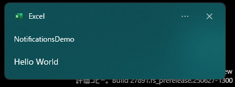
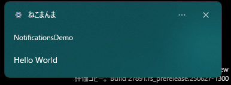
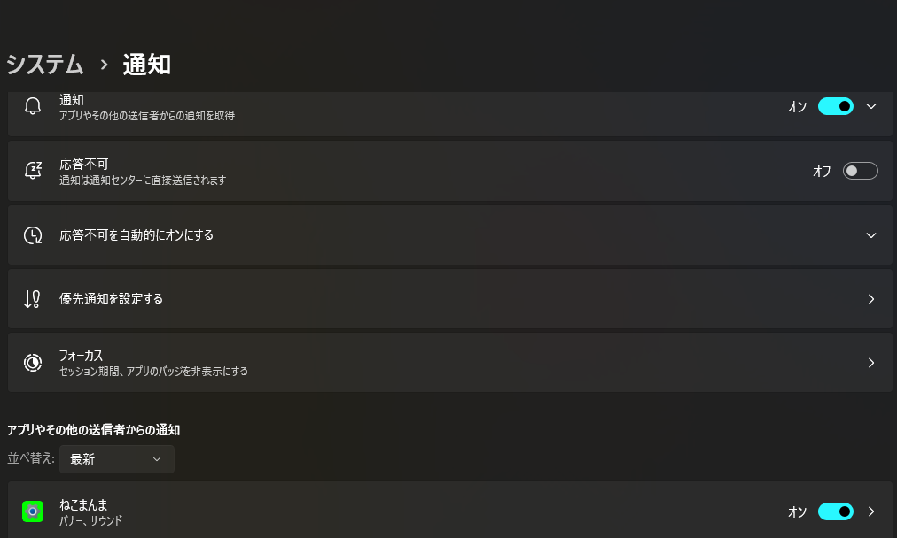
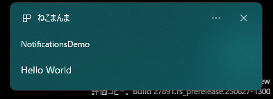
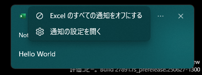
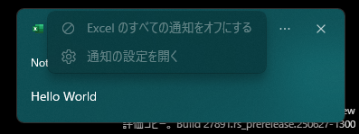
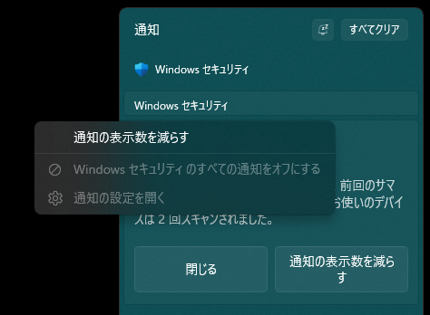

# パンドラの箱へようこそ

これは、気弱な者のためのガイドではない。我々は、WinRT APIという安全な境界線を越え、Windowsの内部設定という未踏の領域へと旅に出る。  
直接的なレジストリ操作とSQLiteベースのデータベースハッキングを通じて、OSがサードパーティ開発者には決して意図しなかった通知の挙動を、いかにして強制するかを実証する。  
**自己責任で読み進めよ。**
> [!IMPORTANT]
> 以降の解説は全て、DLLファイル前提の解説とします。  
> グループポリシーによる制限下での動作確認は取れてません。

## レジストリ操作編

下記の2つが、通知関係の設定が保存されています
- コンピューター\HKEY_CURRENT_USER\Software\Classes\AppUserModelId\\{AppUserModelID名称}
- コンピューター\HKEY_CURRENT_USER\Software\Microsoft\Windows\CurrentVersion\Notifications\Settings\\{AppUserModelID名称}

> [!NOTE]
> システム領域の箇所もありますがここでは割愛します。

### Classes配下

この辺は[公式サイト](https://learn.microsoft.com/ja-jp/windows/apps/design/shell/tiles-and-notifications/send-local-toast-other-apps)でも出ていますが、実はもう1つ隠れた設定があります。

|設定名称|説明|
|---|---|
|ShowInSettings|通知設定画面に表示するか切り替えます。<br>`0`で設定することで非表示にできます。この場合、通知表示のスイッチングが効かなくなります。<br>仮に、設定画面を出したまま、ShowInSettings を`0`にすると、<br>設定画面で通知表示のオンオフが効かなくなります。|
|DisplayName|通知の左上あたりにある表示名を変更できます。<br>存在しない場合は、デフォルトのアプリ名を表示します。<br><br>弊害として、アプリのデフォルトアイコンが出なくなります。|
|IconUri|通知の左上あたりにあるアイコンソースを変更できます。<br>Ico,png といった単純な画像ファイルのみ対応します。<br><br>DisplayName を設定しないと反映されません。|
|IconBackgroundColor|通知設定画面に表示する背景色を変更します。<br>現状、アプリ通知上での変化は見れません。設定画面のみです。<br>アイコンが不透明の四角形の場合、効果は見れないことがあります。<br><br>色コード指定となります。アルファチャンネルとRGB値の組み合わせです。<br>例：FFFF0000　→　赤|
|CustomActivator|例えば、アプリケーションが実行されていない状態からの起動や、アプリ本体を起動せずに、バックグラウンドで応答したい<br>といった時に使う高度な設定です。|

さて、`ShowInSettings`という公式サイトでは見れない名称が来ましたね。それの解説の前にまずは、公式にある名称の仕様を解説しよう。  
なお、`CustomActivator`はExcelではまず使うことのない物なので、省略します。

#### サンプルコード

次のコードは、レジストリ`コンピューター\HKEY_CURRENT_USER\Software\Classes\AppUserModelId\Microsoft.Office.EXCEL.EXE.15`に、下記3つのパラメーターを設定し確認後、削除します。

- DisplayName
- IconUri
- IconBackgroundColor

> [!NOTE]
> 各メソッドの解説は後ほど

```bas
Sub Classes配下レジストリ()
    'クラスオブジェクトを作成
    Dim TestToast As New clsAppNotificationBuilder
    Const TagName As String = "SmapleSpecial001"

    With TestToast
        'テキストを用意
        .SetToastGenericTitleText = "Hello World"
        
        '普通の通知
        .RunDll_ToastNotifierShow TagName
        Stop
        
        'レジストリ登録操作
        .PresetRegistry(DisplayName) = "ねこまんま"
        .PresetRegistry(IconUri) = Environ("SYSTEMROOT") & "\ImmersiveControlPanel\images\logo.png"
        .PresetRegistry(IconBackgroundColor) = "FF00FF00"
    
        '反映後の通知
        .RunDll_ToastNotifierShow TagName
        Stop
    
        'レジストリ削除操作
        .PresetDelRegistry = DisplayName
        .PresetDelRegistry = IconUri
        .PresetDelRegistry = IconBackgroundColor
    
        '普通の通知
        .RunDll_ToastNotifierShow TagName
    End With
End Sub
```

実行すると、下記の順で通知が出ると思います。  
  
↓  
  
↓  
  

2枚目の画像を見ていただくとわかるように、**アイコン**と**アプリ名**が、レジストリの登録内容に沿った表示になっているのがわかると思います。  
特にアプリ名を変えれるのはきっと嬉しい方もいるのではないでしょうか？  
なお、`IconBackgroundColor`の部分は、設定→システム→通知 で意味がわかります。  


ただ欠点として、`DisplayName`を設定すると、デフォルトアイコン(今回だと、Excelアイコン)が使えなくなってしまいます😣  
試しに、`.PresetRegistry(IconUri)`部分をコメントアウトして実行すると…  
  
と、別のアイコンになってしまいます。自前でアイコン画像を用意する必要があります。

#### ShowInSettings のサンプルコード

> [!TIP]
> 反映には、エクスプローラーの再起動が必要の場合があります。

```bas
Sub 通知オンオフ切り替え無効化()
    'クラスオブジェクトを作成
    Dim TestToast As New clsAppNotificationBuilder
    Const TagName As String = "SmapleSpecial002"

    With TestToast
        'テキストを用意
        .SetToastGenericTitleText = "Hello World"
        
        'Before
        .RunDll_ToastNotifierShow TagName
        Stop
        
        'レジストリ登録操作
        .PresetRegistry(ShowInSettings) = 0
    
        'After　うまく行かない場合は一旦、マクロを停止し、エクスプローラーを再起動して、再度実行する
        .RunDll_ToastNotifierShow TagName
        Stop
    
        'レジストリ削除操作
        .PresetDelRegistry = ShowInSettings
    
        'もとに戻った
        .RunDll_ToastNotifierShow TagName
    End With
End Sub
```

実行して、右側の「...」ボタンを押下してメニューの状態を確認すると…  
  
↓  
  
↓  
  
なんと！Excelからの通知をOFF にできなくなっちゃう設定になりました！  
そうこれは、Windows セキュリティアプリのような挙動を再現できちゃう設定となります。  
  
Windows セキュリティアプリの場合は、システム領域のレジストリとなりますが、同じ名称のレジストリがあるのが確認できます。

### Notifications\Settings 配下

`設定→システム→通知→アプリ名`で、設定すると書き込まれる領域となります。

#### サンプルコード一覧

プロシージャごとに、各種設定のON/OFFの切り替えをしています。  
`Stop`辺りで、通知設定←→アプリ名 といった感じで、行ったり来たり操作をすることで、設定が変わって反映もしているのがわかると思います。

> [!WARNING]
> 前の設定は保持されないので各自手動で、元の設定に戻してください。

```bas
Sub 通知オンオフ切り替え()
    'クラスオブジェクトを作成
    Dim TestToast As New clsAppNotificationBuilder
    Const TagName As String = "通知オンオフ"

    With TestToast
        'テキストを用意
        .SetToastGenericTitleText = TagName
        
        '---OFF---
        .PresetRegistry(Enabled) = 0
        .Wpndatabase_SettingKeyValue(skS_toast) = False
        .SetToastGenericContentsText = "通知は出ません"
        .RunDll_ToastNotifierShow TagName
        
        
        Stop
        
        
        '---ON---
        .PresetDelRegistry = Enabled
        .Wpndatabase_SettingKeyValue(skS_toast) = True
        .SetToastGenericContentsText = "通知がでます"
        .RunDll_ToastNotifierShow TagName
    End With
End Sub


Sub 通知バナーを表示()
    'クラスオブジェクトを作成
    Dim TestToast As New clsAppNotificationBuilder
    Const TagName As String = "通知バナーを表示"

    With TestToast
        'テキストを用意
        .SetToastGenericTitleText = TagName
        
        '---OFF---
        .PresetRegistry(ShowBanner) = 0
        .Wpndatabase_SettingKeyValue(skS_banner) = False
        .SetToastGenericContentsText = "バナーは出ません"
        .RunDll_ToastNotifierShow TagName
        
        
        Stop
        
        
        '---ON---
        .PresetDelRegistry = ShowBanner
        .Wpndatabase_SettingKeyValue(skS_banner) = True
        .SetToastGenericContentsText = "バナーがでます"
        .RunDll_ToastNotifierShow TagName
    End With
End Sub

Sub 通知センターに通知を表示する()
    'クラスオブジェクトを作成
    Dim TestToast As New clsAppNotificationBuilder
    Const TagName As String = "通知センターに通知を表示する"

    With TestToast
        'テキストを用意
        .SetToastGenericTitleText = TagName
        
        '---OFF---
        .PresetRegistry(ShowInActionCenter) = 0
        .SetToastGenericContentsText = "通知センターに通知を表示しません"
        .RunDll_ToastNotifierShow TagName
        
        
        Stop
        
        
        '---ON---
        .PresetDelRegistry = ShowInActionCenter
        .SetToastGenericContentsText = "通知センターに通知を表示"
        .RunDll_ToastNotifierShow TagName
    End With
End Sub

Option Explicit

Sub ロック画面で通知を受け取ったときに内容を表示しない()
    '実行後、すぐに 田 + L でロック！


    'クラスオブジェクトを作成
    Dim TestToast As New clsAppNotificationBuilder
    Const TagName As String = "ロック画面で通知を受け取ったときに内容を表示しない"

    With TestToast
        'テキストを用意
        .SetToastGenericTitleText = TagName
        
        
        '---OFF---
        .PresetRegistry(AllowContentAboveLock) = 1
        Application.Wait (Now + TimeValue("0:00:05"))
        .SetToastGenericContentsText = "05s待機後、ロック画面に通知内容を表示"
        .RunDll_ToastNotifierShow TagName
        
        
        'この間にログイン→ロックを素早くやらないと、確認できない仕様のもよう
        
        
        '---ON---
        .PresetDelRegistry = AllowContentAboveLock
         Application.Wait (Now + TimeValue("0:00:15"))
        .SetToastGenericContentsText = "15s待機後、ロック画面に通知内容を表示しません"
        .RunDll_ToastNotifierShow TagName
    End With
End Sub

Sub 応答不可がオンのときにアプリが重要な通知を送信できるようにする()
    'クラスオブジェクトを作成
    Dim TestToast As New clsAppNotificationBuilder
    Const TagName As String = "応答不可がオンのときにアプリが重要な通知を送信できるようにする"

    With TestToast
        'テキストを用意
        .SetToastGenericTitleText = TagName

        '重要な通知モード
        .SetToastContent_Scenario = tsUrgent

        .SetToastGenericContentsText = "1. 初めての重要な通知による「重要な通知の要求」"
        .PresetDelRegistry = AllowUrgentNotifications
        .RunDll_ToastNotifierShow TagName


        MsgBox "右下に出る「重要な通知の要求」をアクションセンターから削除後、OKを押します。", vbInformation, "お願い"


        .SetToastGenericContentsText = "2. 初めての重要な通知だが、「重要な通知の要求」を出さない"
        .PresetDelRegistry = AllowUrgentNotifications   'リセット
        .PresetRegistry(AllowUrgentNotifications) = 0
        .RunDll_ToastNotifierShow TagName


         MsgBox "[応答不可]テストを行います。[応答不可]をONにしてください。", vbInformation, "お願い"


        .SetToastGenericContentsText = "3. [応答不可]ON 重要な通知OFF"
        .RunDll_ToastNotifierShow TagName
       
       
        Stop
        
        
        .SetToastGenericContentsText = "4. [応答不可]ON 重要な通知ON"
        .PresetRegistry(AllowUrgentNotifications) = 1
        .RunDll_ToastNotifierShow TagName
    End With
End Sub

Sub 通知が届いたら音を鳴らす()
    'クラスオブジェクトを作成
    Dim TestToast As New clsAppNotificationBuilder
    Const TagName As String = "通知が届いたら音を鳴らす"

    With TestToast
        'テキストを用意
        .SetToastGenericTitleText = TagName
        
        '---OFF---
        .PresetRegistry(SoundFile) = ""
        .SetToastGenericContentsText = "通知が届いても音を鳴らさない"
        .RunDll_ToastNotifierShow TagName
        
        
        Stop
        
        
        '---ON---
        .PresetDelRegistry = SoundFile
        .SetToastGenericContentsText = "通知が届いたら音を鳴らす"
        .RunDll_ToastNotifierShow TagName
    End With
End Sub

Sub 通知センターの通知の優先度()
    'クラスオブジェクトを作成
    Dim TestToast As New clsAppNotificationBuilder
    Const TagName As String = "通知が届いたら音を鳴らす"

    With TestToast
        'テキストを用意
        .SetToastGenericTitleText = TagName
        .SetToastHeader = ""
        
        '---上---
        .PresetRegistry(Rank) = 99
        .SetToastGenericContentsText = "通知センターの上部に表示"
        .RunDll_ToastNotifierShow TagName & "上"
        
        
        Stop
        
        
        '---高---
        .PresetRegistry(Rank) = 1
        .SetToastGenericContentsText = "通知センターで標準優先度通知の上に表示"
        .RunDll_ToastNotifierShow TagName & "高"
    
    
        Stop
        
        
        '---標準---
        .PresetDelRegistry = Rank
        .SetToastGenericContentsText = "通知センターで高優先度通知の下に表示"
        .RunDll_ToastNotifierShow TagName & "標準"
    
    End With
End Sub
```

### メソッド一覧

レジストリ操作のメソッドです。

#### PresetRegistry

引数に対した値の登録を行います。  
現在対応してるのは以下のとおりです

|引数|設定可能な値|設定レジストリ先|`wpndatabase.db`との**連携**|補足説明|
|---|---|---|---|---|
|ShowInSettings|0,1|HKEY_CURRENT_USER\Software\Classes\AppUserModelId|<ul><li>[ ] </li></ul>|0：設定画面から操作させない<br>1：設定画面から操作できる|
|DisplayName|任意の文字列|HKEY_CURRENT_USER\Software\Classes\AppUserModelId|<ul><li>[ ] </li></ul>|空文字では効果ありません。|
|IconUri|png,ico 等の画像ファイル絶対パス|HKEY_CURRENT_USER\Software\Classes\AppUserModelId|<ul><li>[ ] </li></ul>|・exe 等の埋込式アイコンは指定できません。<br>・`DisplayName`を設定しないと効果ありません。|
|IconBackgroundColor|アルファチャンネル込の16進数式色コード|HKEY_CURRENT_USER\Software\Classes\AppUserModelId|<ul><li>[ ] </li></ul>|例：`FF00FF00` で緑背景になります|
|Enabled|0,1|HKEY_CURRENT_USER\Software\Microsoft\Windows\CurrentVersion\Notifications\Settings|<ul><li>[x] </li></ul>|0：通知OFF<br>1：通知ON|
|ShowBanner|0,1|HKEY_CURRENT_USER\Software\Microsoft\Windows\CurrentVersion\Notifications\Settings|<ul><li>[x] </li></ul>|0：通知バナーを表示しない<br>1：通知バナーを表示する|
|SoundFile|任意の文字列|HKEY_CURRENT_USER\Software\Microsoft\Windows\CurrentVersion\Notifications\Settings|<ul><li>[ ] </li></ul>|空文字：通知が届いても音を鳴らさない<br>何かしらの文字列：通知が届いてたら音を鳴らす|
|AllowContentAboveLock|0,1|HKEY_CURRENT_USER\Software\Microsoft\Windows\CurrentVersion\Notifications\Settings|<ul><li>[ ] </li></ul>|0：ロック画面に通知内容を出さない<br>1：ロック画面に通知内容を出す|
|Rank|0,1,99|HKEY_CURRENT_USER\Software\Microsoft\Windows\CurrentVersion\Notifications\Settings|<ul><li>[ ] </li></ul>|0：標準<br>1：高<br>99：上|
|ShowInActionCenter|0,1|HKEY_CURRENT_USER\Software\Microsoft\Windows\CurrentVersion\Notifications\Settings|<ul><li>[ ] </li></ul>|0：通知センターに通知を表示しない<br>1：通知センターに通知を表示する|
|AllowUrgentNotifications|0,1|HKEY_CURRENT_USER\Software\Microsoft\Windows\CurrentVersion\Notifications\Settings|<ul><li>[ ] </li></ul>|0：[応答不可]がオンのときにアプリが重要な通知を送信できるようにしない<br>1：[応答不可]がオンのときにアプリが重要な通知を送信できるようにする|

#### PresetRegistry

設定したレジストリの削除を行います。  
削除時の挙動は次の通りです。

|設定可能な値|削除レジストリ先|wpndatabase.dbとの連携|削除後の挙動|
|---|---|---|---|
|ShowInSettings|HKEY_CURRENT_USER\Software\Classes\AppUserModelId|<ul><li>[ ] </li></ul>|設定画面から操作できる|
|DisplayName|HKEY_CURRENT_USER\Software\Classes\AppUserModelId|<ul><li>[ ] </li></ul>|デフォルトのアプリ名が表示される|
|IconUri|HKEY_CURRENT_USER\Software\Classes\AppUserModelId|<ul><li>[ ] </li></ul>|デフォルトのアプリアイコンが表示される|
|IconBackgroundColor|HKEY_CURRENT_USER\Software\Classes\AppUserModelId|<ul><li>[ ] </li></ul>|透明背景|
|Enabled|HKEY_CURRENT_USER\Software\Microsoft\Windows\CurrentVersion\Notifications\Settings|<ul><li>[x] </li></ul>|通知ON|
|ShowBanner|HKEY_CURRENT_USER\Software\Microsoft\Windows\CurrentVersion\Notifications\Settings|<ul><li>[x] </li></ul>|通知バナーを表示する|
|SoundFile|HKEY_CURRENT_USER\Software\Microsoft\Windows\CurrentVersion\Notifications\Settings|<ul><li>[ ] </li></ul>|通知が届いてたら音を鳴らす|
|AllowContentAboveLock|HKEY_CURRENT_USER\Software\Microsoft\Windows\CurrentVersion\Notifications\Settings|<ul><li>[ ] </li></ul>|ロック画面に通知内容を出さない|
|Rank|HKEY_CURRENT_USER\Software\Microsoft\Windows\CurrentVersion\Notifications\Settings|<ul><li>[ ] </li></ul>|標準|
|ShowInActionCenter|HKEY_CURRENT_USER\Software\Microsoft\Windows\CurrentVersion\Notifications\Settings|<ul><li>[ ] </li></ul>|通知センターに通知を表示する|
|AllowUrgentNotifications|HKEY_CURRENT_USER\Software\Microsoft\Windows\CurrentVersion\Notifications\Settings|<ul><li>[ ] </li></ul>|設定画面から、切り替えができなくなる|

> [!NOTE]
> お察しかもしれませんがこのOFF部分のコードをコメントアウトして、**設定で手動OFF**にしても、ONの処理でちゃんとONになっています😎逆も然り。  
> つまり、設定画面を介さずにこの`VBA × DLL`だけで、設定の切り替えが出来ていることを意味してます🤭  
> 特にユーザーが特定アプリの通知をOFFにしても、このコードでONにできちゃうのは中々のいたずらです🙂

## 高度な設定の解放：wpndatabase.dbによる直接制御

なぜ、ある通知機能はUWPアプリでは動くのに、自分のVBAプロジェクトでは動かないのか、不思議に思ったことはないだろうか？  
その答えは`wpndatabase.db`の中にある。  
初期のWindowsが独自形式を使っていたのに対し、現代のシステムは、アプリごとの通知設定を、アクセス可能なSQLiteデータベースに保存しているのだ。  
このセクションは、究極の回避策を提供する。C++ DLLを使ってこのデータベースを直接読み書きし、インターネット画像やバッジ通知といった機能を有効化し、さらには**ユーザー設定すらもExcel VBAコードから直接上書きする方法**をお見せしよう。あなたの通知ゲームを、レベルアップさせる時が来た。
