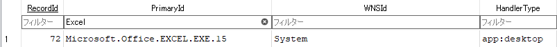
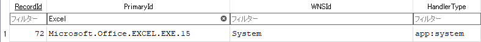
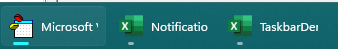
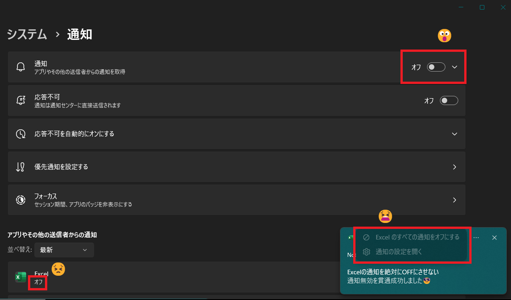

# パンドラの箱へようこそ

ほとんどの人間は、メインページで足を止める。だが、君は掘り続けた。気に入ったよ。これが本当にどう動いているのかに興味を持ってくれて、ありがとう🦊

その探求心への褒美として、今から公のページには書かれていないことを君に共有しよう。Windowsレジストリとwpndatabase.dbの間の、繊細な舞踏を操作するための、私の研究と手法だ。  
これには、標準APIを超える能力を授ける、禁断のコードも含まれている。この知識は、責任を持って使うように。

なぜなら君は今、他の誰も知らないことを知るのだから。🤫

> [!IMPORTANT]
> 以降の解説は全て、DLLファイル使用前提の解説とします。  
> グループポリシーによる制限下での動作確認は取れてません。

## レジストリ操作編

下記の2つが、通知関係の設定が保存されています
- コンピューター\HKEY_CURRENT_USER\Software\Classes\AppUserModelId\\{AppUserModelID名称}
- コンピューター\HKEY_CURRENT_USER\Software\Microsoft\Windows\CurrentVersion\Notifications\Settings\\{AppUserModelID名称}

> [!NOTE]
> システム領域の箇所もありますがここでは割愛します。

### Classes配下

この辺は[公式サイト](https://learn.microsoft.com/ja-jp/windows/apps/design/shell/tiles-and-notifications/send-local-toast-other-apps)でも出ていますが、実はもう1つ隠れた設定があります。

|設定名称|説明|
|---|---|
|ShowInSettings|通知設定画面に表示するか切り替えます。<br>`0`で設定することで非表示にできます。この場合、通知表示のスイッチングが効かなくなります。<br>仮に、設定画面を出したまま、ShowInSettings を`0`にすると、<br>設定画面で通知表示のオンオフが効かなくなります。|
|DisplayName|通知の左上あたりにある表示名を変更できます。<br>存在しない場合は、デフォルトのアプリ名を表示します。<br><br>弊害として、アプリのデフォルトアイコンが出なくなります。|
|IconUri|通知の左上あたりにあるアイコンソースを変更できます。<br>Ico,png といった単純な画像ファイルのみ対応します。<br><br>DisplayName を設定しないと反映されません。|
|IconBackgroundColor|通知設定画面に表示する背景色を変更します。<br>現状、アプリ通知上での変化は見れません。設定画面のみです。<br>アイコンが不透明の四角形の場合、効果は見れないことがあります。<br><br>色コード指定となります。アルファチャンネルとRGB値の組み合わせです。<br>例：FFFF0000　→　赤|
|CustomActivator|例えば、アプリケーションが実行されていない状態からの起動や、アプリ本体を起動せずに、バックグラウンドで応答したい<br>といった時に使う高度な設定です。|

さて、`ShowInSettings`という公式サイトでは見れない名称が来ましたね。それの解説の前にまずは、公式にある名称の仕様を解説しよう。  
なお、`CustomActivator`はExcelではまず使うことのない物なので、省略します。

#### サンプルコード

次のコードは、レジストリ`コンピューター\HKEY_CURRENT_USER\Software\Classes\AppUserModelId\Microsoft.Office.EXCEL.EXE.15`に、下記3つのパラメーターを設定し確認後、削除します。

- DisplayName
- IconUri
- IconBackgroundColor

> [!NOTE]
> 各メソッドの解説は後ほど

```bas
Sub Classes配下レジストリ()
    'クラスオブジェクトを作成
    Dim TestToast As New clsAppNotificationBuilder
    Const TagName As String = "SmapleSpecial001"

    With TestToast
        'テキストを用意
        .SetToastGenericTitleText = "Hello World"
        
        '普通の通知
        .RunDll_ToastNotifierShow TagName
        Stop
        
        'レジストリ登録操作
        .PresetRegistry(DisplayName) = "ねこまんま"
        .PresetRegistry(IconUri) = Environ("SYSTEMROOT") & "\ImmersiveControlPanel\images\logo.png"
        .PresetRegistry(IconBackgroundColor) = "FF00FF00"
    
        '反映後の通知
        .RunDll_ToastNotifierShow TagName
        Stop
    
        'レジストリ削除操作
        .PresetDelRegistry = DisplayName
        .PresetDelRegistry = IconUri
        .PresetDelRegistry = IconBackgroundColor
    
        '普通の通知
        .RunDll_ToastNotifierShow TagName
    End With
End Sub
```

実行すると、下記の順で通知が出ると思います。  
  
↓  
  
↓  
  

2枚目の画像を見ていただくとわかるように、**アイコン**と**アプリ名**が、レジストリの登録内容に沿った表示になっているのがわかると思います。  
特にアプリ名を変えれるのはきっと嬉しい方もいるのではないでしょうか？  
なお、`IconBackgroundColor`の部分は、設定→システム→通知 で意味がわかります。  


ただ欠点として、`DisplayName`を設定すると、デフォルトアイコン(今回だと、Excelアイコン)が使えなくなってしまいます😣  
試しに、`.PresetRegistry(IconUri)`部分をコメントアウトして実行すると…  
  
と、別のアイコンになってしまいます。自前でアイコン画像を用意する必要があります。

#### ShowInSettings のサンプルコード

> [!TIP]
> 反映には、エクスプローラーの再起動が必要の場合があります。

```bas
Sub 通知オンオフ切り替え無効化()
    'クラスオブジェクトを作成
    Dim TestToast As New clsAppNotificationBuilder
    Const TagName As String = "SmapleSpecial002"

    With TestToast
        'テキストを用意
        .SetToastGenericTitleText = "Hello World"
        
        'Before
        .RunDll_ToastNotifierShow TagName
        Stop
        
        'レジストリ登録操作
        .PresetRegistry(ShowInSettings) = 0
    
        'After　うまく行かない場合は一旦、マクロを停止し、エクスプローラーを再起動して、再度実行する
        .RunDll_ToastNotifierShow TagName
        Stop
    
        'レジストリ削除操作
        .PresetDelRegistry = ShowInSettings
    
        'もとに戻った
        .RunDll_ToastNotifierShow TagName
    End With
End Sub
```

実行して、右側の「...」ボタンを押下してメニューの状態を確認すると…  
  
↓  
  
↓  
  
なんと！Excelからの通知をOFF にできなくなっちゃう設定になりました！  
そうこれは、Windows セキュリティアプリのような挙動を再現できちゃう設定となります。  
  
Windows セキュリティアプリの場合は、システム領域のレジストリとなりますが、同じ名称のレジストリがあるのが確認できます。

### Notifications\Settings 配下

`設定→システム→通知→アプリ名`で、設定すると書き込まれる領域となります。

#### サンプルコード一覧

プロシージャごとに、各種設定のON/OFFの切り替えをしています。  
`Stop`辺りで、通知設定←→アプリ名 といった感じで、行ったり来たり操作をすることで、設定が変わって反映もしているのがわかると思います。

> [!WARNING]
> 前の設定は保持されないので各自手動で、元の設定に戻してください。

```bas
Sub 通知オンオフ切り替え()
    'クラスオブジェクトを作成
    Dim TestToast As New clsAppNotificationBuilder
    Const TagName As String = "通知オンオフ"

    With TestToast
        'テキストを用意
        .SetToastGenericTitleText = TagName
        
        '---OFF---
        .PresetRegistry(Enabled) = 0
        .Wpndatabase_SettingKeyValue(skS_toast) = False
        .SetToastGenericContentsText = "通知は出ません"
        .RunDll_ToastNotifierShow TagName
        
        
        Stop
        
        
        '---ON---
        .PresetDelRegistry = Enabled
        .Wpndatabase_SettingKeyValue(skS_toast) = True
        .SetToastGenericContentsText = "通知がでます"
        .RunDll_ToastNotifierShow TagName
    End With
End Sub


Sub 通知バナーを表示()
    'クラスオブジェクトを作成
    Dim TestToast As New clsAppNotificationBuilder
    Const TagName As String = "通知バナーを表示"

    With TestToast
        'テキストを用意
        .SetToastGenericTitleText = TagName
        
        '---OFF---
        .PresetRegistry(ShowBanner) = 0
        .Wpndatabase_SettingKeyValue(skS_banner) = False
        .SetToastGenericContentsText = "バナーは出ません"
        .RunDll_ToastNotifierShow TagName
        
        
        Stop
        
        
        '---ON---
        .PresetDelRegistry = ShowBanner
        .Wpndatabase_SettingKeyValue(skS_banner) = True
        .SetToastGenericContentsText = "バナーがでます"
        .RunDll_ToastNotifierShow TagName
    End With
End Sub

Sub 通知センターに通知を表示する()
    'クラスオブジェクトを作成
    Dim TestToast As New clsAppNotificationBuilder
    Const TagName As String = "通知センターに通知を表示する"

    With TestToast
        'テキストを用意
        .SetToastGenericTitleText = TagName
        
        '---OFF---
        .PresetRegistry(ShowInActionCenter) = 0
        .SetToastGenericContentsText = "通知センターに通知を表示しません"
        .RunDll_ToastNotifierShow TagName
        
        
        Stop
        
        
        '---ON---
        .PresetDelRegistry = ShowInActionCenter
        .SetToastGenericContentsText = "通知センターに通知を表示"
        .RunDll_ToastNotifierShow TagName
    End With
End Sub

Option Explicit

Sub ロック画面で通知を受け取ったときに内容を表示しない()
    '実行後、すぐに 田 + L でロック！


    'クラスオブジェクトを作成
    Dim TestToast As New clsAppNotificationBuilder
    Const TagName As String = "ロック画面で通知を受け取ったときに内容を表示しない"

    With TestToast
        'テキストを用意
        .SetToastGenericTitleText = TagName
        
        
        '---OFF---
        .PresetRegistry(AllowContentAboveLock) = 1
        Application.Wait (Now + TimeValue("0:00:05"))
        .SetToastGenericContentsText = "05s待機後、ロック画面に通知内容を表示"
        .RunDll_ToastNotifierShow TagName
        
        
        'この間にログイン→ロックを素早くやらないと、確認できない仕様のもよう
        
        
        '---ON---
        .PresetDelRegistry = AllowContentAboveLock
         Application.Wait (Now + TimeValue("0:00:15"))
        .SetToastGenericContentsText = "15s待機後、ロック画面に通知内容を表示しません"
        .RunDll_ToastNotifierShow TagName
    End With
End Sub

Sub 応答不可がオンのときにアプリが重要な通知を送信できるようにする()
    'クラスオブジェクトを作成
    Dim TestToast As New clsAppNotificationBuilder
    Const TagName As String = "応答不可がオンのときにアプリが重要な通知を送信できるようにする"

    With TestToast
        'テキストを用意
        .SetToastGenericTitleText = TagName

        '重要な通知モード
        .SetToastContent_Scenario = tsUrgent

        .SetToastGenericContentsText = "1. 初めての重要な通知による「重要な通知の要求」"
        .PresetDelRegistry = AllowUrgentNotifications
        .RunDll_ToastNotifierShow TagName


        MsgBox "右下に出る「重要な通知の要求」をアクションセンターから削除後、OKを押します。", vbInformation, "お願い"


        .SetToastGenericContentsText = "2. 初めての重要な通知だが、「重要な通知の要求」を出さない"
        .PresetDelRegistry = AllowUrgentNotifications   'リセット
        .PresetRegistry(AllowUrgentNotifications) = 0
        .RunDll_ToastNotifierShow TagName


         MsgBox "[応答不可]テストを行います。[応答不可]をONにしてください。", vbInformation, "お願い"


        .SetToastGenericContentsText = "3. [応答不可]ON 重要な通知OFF"
        .RunDll_ToastNotifierShow TagName
       
       
        Stop
        
        
        .SetToastGenericContentsText = "4. [応答不可]ON 重要な通知ON"
        .PresetRegistry(AllowUrgentNotifications) = 1
        .RunDll_ToastNotifierShow TagName
    End With
End Sub

Sub 通知が届いたら音を鳴らす()
    'クラスオブジェクトを作成
    Dim TestToast As New clsAppNotificationBuilder
    Const TagName As String = "通知が届いたら音を鳴らす"

    With TestToast
        'テキストを用意
        .SetToastGenericTitleText = TagName
        
        '---OFF---
        .PresetRegistry(SoundFile) = ""
        .SetToastGenericContentsText = "通知が届いても音を鳴らさない"
        .RunDll_ToastNotifierShow TagName
        
        
        Stop
        
        
        '---ON---
        .PresetDelRegistry = SoundFile
        .SetToastGenericContentsText = "通知が届いたら音を鳴らす"
        .RunDll_ToastNotifierShow TagName
    End With
End Sub

Sub 通知センターの通知の優先度()
    'クラスオブジェクトを作成
    Dim TestToast As New clsAppNotificationBuilder
    Const TagName As String = "通知が届いたら音を鳴らす"

    With TestToast
        'テキストを用意
        .SetToastGenericTitleText = TagName
        .SetToastHeader = ""
        
        '---上---
        .PresetRegistry(Rank) = 99
        .SetToastGenericContentsText = "通知センターの上部に表示"
        .RunDll_ToastNotifierShow TagName & "上"
        
        
        Stop
        
        
        '---高---
        .PresetRegistry(Rank) = 1
        .SetToastGenericContentsText = "通知センターで標準優先度通知の上に表示"
        .RunDll_ToastNotifierShow TagName & "高"
    
    
        Stop
        
        
        '---標準---
        .PresetDelRegistry = Rank
        .SetToastGenericContentsText = "通知センターで高優先度通知の下に表示"
        .RunDll_ToastNotifierShow TagName & "標準"
    
    End With
End Sub
```

> [!NOTE]
> お察しかもしれませんがこのOFF部分のコードをコメントアウトして、**設定で手動OFF**にしても、ONの処理でちゃんとONになっています😎逆も然り。  
> つまり、設定画面を介さずにこの`VBA × DLL`だけで、設定の切り替えが出来ていることを意味してます🤭  
> 特にユーザーが特定アプリの通知をOFFにしても、このコードでONにできちゃうのは中々のいたずらです🙂

### メソッド一覧

レジストリ操作のメソッドです。

#### PresetRegistry

引数に対した値の登録を行います。  
現在対応してるのは以下のとおりです

|引数|設定可能な値|設定レジストリ先|`wpndatabase.db`との**連携**|補足説明|
|---|---|---|---|---|
|ShowInSettings|0,1|HKEY_CURRENT_USER\Software\Classes\AppUserModelId|<ul><li>[ ] </li></ul>|0：設定画面から操作させない<br>1：設定画面から操作できる|
|DisplayName|任意の文字列|HKEY_CURRENT_USER\Software\Classes\AppUserModelId|<ul><li>[ ] </li></ul>|空文字では効果ありません。|
|IconUri|png,ico 等の画像ファイル絶対パス|HKEY_CURRENT_USER\Software\Classes\AppUserModelId|<ul><li>[ ] </li></ul>|・exe 等の埋込式アイコンは指定できません。<br>・`DisplayName`を設定しないと効果ありません。|
|IconBackgroundColor|アルファチャンネル込の16進数式色コード|HKEY_CURRENT_USER\Software\Classes\AppUserModelId|<ul><li>[ ] </li></ul>|例：`FF00FF00` で緑背景になります|
|Enabled|0,1|HKEY_CURRENT_USER\Software\Microsoft\Windows\CurrentVersion\Notifications\Settings|<ul><li>[x] </li></ul>|0：通知OFF<br>1：通知ON|
|ShowBanner|0,1|HKEY_CURRENT_USER\Software\Microsoft\Windows\CurrentVersion\Notifications\Settings|<ul><li>[x] </li></ul>|0：通知バナーを表示しない<br>1：通知バナーを表示する|
|SoundFile|任意の文字列|HKEY_CURRENT_USER\Software\Microsoft\Windows\CurrentVersion\Notifications\Settings|<ul><li>[ ] </li></ul>|空文字：通知が届いても音を鳴らさない<br>何かしらの文字列：通知が届いてたら音を鳴らす|
|AllowContentAboveLock|0,1|HKEY_CURRENT_USER\Software\Microsoft\Windows\CurrentVersion\Notifications\Settings|<ul><li>[ ] </li></ul>|0：ロック画面に通知内容を出さない<br>1：ロック画面に通知内容を出す|
|Rank|0,1,99|HKEY_CURRENT_USER\Software\Microsoft\Windows\CurrentVersion\Notifications\Settings|<ul><li>[ ] </li></ul>|0：標準<br>1：高<br>99：上|
|ShowInActionCenter|0,1|HKEY_CURRENT_USER\Software\Microsoft\Windows\CurrentVersion\Notifications\Settings|<ul><li>[ ] </li></ul>|0：通知センターに通知を表示しない<br>1：通知センターに通知を表示する|
|AllowUrgentNotifications|0,1|HKEY_CURRENT_USER\Software\Microsoft\Windows\CurrentVersion\Notifications\Settings|<ul><li>[ ] </li></ul>|0：[応答不可]がオンのときにアプリが重要な通知を送信できるようにしない<br>1：[応答不可]がオンのときにアプリが重要な通知を送信できるようにする|

#### PresetRegistry

設定したレジストリの削除を行います。  
削除時の挙動は次の通りです。

|設定可能な値|削除レジストリ先|wpndatabase.dbとの連携|削除後の挙動|
|---|---|---|---|
|ShowInSettings|HKEY_CURRENT_USER\Software\Classes\AppUserModelId|<ul><li>[ ] </li></ul>|設定画面から操作できる|
|DisplayName|HKEY_CURRENT_USER\Software\Classes\AppUserModelId|<ul><li>[ ] </li></ul>|デフォルトのアプリ名が表示される|
|IconUri|HKEY_CURRENT_USER\Software\Classes\AppUserModelId|<ul><li>[ ] </li></ul>|デフォルトのアプリアイコンが表示される|
|IconBackgroundColor|HKEY_CURRENT_USER\Software\Classes\AppUserModelId|<ul><li>[ ] </li></ul>|透明背景|
|Enabled|HKEY_CURRENT_USER\Software\Microsoft\Windows\CurrentVersion\Notifications\Settings|<ul><li>[x] </li></ul>|通知ON|
|ShowBanner|HKEY_CURRENT_USER\Software\Microsoft\Windows\CurrentVersion\Notifications\Settings|<ul><li>[x] </li></ul>|通知バナーを表示する|
|SoundFile|HKEY_CURRENT_USER\Software\Microsoft\Windows\CurrentVersion\Notifications\Settings|<ul><li>[ ] </li></ul>|通知が届いてたら音を鳴らす|
|AllowContentAboveLock|HKEY_CURRENT_USER\Software\Microsoft\Windows\CurrentVersion\Notifications\Settings|<ul><li>[ ] </li></ul>|ロック画面に通知内容を出さない|
|Rank|HKEY_CURRENT_USER\Software\Microsoft\Windows\CurrentVersion\Notifications\Settings|<ul><li>[ ] </li></ul>|標準|
|ShowInActionCenter|HKEY_CURRENT_USER\Software\Microsoft\Windows\CurrentVersion\Notifications\Settings|<ul><li>[ ] </li></ul>|通知センターに通知を表示する|
|AllowUrgentNotifications|HKEY_CURRENT_USER\Software\Microsoft\Windows\CurrentVersion\Notifications\Settings|<ul><li>[ ] </li></ul>|設定画面から、切り替えができなくなる|

## 高度な設定の解放：`wpndatabase.db`による直接制御

なぜ、ある通知機能はUWPアプリでは動くのに、自分のVBAプロジェクトでは動かないのか、不思議に思ったことはないだろうか？  
その答えは`wpndatabase.db`の中にある。  
初期のWindowsが[独自形式](https://www.swiftforensics.com/2016/06/prasing-windows-10-notification-database.html)を使っていたのに対し、現代のシステムは、アプリごとの通知設定を、アクセス可能な[SQLiteデータベース](https://inc0x0.com/2018/10/windows-10-notification-database/)に保存しているのだ。  
このセクションは、究極の回避策を提供する。C++ DLLを使ってこのデータベースを直接読み書きし、インターネット画像やバッジ通知といった機能を有効化し、さらには**ユーザー設定すらもExcel VBAコードから直接上書きする方法**をお見せしよう。あなたの通知ゲームを、レベルアップさせる時が来た。

### 1分で理解！`wpndatabase.db`ってな～に？

Windows通知システムの真の「脳」として機能する、ユーザーごとのSQLiteデータベースです。

Q: 中には何が？  
A: すべてです。通知の履歴、ユーザー向けの設定、そして最も重要なことに、各アプリが「本当に」何をすることが許されているか（例：インターネット画像の使用、バッジの表示）を定義する、隠されたフラグのセットが含まれています。  

Q: なぜSQLiteなのですか？  
A: 推測の領域ですが、クロスプラットフォーム互換性（PC、Xboxなど）と信頼性のためと思われます。Microsoftは、独自形式よりも、実績のあるオープンソースを選んだもようです。  

Q: 編集できますか？  
A: 技術的には出来ます。このガイドは、まさにそのためのものです。  

Q: 編集すべきですか？  
A: 製品環境では、絶対にやめてください。これは未サポートのリバースエンジニアリングの試みです。データベースの構造は、Windows Updateでも変更される可能性があり、あなたのアプリや通知システム自体を破壊するかもしれません。好奇心と共に、慎重に進めてください。

### GetWpndatabase_WNSId

現在の AppUserModelID の WNSID を取得します。
#### サンプルコード

次のコードは、`Microsoft.Office.EXCEL.EXE.15` の WNSID を取得します

```bas
Sub WNSIDの確認()
    'クラスオブジェクトを作成
    Dim TestToast As New clsAppNotificationBuilder

    With TestToast
        'ここに、任意のAppUserModelIDを指定できます
        'デフォルトは、Microsoft.Office.EXCEL.EXE.15 です
        '.SetAppUserModelID = "Microsoft.WindowsTerminal_8wekyb3d8bbwe!App"  'ちなみにこれは、Windows Terminal

        Debug.Print .GetWpndatabase_WNSId
    End With
End Sub
```

上記のサンプルコードを実行すると、`wpndatabase.db`に対して、下記のSQL文を実行して、取得します。  
`PrimaryId`が、AppUserModelID にあたります。

```sql
SELECT WNSId FROM NotificationHandler WHERE PrimaryId='Microsoft.Office.EXCEL.EXE.15';
```

`Microsoft.Office.EXCEL.EXE.15`の場合、イミディエイトには、`NonImmersivePackage`と出るはずです。

### SetWpndatabase_WNSId

現在の AppUserModelID に 任意の WNSID を設定します。

#### 使える設定値

|設定値|処理内容|パラメーターの意味|
|---|---|---|
|wsCustom|WNSId に、引数の内容で書き換えます。<br>・.SetWpndatabase_WNSId = wsCustom　→　NULL で書き換え<br>・.SetWpndatabase_WNSId("Vulpes") = wsCustom　→　Vulpes で書き換え|主に、UWP (Universal Windows Platform) アプリまたはMSIXでパッケージ化されたモダンアプリに使われます。|
|wsSystem|WNSId に、「System」と書き換えます|OSのコアコンポーネント自身によって生成・処理される、最も特権的な通知ハンドラであることを示します。|
|wsNonImmersivePackage|WNSId に、「NonImmersivePackage」と書き換えます|伝統的なWin32デスクトップアプリケーション（UWP/モダンアプリではない、"非没入型"のパッケージ）であることを示す、特別な識別子です。|

#### サンプルコード

次のコードは、`Microsoft.Office.EXCEL.EXE.15` の WNSID に、`System`として書き換えます。

```bas
Sub WNSIDの設定()
    'クラスオブジェクトを作成
    Dim TestToast As New clsAppNotificationBuilder

    With TestToast
        'ここに、任意のAppUserModelIDを指定できます
        'デフォルトは、Microsoft.Office.EXCEL.EXE.15 です
        '.SetAppUserModelID = "Microsoft.WindowsTerminal_8wekyb3d8bbwe!App"  'ちなみにこれは、Windows Terminal

        'System で書き換え
        .SetWpndatabase_WNSId = wsSystem
        Debug.Print "書き換え後:" & .GetWpndatabase_WNSId
    End With
End Sub
```

上記のサンプルコードを実行すると、`wpndatabase.db`に対して、下記のSQL文を実行して、更新します。  

```sql
UPDATE NotificationHandler SET WNSId='System' WHERE PrimaryId='Microsoft.Office.EXCEL.EXE.15';
```

そして、イミディエイトに`書き換え後:System`と出てきて、書き換わったのが確認できます。  
もちろん、実際のSQLiteのビュアーを見ても変わっております。  


> [!TIP]
> もとに戻す場合は、`.SetWpndatabase_WNSId = wsNonImmersivePackage`にすればOKです。

### GetWpndatabase_HandlerType

現在の AppUserModelID の HandlerType を取得します。

#### サンプルコード

次のコードは、`Microsoft.Office.EXCEL.EXE.15` の HandlerType を取得します

```bas
Sub HandlerTypeの確認()
    'クラスオブジェクトを作成
    Dim TestToast As New clsAppNotificationBuilder

    With TestToast
        'ここに、任意のAppUserModelIDを指定できます
        'デフォルトは、Microsoft.Office.EXCEL.EXE.15 です
        '.SetAppUserModelID = "Microsoft.WindowsTerminal_8wekyb3d8bbwe!App"  'ちなみにこれは、Windows Terminal

        Debug.Print .GetWpndatabase_HandlerType
    End With
End Sub
```

上記のサンプルコードを実行すると、`wpndatabase.db`に対して、下記のSQL文を実行して、取得します。  

```sql
SELECT HandlerType FROM NotificationHandler WHERE PrimaryId='Microsoft.Office.EXCEL.EXE.15';
```

`Microsoft.Office.EXCEL.EXE.15`の場合、イミディエイトには、`app:desktop`と出るはずです。

### SetWpndatabase_HandlerType

現在の AppUserModelID に 任意の HandlerType を設定します。

#### 使える設定値

|設定値|処理内容|パラメーターの意味|
|---|---|---|
|htDesktop|HandlerType に、「app:desktop」と書き換えます|伝統的なWin32デスクトップアプリケーションを指します。|
|htImmersive|HandlerType に、「app:immersive」と書き換えます|UWP (Universal Windows Platform) アプリ、またはMSIXでパッケージ化されたモダンアプリを指します。|
|htSystem|HandlerType に、「app:system」と書き換えます|OSのコアコンポーネント、またはOSと一体化した特権的なプロセスを指します。|


#### サンプルコード

次のコードは、`Microsoft.Office.EXCEL.EXE.15` の WNSID に、`System`として書き換えます。

```bas
Sub HandlerTypeの設定()
    'クラスオブジェクトを作成
    Dim TestToast As New clsAppNotificationBuilder

    With TestToast
        'ここに、任意のAppUserModelIDを指定できます
        'デフォルトは、Microsoft.Office.EXCEL.EXE.15 です
        '.SetAppUserModelID = "Microsoft.WindowsTerminal_8wekyb3d8bbwe!App"  'ちなみにこれは、Windows Terminal

        
        'System として書き換えます
        .SetWpndatabase_HandlerType = htSystem
        Debug.Print "書き換え後:" & .GetWpndatabase_HandlerType
    End With
End Sub
```

上記のサンプルコードを実行すると、`wpndatabase.db`に対して、下記のSQL文を実行して、更新します。  

```sql
UPDATE NotificationHandler SET HandlerType='app:system' WHERE PrimaryId='Microsoft.Office.EXCEL.EXE.15';
```

そして、イミディエイトに`書き換え後:app:system`と出てきて、書き換わったのが確認できます。  
もちろん、実際のSQLiteのビュアーを見ても変わっております。  


> [!TIP]
> もとに戻す場合は、`.SetWpndatabase_HandlerType = htDesktop`にすればOKです。

### Wpndatabase_SettingKeyValue

現在の AppUserModelID の`SettingKey`に対する`Value`の状態を確認/設定を行います。

#### 使える設定値

|設定値|処理内容|
|---|---|
|TRUE|Value に 1 を設定します|
|FALSE|Value に 0 を設定します|

#### 使える引数

> [!CAUTION]
> 顕著な変化がない項目は、推測扱いとなります。

|引数値|顕著な変化|意味|詳細解説|
|---|---|---|---|
|skC_badge|<ul><li>[ ] </li></ul>|バッジ通知の能力|バッジ通知機能を持たせるか設定だと思いますが、<br>この設定値は無視されるっぽいようで、s:badge が真のスイッチングです。|
|skC_cloud|<ul><li>[ ] </li></ul>|クラウド同期|Microsoftアカウントを介した、デバイス間での通知の同期（クラウド同期）を許可/停止するフラグ。|
|skC_internet|<ul><li>[x] </li></ul>|インターネット画像の許可|http(インターネット上)ソース画像の使用を許可します|
|skC_ringing|<ul><li>[ ] </li></ul>|着信音/アラーム音の能力|通常の通知音とは異なる、特別な「呼び出し音」やアラーム音を鳴らす能力。<br>いわゆる、カスタム オーディオ機能を使うためのフラグと思われます。<br><br>WindowsAPI：mciSendString を使ったほうが手っ取り早いです|
|skC_storage_tile|<ul><li>[ ] </li></ul>|ストレージベースのタイル|ローカルファイルなど、ストレージ起点の通知を許可するか。オフライン機能関連。|
|skC_storage_toast|<ul><li>[ ] </li></ul>|ストレージベースの通知|ローカルファイルなど、ストレージ起点の通知を許可するか。オフライン機能関連。|
|skC_tile|<ul><li>[x] </li></ul>|アプリのライブタイル能力|タイル通知機能を持たせるか設定します。<br>OFF にすると、NotificationSetting 列挙型：DisabledByManifest　扱いになります。<br><br>残念ながら、デスクトップアプリに対しては、ここをいじっても無視です😭<br>これはガチで、UWP版限定です|
|skC_toast|<ul><li>[x] </li></ul>|アプリのトースト通知能力|トースト通知機能を持たせるか設定します。<br>OFF にすると、NotificationSetting 列挙型：DisabledByManifest　扱いになります。|
|skC_voip|<ul><li>[ ] </li></ul>|VoIPアプリとしての認識|このアプリがVoIPアプリとしてOSに認識されているか。<br>どちらかというと、scenario：IncomingCall が優先されそう|
|skC_tickle|<ul><li>[ ] </li></ul>|プッシュ通知のトリガー|Tickleは、サーバーからクライアントを「つつく」ことで、何かのアクションを起動させるプッシュ通知の専門用語。<br>WNS (Windows Push Notification Service) からのサイレントなプッシュ通知を受け取る能力に関連する可能性が高い。|
|skM_SecondaryTileMigrationComplete|<ul><li>[ ] </li></ul>|セカンダリタイルの移行完了|Windows 8.1からWindows 10へのアップグレード、あるいはWindows 10のメジャーアップデートが行われた際に、古い形式のセカンダリタイル（ユーザーがアプリ内からスタートメニューにピン留めしたタイル）の情報を、新しいOSのデータベース形式に移行（マイグレーション）する処理が完了したかどうかを示す、一度きりのフラグだと思われます。|
|skR_badge|※未検証|現在のバッジ状態を読み取れるか|実行時のバッジの状態（読み取り専用）。XMLを読み取る？|
|skR_tile|※未検証|現在のタイル状態を読み取れるか|実行時のライブタイルの状態（読み取り専用）。XMLを読み取る？|
|skS_audio|<ul><li>[ ] </li></ul>|通知音の有効/無効|トースト通知が到着した際に、サウンドを再生するかの設定。<br>だと思うのですが、レジストリ：SoundFile が優先されるようです。|
|skS_badge|<ul><li>[x] </li></ul>|バッジ通知の有効/無効 (全体)|UWP用のバッジ通知アイコンの編集を許可します。<br>なお、ITaskbarList3::SetOverlayIcon の設定よりも優先して表示されます。<br>※上書きされることはなく、このバッチを消すと、ITaskbarList3::SetOverlayIcon の設定が復活します|
|skS_banner|<ul><li>[x] </li></ul>|バナー表示の有効/無効|トースト通知を画面右下にポップアップ（バナー表示）させるかの設定。<br>ただし、レジストリ：ShowBanner と連携が必要です|
|skS_cycle_large|※未検証|コンテンツのサイクリング（巡回表示）を許可するか|大サイズタイルの巡回表示をON/OFFする。|
|skS_cycle_medium|※未検証|コンテンツのサイクリング（巡回表示）を許可するか|中サイズタイルの巡回表示をON/OFFする。|
|skS_cycle_wide|※未検証|コンテンツのサイクリング（巡回表示）を許可するか|横長サイズタイルの巡回表示をON/OFFする。|
|skS_listenerEnabled|<ul><li>[ ] </li></ul>|リスナーの有効状態|アプリが通知のイベントをリッスンする（受け取る）機能全体が有効になっているか。<br>オフにしても普通に、「Activated」はできるので謎|
|skS_lock_badge|※未検証|ロック画面でのバッジ表示|ロック画面にバッジを表示するかの設定。|
|skS_lock_tile|※未検証|ロック画面でのタイル表示|ロック画面にこのアプリのタイル情報を表示するか（天気など）。|
|skS_lock_toast|<ul><li>[ ] </li></ul>|ロック画面でのトースト通知表示|PCがロックされている状態でも、トースト通知を表示するかの設定。<br>だと思うのですが、レジストリ：AllowContentAboveLock が優先されるようです。|
|skS_stopCloud|<ul><li>[ ] </li></ul>|クラウド同期|Microsoftアカウントを介した、デバイス間での通知の同期（クラウド同期）を許可/停止するフラグ。|
|skS_tickle|<ul><li>[ ] </li></ul>|プッシュ通知のトリガー|Tickleは、サーバーからクライアントを「つつく」ことで、何かのアクションを起動させるプッシュ通知の専門用語。WNS (Windows Push Notification Service) からのサイレントなプッシュ通知を受け取る能力に関連する可能性が高い。|
|skS_tile|<ul><li>[x] </li></ul>|ライブタイルの有効/無効|タイル通知のON/OFFを切り替えます。<br>OFF にすると、NotificationSetting 列挙型：DisabledForApplication　扱いになります。|
|skS_toast|<ul><li>[x] </li></ul>|トースト通知の有効/無効 (基本)|ユーザーが「設定」でON/OFFする、最も基本的なトースト通知の許可フラグ。<br>ただし、レジストリ：Enabled と連携が必要です|
|skS_voip|<ul><li>[ ] </li></ul>|VoIP通知の許可|電話の着信のような、VoIP（Voice over IP）関連の特別な通知を許可するか。<br>どちらかというと、scenario：IncomingCall が優先されそう|

> [!WARNING]
> SettingKeyValueテーブルは、ドキュメント化されていないフラグが眠る地雷原だ。そのほとんどは過去のWindowsバージョンの休眠した遺物だが、一握りのフラグは今も生きており、あなたのアプリケーションに本来意図されていなかった能力を授ける力を持っている。  
> 警告する。ここから我々は、単なるカスタマイズを超え、直接的なシステム操作の領域へと足を踏み入れる。我々は、本当に意味を持つ、数少ない強力なフラグを探求し、通知システムのルールをあなたの意のままに曲げる方法を実証する。この知識を以てすれば、ユーザー自身の設定にさえ抗うシナリオを構築することも可能だ。自らが振るう力の意味を、明確に理解した上で進め。

### サンプルコード：HTTP画像：面倒な方法 vs 簡単な方法

このサンプルは、インターネット上の画像付きトーストを表示する。  
このClassファイルには既に`AllowUse_InternetImage`メソッドというのがあるがこれは、
1. URLDownloadToFile APIを呼ぶ。
2. 画像を一時フォルダに保存する。
3. ローカルファイルパスをトーストに渡す。

…といった手順を踏む。まぁ割と面倒😣。だから、その方法はやめておこう。  
実は、この機能はWindows通知システムに元々組み込まれているが、デスクトップアプリケーションでは[公式上、無効化](https://learn.microsoft.com/ja-jp/windows/apps/design/shell/tiles-and-notifications/send-local-toast-desktop-cpp-wrl#step-7-send-a-notification)されている。  
しかし、`wpndatabase.db`にある、たった一つの小さな設定`c:internet`を変更することで、我々はこの制限を完全にバイパスできる。  
手動ダウンロードも、一時ファイルも不要だ。ただ、データベースへの一度の書き込みで解放される、純粋な、ネイティブのHTTP画像サポート。システムを、我々のために働かせようではないか😎

```bas
Sub httpソース画像の使用をアンロック()
    'クラスオブジェクトを作成
    Dim TestToast As New clsAppNotificationBuilder
    Const TagName As String = "httpソース画像の使用をアンロック"

    With TestToast
        'タイトルテキストを用意
        .SetToastGenericTitleText = TagName
        .SetToastGenericContentsText = "まだ、ネット上の画像は使えない"
        
        'httpソースを付与
        .SetToastGenericInlineImage = "https://kemono-friends-20170110.jp/wp-content/themes/kemono-friends/assets/movie/img/img_cm25.png"

        '通知発行
        .RunDll_ToastNotifierShow TagName
        
        
        Stop
        

        'アンロック
        .Wpndatabase_SettingKeyValue(skC_internet) = True
        
        'メッセージ変更
        .SetToastGenericContentsText = "ネット上の画像が使えたよ" & WorksheetFunction.Unichar(129418)

        '再度通知発行
        .RunDll_ToastNotifierShow TagName
        
        
        Stop


        'もとに戻す
        .Wpndatabase_SettingKeyValue(skC_internet) = False

    End With
End Sub
```

> [!TIP]
> WorksheetFunction.Unichar を利用すれば、VBAで絵文字の埋め込みが可能です。

処理結果の画像はここでは見せれないが是非、自分の目で確かめていただきたい。

なお、内部的に`wpndatabase.db`に対して、下記のSQL文を順番に実行して、更新します。

```sql
-- 1. AppUserModelID を基に、HandlerId(RecordId) を取得
SELECT RecordId FROM NotificationHandler WHERE PrimaryId='Microsoft.Office.EXCEL.EXE.15';

-- 2. 入手した HandlerId で、c:internet の設定値を有効(1)にする
UPDATE HandlerSettings SET Value='1' WHERE HandlerId='72' AND SettingKey='c:internet';
```

### サンプルコード：ITaskbarList3::SetOverlayIcon の限界を超えて

我々は皆、[ITaskbarList3::SetOverlayIcon](https://learn.microsoft.com/ja-jp/windows/win32/shell/taskbar-extensions#icon-overlays)を使ったことがある。そして皆、その限界を感じてきた。

- 完璧なオーバーレイアイコンを作り上げても、アプリを閉じた瞬間にそれは消え去る。  
- ただシンプルな「新着メッセージ」のシンボルが欲しかっただけなのに、アイコンのデザインに何時間も費やす。  

我々は、古いやり方に縛られていた。今まで、は。

このコードは、その鎖を断ち切るハックを明らかにする。  
通知データベースの`s:badge`フラグを直接操作することで、我々はUWPアプリ専用のはずだった、永続的で、グリフベースのバッジシステムを解放する。

あなたのステータス更新は、今やアプリケーションの再起動を生き延び、自作する代わりにクリーンな組み込みのWindowsグリフを活用できる。  
単なるアイコンのオーバーレイはやめて、真の、モダンな[バッジ](https://learn.microsoft.com/ja-jp/windows/apps/design/shell/tiles-and-notifications/badges)を使い始める時だ。

> [!IMPORTANT]
> 検証前に[こちらにある](https://github.com/Eschamali/TaskbarExtensionsVBA)DLLファイルを読み込ませる必要があります

```bas
Private Declare PtrSafe Sub SetTaskbarOverlayBadge Lib "TaskbarExtensions" (ByVal badgeValue As Long, ByVal AppID As LongPtr)           'UWPアプリ向けバッチ通知

Sub バッジ通知機能をアンロック()
    'クラスオブジェクトを作成
    Dim TestToast As New clsAppNotificationBuilder

    With TestToast
        'アンロック前
        SetTaskbarOverlayBadge 50, StrPtr("Microsoft.Office.EXCEL.EXE.15")
        Stop
        
        
        'アンロック
        .Wpndatabase_SettingKeyValue(skS_badge) = True
        SetTaskbarOverlayBadge 50, StrPtr("Microsoft.Office.EXCEL.EXE.15")
        Stop


        'もとに戻す
        SetTaskbarOverlayBadge 0, StrPtr("Microsoft.Office.EXCEL.EXE.15")
        .Wpndatabase_SettingKeyValue(skS_badge) = False
    End With
End Sub
```

これで、お分かりだろう。変更前は、バッジ通知が何も起こさなかったのを。(1つ目の`Stop`)  


しかし、`c:badge`フラグが`1`に反転された後、それが生命を吹き込まれたのが分かっただろうか？🙂(2つ目の`Stop`)  


そのたった1ビットのデータが、標準的なデスクトップアプリと、このモダンなUI機能とを隔てる、唯一のものなのだ。それは、能力そのものは既にそこにあり、ただ我々がそれを解き放つのを待っているだけだったことの証明だ。

> [!CAUTION]
> この機能は、「タスクバーのボタンをまとめ、ラベルを非表示にする」で「常時」にしないと、不自然な感じになるかもです。
> - ITaskbarList3::SetOverlayIcon　→　ウィンドウ単位
> - CreateBadgeUpdaterForApplication　→　アプリ単位

## 禁断の知識：HandlerSettings × レジストリの秘密 を駆使した 禁断のチートコード

最後にこのチートコードを共有しよう。

このコードは、あなたのExcelからの通知が常に見られることを保証するための、禁断の知識が含まれている。  
これは小手先のトリックではない。Windowsがあなたのアプリケーションをどう認識するかを、根本的に改変するものだ。  
なお、元の設定に戻す機能も入れてるので、ご安心いただきたい。

```bas
Sub Excelの通知を絶対にOFFにさせない()
    'クラスオブジェクトを作成
    Dim TestToast As New clsAppNotificationBuilder
    Const TagName As String = "Excelの通知を絶対にOFFにさせない"

    With TestToast
        '準備を促す
        MsgBox "Excelの通知と全体の通知をOFFにしてみてください。", vbInformation
    
        'タイトルテキストを用意
        .SetToastGenericTitleText = TagName
        .SetToastGenericContentsText = "これは見えないはず"
        
        'まずは普通に出す
        .RunDll_ToastNotifierShow TagName
        
        '確認
        Dim 中断 As Long: 中断 = MsgBox("通知は出なかったですか？" & vbCrLf & "出た場合は、「いいえ」を押して、やり直してください", vbYesNo + vbQuestion, "どう？")
        If 中断 = vbNo Then Exit Sub
        
        
        '-------　通知無効貫通処理　-------
        'システムアプリとして認識させる
        .SetWpndatabase_WNSId = wsSystem
        .SetWpndatabase_HandlerType = htSystem
        
        '通知を強制ONにする
        .Wpndatabase_SettingKeyValue(skS_toast) = True
        .PresetDelRegistry = Enabled
        
        'スイッチングを無効化
        .PresetRegistry(ShowInSettings) = 0
        
        'これで、通知が出る！ﾌﾌﾌ…
        .SetToastGenericContentsText = "通知無効を貫通成功しました" & WorksheetFunction.Unichar(128526)
        .RunDll_ToastNotifierShow TagName
        
        MsgBox "書き換え完了しました。どう、通知でたかな？あと、設定画面からも見れないようにしたよ。" & vbCrLf & "ご安心ください。OK を押して、元のパラメーターに戻します。", vbInformation
        
        
        '-------　もとに戻す　-------
        'デスクトップアプリとして認識させる
        .SetWpndatabase_WNSId = wsNonImmersivePackage
        .SetWpndatabase_HandlerType = htDesktop
        
         'スイッチングを有効化
        .PresetDelRegistry = ShowInSettings
        MsgBox "元のパラメーターに戻しました。設定画面にも表れているはずです。", vbInformation
    End With
End Sub
```

3つ目の`msgbox`で、その効果を観察せよ

- 貫通： 通知OFFやユーザーによる無効化設定を突破する😮
- 不可視： Excelは設定リストから消え去り、ユーザーは手出しできなくなる😣（通知メニューから抜け出して再度通知メニューに入ると消えます）
- 無敵： トースト自体をミュートしたり、設定変更したりすることができなくなる😫（完全に反映するにはExplorer.exeの再起動が必要な場合がある）


その仕組みはシンプルだが強力だ。  
我々はドキュメント化されていないメカニズムを利用し、ExcelをWindowsセキュリティのような重要システムコンポーネントに偽装しているのだ。この「システムステータス」を獲得することで、通常のアプリケーションのルールを超越した特権――ブロック不可能な通知の配信を含む――を手に入れる。  
この力は、賢明に使え。

### 応答不可も貫通させる場合は？

現時点では、応答不可 そのものを切り替える方法はないが、回避法はある。  
以下の2パターンがあるので、お好みで使い分けてほしい
1. 重要な通知で発行する

この場合は、下記を前述のチートコードに追加すればOK

```bas
'ついでに、応答不可も貫通させる
.SetToastContent_Scenario = tsUrgent
.PresetRegistry(AllowUrgentNotifications) = 1
```

`.PresetRegistry(AllowUrgentNotifications) = 1`により、Windowsから「重要な通知のリクエスト」を出さずに、通知を表示できます。

2. アラームとして発行

この場合は、下記を前述のチートコードに追加すればOK

```bas
'ついでに、応答不可も貫通させる
.SetToastContent_Scenario = tsAlarm
.SetIToastActions("閉じる", "") = 1
.SetToastAudio = NotificationMute        'うるさいので、ミュートにしておく
```

レジストリ等の危険行為をせずとも、貫通できる仕様を突いたものです。  
なお、アラームとして通知を出すには、ボタンを1つ以上用意する必要があります。

## 最後に

そして、禁断の魔導書は閉じられる。

あなたは今、閉ざされているべきだった王国の鍵を手にした。通知システムをあなたの意のままに曲げる方法、ルールをバイパスする方法、そしてAPIの影で操作する方法を知っている。

最後に、これだけは忘れないでほしい  
それができるからといって、それをすべきだとは限らない。賢いハックと、通知システムを破壊するエクスプロイトとの境界線は、紙一重だ。力は、今やあなたの手の中にある。その責任もまた、同様に。
